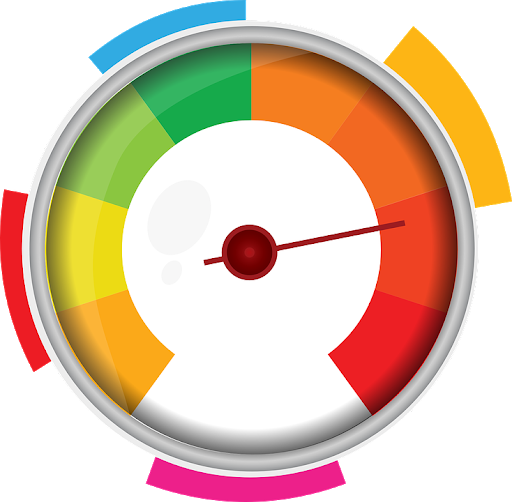
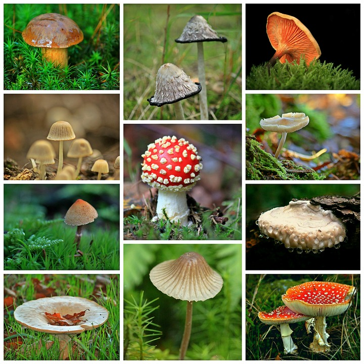
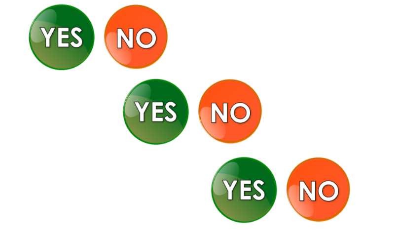
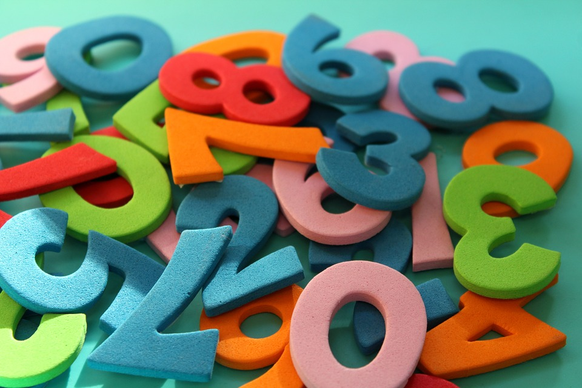

# Classification with Scikit-learn

<!--
So far we have learned about:
* Regression (straight-line)
* Polynomial Regression
* Classification
* scikit-learn
* TensorFlow
and many more concepts and tools used in machine learning.

In this unit we are going to combine the concepts about classification that we recently learned and apply them using the scikit-learn toolkit.
-->

---

# The dataset

<!--
The dataset that we'll be using in the examples in this colab is the "Iris Dataset". The dataset comes packaged with scikit-learn and contains feature measurements of three different species of iris. This is a classic machine learning dataset that you'll see in many machine learning examples.

Image Details:
* [classwithscikit1.png](https://pixabay.com/photos/iris-germanica-baardiris-purple-4215370/): Pixabay License
-->

---

# Binary classification

<!--
The first classification example we will build is a "binary classification" model. This model will give us a yes/no decision about if an object falls into a specific class.

Image Details:
* [classwithscikit2.png](https://pixabay.com/illustrations/yes-no-button-orange-green-icon-1713011/): Pixabay License
-->

---

# Binary classification: threshold

<!--
Despite the name, binary classifiers don't typically give you a yes/no decision. Instead they provide some numeric representation of confidence and it is the responsibility of the consumer of the model output to determine the threshold that divides the classification. Typically there is a default threshold, but depending on your model and use case, you might want to tweak that threshold.

Image Details:
* [classwithscikit3.png](https://pixabay.com/vectors/speedometer-speed-meter-fast-power-1063350/): Pixabay License
-->

---

# Multiclass classification

<!--
Other models can handle "multi-class" classification. These models understand many different class labels and attempt to predict the likelihood that an prediction matches each label.

Image Details:
* [classwithscikit4.png](https://pixabay.com/photos/mushrooms-collage-autumn-forest-1798755/): Pixabay License
-->

---

# Multiclass classification: chained binary classifications

<!--
An easy way to perform multiclass classification is to simply string together binary predictions and choose the best match. This is "Other vs. All" (OvA) classification. Another option is to pair each class and see which class prevails in an "Other vs. Other" (OvO) competition.

Often this complexity is hidden from us, but it is important to know a little of what is going on under the hood.

Image Details:
* [classwithscikit5.png](https://pixabay.com/illustrations/yes-no-button-orange-green-icon-1713011/): Pixabay License
-->

---

# Exercises: digit identification

<!--
For our exercise we'll create a classifier that identified digits in a popular handwritten digits dataset.

Image Details:
* [classwithscikit6.png](https://pixabay.com/photos/digits-counting-mathematics-4014181/): Pixabay License
-->

