---

marp: true

---

# Classification

<!---
We are now shifting our focus away from regression and on to another application of machine learning: classification.
-->

---

# Classification vs. Regression

<!--
Recall that a regression attempts to predict a continuous value. In the illustration on this slide, you can see a linear regression that attempts to fit a line to a dataset.

We judge the quality of our regression by measuring the distance of the actual data from our prediction line. Measurements such as mean squared error (MSE) and root mean squared error (RMSE) are common.

Image Details:
* [regression.gif](https://opensource.google/docs/copyright/): Copyright Google
-->

---

# Classification vs. Regression

<!--
Classification models don't predict a continuous value, but instead attempt to predict the "class" of a data point. Classification algorithms can be used to choose between two states, such as spam or not spam. They can also be used to determine the probability that a data point is one of dozens or even thousands of classes, such as the species of a particular plant.

The 2-class problem is often referred to as "binary classification," for which we train a "binary classifier" model. When more than two classes are being considered, the problem is referred to as "multi-class classification." There are some algorithms that only work for binary classification, while others can be successful in both binary and multi-class applications.

In the illustration here, you can see that we have two classes of data signified by the red and blue dots. We separate the classes using a line. All data on one side of the line is in the blue class, and all data on the other side of the line is in the red class.

Image Details:
* [classification.gif](https://opensource.google/docs/copyright/): Copyright Google
-->
-->

---

# What Does It Mean to Classify?

<!--
Binary classification can be as simple as a yes/no decision as to which side of a "line" a data point falls on, but most of the time classification is presented as a list of confidences that a class applies to a data point.
-->

---

# Classification Confidence

<!--
Classification model results are often returned as a list of confidences. The model will predict the probability that the given data point is part of each class. In these cases, the model only makes predictions. Your code will need to make decisions based on these predictions.

Notice that these confidences do not necessarily sum to 1, so they aren’t quite probabilities. You can perform a mathematical transformation, such as a “softmax” function, so you can interpret them as probabilities instead.

Image Details:
* [tiger.png](https://unsplash.com/photos/-KNNQqX9rqY): Unsplash License
-->

---

# Classification Confidence

<!--
Here is an example of a model returning confusing predictions. The model is highly confident that the image contains either an orange or a grapefruit. What would you do in this situation?

Image Details:
* [grapefruit.jpg](https://pixabay.com/photos/grapefruit-fruit-vitamins-1647507/): Pixabay License
-->

---

# Classification Models

* Logistic Regression
* Nearest Neighbors
* Decision Trees
* Random Forests
* Naive Bayes
* Deep Learning

<!--
There are numerous models that can be used for classification. Some of the more common ones that you'll see are mentioned here.

* Logistic regression: a variation of linear regression that performs a regression, then uses some threshold to make a classification decision
* Nearest Neighbors: a distance measure is used to find the neighbors of a datapoint, and classification decisions are made from those
* Decision trees: a tree structure where a classification is made through a series of small decisions that ultimately lead to the leaf of a tree
* Random forests: a group of trees, each with a random part of the training data, are queried and a consensus classification decision is made
* Naive Bayes: Bayesian statistics applied to data to make a classification decision
* Deep Learning: Neural networks trained to make classification decisions
-->

---

# Model Performance

<!--
As mentioned before, determining the performance of a regression model is calculated by measuring the distance between continuous values. In the case of classification models, there aren't any continuous values to measure, and we don't have a good definition of distance. Instead, we count the number of predictions that the model got correct and the number that were incorrect. Using these counts we can then create various metrics that can be used to calculate model quality.

We’ll briefly cover the most common measures of classification performance now, and you’ll get more practice with these and more advanced measures later.
-->

---

# Confusion Matrix

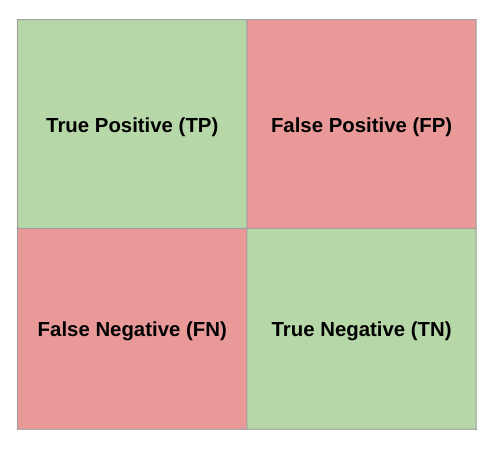

<!--
Most of the performance measures that we look at will be based on values taken from the confusion matrix. For the sake of simplicity, we'll stick to evaluating model quality for binary classification or at least from the perspective of a single class.

Think of the two classes as one “positive” and one “negative” class.

* True Positive means the model predicted "positive" and the correct class is "positive."
* False Positive means the model predicted “positive” but the correct class is “negative.”
* False Negative means the model predicted "negative" but the correct class is "positive."
* True Negative means the model predicted "negative" and the correct class is "negative."

Image Details:
* [confusion-matrix.png](https://opensource.google/docs/copyright/): Copyright Google
-->

---

# Accuracy

* The fraction of predictions that a classification model got right
* In binary classification, the correct predictions by a model is the sum of True Positive (TP) and True Negative (TN)

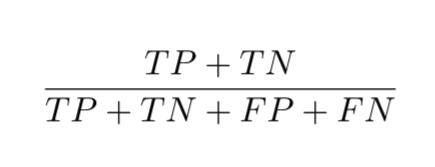

<!--
Accuracy is a very basic quantitative measure. It is simply the number of predictions that the classifier got correct divided by the total number of predictions made.

Accuracy seems like a reasonable thing to check, but it isn't always a good measure. This is especially true for skewed datasets with class imbalances. For example, imagine we are trying to diagnose an extremely rare type of cancer. In our training data, we have 995 samples of benign tumors and only 5 samples of malignant tumors. Let's say we train a model and it ALWAYS predicts false, meaning that it always says a tumor is benign.

Question: What is the accuracy? Answer: 995/1000 = .995 (or 99.5 percent).

So from the perspective of accuracy, this is a great model. But in reality, there are some clear issues, especially if we consider that we would be sending people with cancer home thinking their tumor is benign.

Even with balanced classes, accuracy is problematic because it ignores the context. Sometimes you care more about performance for one class over another. Depending on the consequences of your decision, you will use a different threshold to make the decision. For example, if you’re predicting a disease that would require a dangerous and invasive surgery, you may require a much higher probability for your classification as positive than if it only required recommending two aspirin.

https://stats.stackexchange.com/questions/312780/why-is-accuracy-not-the-best-measure-for-assessing-classification-models

Image Details:
* [accuracy.png](https://opensource.google/docs/copyright/): Copyright Google
-->

---

# Motivation for Precision

When the model predicted positive, how often was it right?
*What is the probability that a tumor is actually malignant, given that our model classified it as malignant?*

<!--
In practice, we need more nuanced measures. The goal of precision is to answer this question.

-->

---

# Precision

* The fraction of predictions that a classification model got right when predicting positive cases
* Compute the fraction of **correct** positive case predictions out of **all** positive case predictions

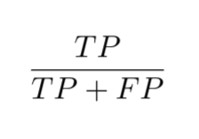

<!--
(Students will get more experience with this in the Classification Quality unit, so there's no need to spend much time on it here. The slide is just showing that precision is the percentage of all positive case predictions that were actually correctly predicted.)

Precision = (true positive / all positive predictions)
Intuition: When the model predicted positive, how often was it right?

Facts:
* High precision implies low false positives (i.e., our model does not classify very many benign tumors as malignant).
* Precision = 1 means all tumors classified as malignant were indeed malignant, but it says nothing about the number of malignant tumors that were incorrectly labeled as benign.

IMPORTANT NOTE: This says nothing about how many malignant tumors our model is missing.

Language: note that precision is also referred to as positive predictive value (PPV).

*It may be helpful to write the formula on the whiteboard at this point.*

Image Details:
* [precision.png](https://opensource.google/docs/copyright/): Copyright Google
-->

---

# Motivation for Recall

Out of all the possible positives, how many did the model correctly identify?
*What is the probability that our model will classify a tumor as malignant, given that it actually is malignant?*

<!--
The goal of recall is to answer this question.

-->

---

# Recall

* The fraction of predictions that a classification model got right out of all actual positive cases
* Compute the fraction of **correct** positive case predictions out of all **actual** positive cases

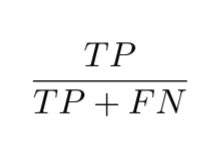

<!--
(Students will get more experience with this in the Classification Quality unit.)

Recall = (true positive / all actual positive)
Intuition: Out of all the actual positive cases, how many did the model correctly identify?

Facts:
* High recall implies low false negatives (i.e., our model does not classify very many malignant tumors as benign).
* Recall = 1 means all malignant tumors are classified as malignant. We’re not missing any malignant tumors. A negative test would definitively rule out malignancy. But we could have a test that always says “malignant.”

IMPORTANT NOTE: This says nothing about how many positive predictions are actually correct.

Language: note that recall is also referred to as sensitivity, hit rate, and true positive rate.

*It may be helpful to write the formula on the whiteboard at this point.*

Image Details:
* [recall.png](https://opensource.google/docs/copyright/): Copyright Google
-->

---

<!--
Balancing precision and recall is a tug-of-war between the metrics. Finding the optimal point where these two metrics are acceptable for your model is the goal.

If we want to increase recall, we should predict positive more often.
If we want to increase precision, we should only predict positive when we’re absolutely sure (i.e., raise the classification threshold).
In general, raising the classification threshold reduces false positives, thus raising precision.

Image Details:
* [tug_of_war.jpg](https://unsplash.com/photos/w55SpMmoPgE): Unsplash License
-->

---

# F1

* Harmonic mean of precision and recall
* High F1 means precision and recall are both high

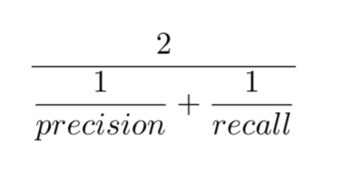

<!--
What is a good way to determine if precision and recall are balanced? The F1 score computes the harmonic mean for the values. This formula penalizes small values of either, so optimizing for a high F1 score helps keep both precision and recall high.

We can expand this formula to get a simplified F1 that can be calculated directly from the TP/TN/FP/FN counts.

Image Details:
* [f1.png](https://opensource.google/docs/copyright/): Copyright Google
-->

---

# F1: Simplified

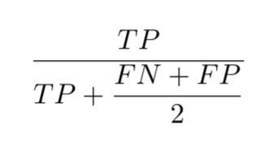

<!--
The F1 formula can be reduced to this formula.

*It may be helpful to write the formula on the whiteboard at this point.*

Image Details:
* [f1_optimized.png](https://opensource.google/docs/copyright/): Copyright Google
-->

---

# Which Do I Use?

<!--
The answer is "it depends."

In general, accuracy isn't a great measure.

F1 is a good measure to balance precision and recall.

We’ll discuss more advanced measures later as well. It is a good idea to measure the quality of your classifier using many different metrics and graphs, and sometimes directly reporting the confusion matrix is also insightful.
-->

---

# Confusion Matrix Example

Model to predict if a tumor is malignant

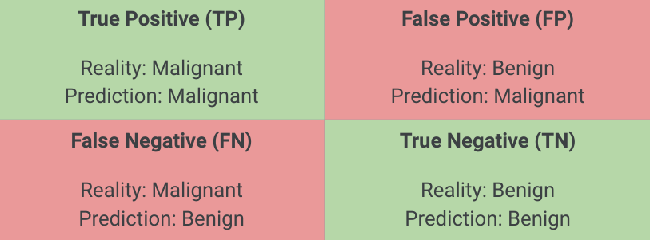

<!--
Let's get some practice calculating these metrics using a confusion matrix.

A confusion matrix is often used to describe how well a classification model performs on a dataset where true values are known.  It’s best to think of it as a table with two rows and two columns. It’s important to note what the model is trying to predict which result represents a “positive” outcome. In this example, the model is trying to predict if a tumor is malignant. So a positive outcome, in this case, is a malignant tumor.

The 4 sections of the confusion matrix:
* True Positive (TP)
  * Model predicts positive outcome (malignant), and it’s actually positive (malignant)
  * A hit scenario
* True Negative (TN)
  * Model predicts negative outcome (benign), and it’s actually negative (benign)
* False Positive (FP)
  * Model predicts positive outcome (malignant), and it’s actually negative (benign)
  * A false alarm scenario, also called Type I error
* False Negative (FN)
  * Model predicts negative outcome (benign), and it’s actually positive (malignant)
  * A miss scenario, also called Type II error

Image Details:
* [confusion_matrix_tumor1.png](https://opensource.google/docs/copyright/): Copyright Google
-->

---

# Confusion Matrix Example

Model to predict if a tumor is malignant

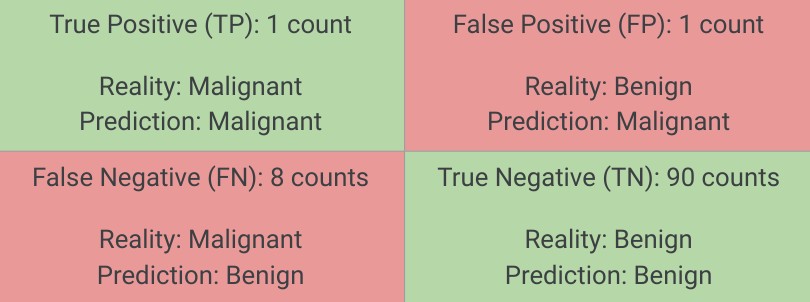

<!--
Let’s calculate based on the following example data where we have:
1 count of TP
1 count of FP
8 counts of FN
90 counts of TN
The total number of predictions is 100 counts

@Exercise (10 minutes) {
Ask students to calculate the accuracy, precision, recall, and F1 scores. The answers will be presented in the following slides.
}

Image Details:
* [confusion_matrix_tumor2.png](https://opensource.google/docs/copyright/): Copyright Google
-->

---

# Accuracy

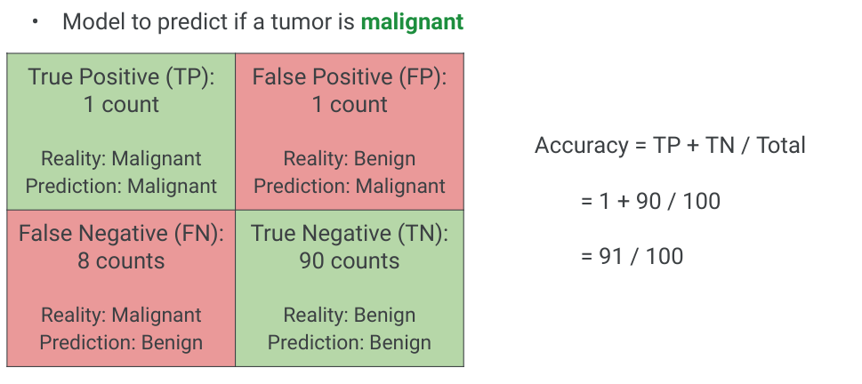

<!--

Image Details:
* [confusion_matrix_tumor_accuracy.png](https://opensource.google/docs/copyright/): Copyright Google
-->

---

# Precision

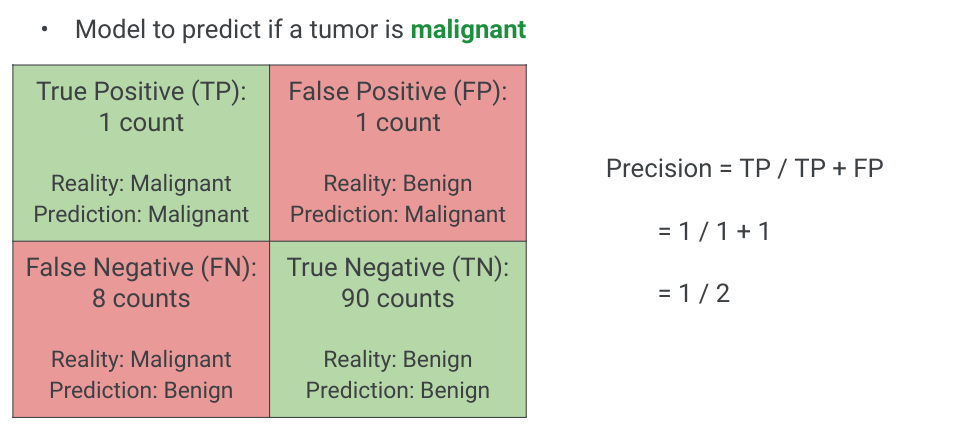

<!--

Image Details:
* [confusion_matrix_tumor_precision.png](https://opensource.google/docs/copyright/): Copyright Google
-->

---

# Recall

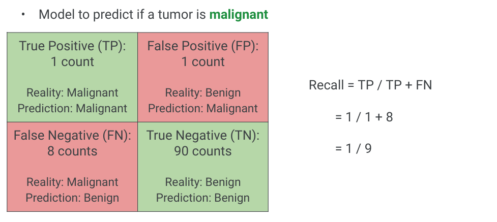

<!--

Image Details:
* [confusion_matrix_tumor_recall.png](https://opensource.google/docs/copyright/): Copyright Google
-->

---

# F1

<!--
Low because recall is low!
from previous slides:
precision = 1 / 2
recall = 1 / 9

Image Details:
* [confusion_matrix_tumor_f1.png](https://opensource.google/docs/copyright/): Copyright Google
-->

---

# Weather Prediction

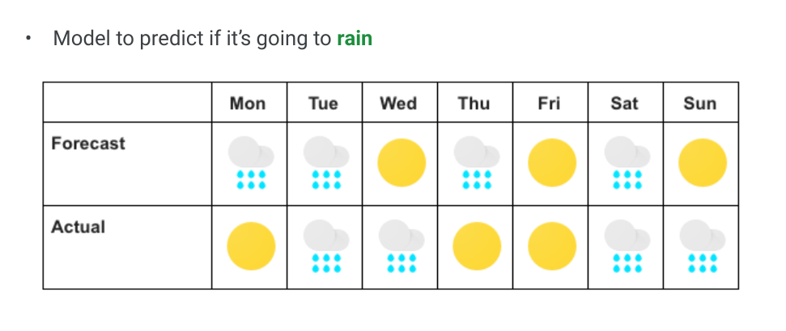
Create a confusion matrix for this model.

<!--

@Exercise (5 minutes) {
Give students a chance to practice creating a confusion matrix for this model.
}

Image Details:
* [weather.png](https://opensource.google/docs/copyright/): Copyright Google
-->

---

# Your Turn

* Now that you have a confusion matrix, calculate
  * Accuracy =
  * Precision =
  * Recall =
  * F1 =

<!--
Click back to the previous slide to let students calculate.
-->

---

# Solution

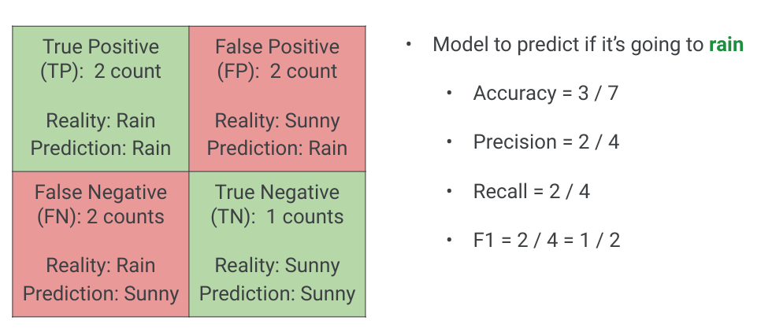

<!--
Image Details:
* [weather_solution.png](https://opensource.google/docs/copyright/): Copyright Google
-->

---

# Graphical Measurements

---

# Precision vs. Recall Curve

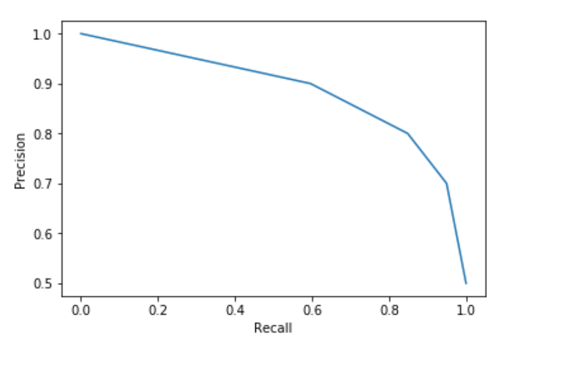

<!--
Besides F1 score, detailed plots of precision vs. recall can also be used to pick where to find a balance. This graph is created by varying the threshold value for a positive prediction (ex: malignant). If the model is 60% confident a tumor is malignant, do we classify it as malignant? What if our model returns a 90% confidence a tumor is malignant? This threshold can be chosen by the researcher, and the precision vs. recall curve helps us decide how to set it.

In the curve shown here, there is a drastic decrease in recall as precision crosses 80%. Depending on your problem, you'll probably want to keep your model tuned to values close to 80% precision.

Talk with class about examples where recall or precision might be favored:
Hiring decision? : precision
YouTube: Marking content that is inappropriate for kids, or copyrighted material : recall
Music / video recommendations? Is it better to play a song the user won’t like, or not play something they would? : accuracy
Medical treatment? What happens if a doctor sends you home and you have a terminal disease? What about when they run the exams just in case? : recall
Criminal justice risk assessment : precision
Fraud / identity theft detection : recall. Every once in a while your card gets blocked or you get a call, especially if travelling or exhibiting unusual purchase behavior, because that’s cheaper than having to deal with the consequences of not detecting it early enough.

Image Details:
* [precision_recall_curve.png](https://opensource.google/docs/copyright/): Copyright Google
-->
---

# Receiver Operating Characteristic (ROC) curve

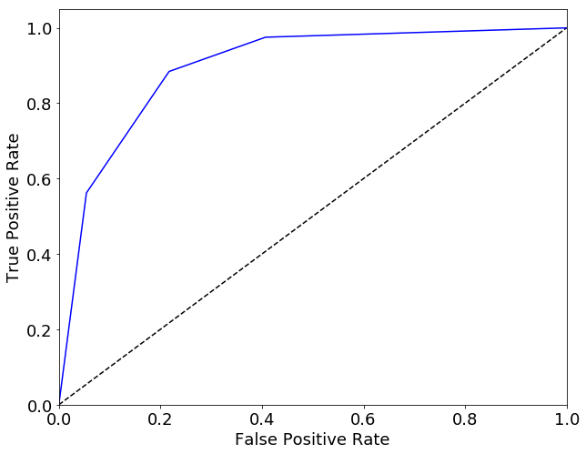

<!--
Another curve used to visualize model quality is the ROC curve. ROC curve plots True Positive Rate (TPR, or recall) against False Positive Rate (FPR) for various threshold values. (FPR is 1 minus the true negative rate.)

The next slides will detail what these values are.

Image Details:
* [roc_curve.png](https://opensource.google/docs/copyright/): Copyright Google
-->

---

# ROC: True Positive Rate = Recall

<!--
The true positive rate in the ROC curve (y-axis) is exactly the recall.

Image Details:
* [recall.png](https://opensource.google/docs/copyright/): Copyright Google
-->

---

# ROC: False Positive Rate

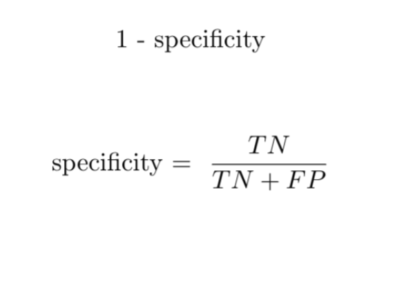

<!--
The false positive rate is one minus the true negative rate (TNR). TNR is also called specificity.

You can interpret this as how many actual negative examples were falsely predicted as positive.

Image Details:
* [specificity.png](https://opensource.google/docs/copyright/): Copyright Google
-->

---

# Receiver Operating Characteristic (ROC) Curve

<!--
TRUE POSITIVE RATE (y-axis):
* The true positive rate in the ROC curve (y-axis) is exactly the recall.
* In the medical case, it is the proportion of correctly classified malignant tumors.

FALSE POSITIVE RATE (x-axis):
* The false positive rate is one minus the true negative rate (TNR). TNR is also called specificity.
* In the medical case, it is the proportion of incorrectly classified benign tumors (negative samples falsely predicted as positive).

DOTTED LINE:
* On the dotted line, the True Positive Rate = False Positive Rate.
* Probability that you correctly classify a malignant tumor is equal to the probability that you incorrectly classify a benign tumor, i.e., given any sample, malignant or benign, the model has an equal probability of classifying them as malignant.
* Above the dotted line, the True Positive Rate > False Positive Rate. i.e. probability that you correctly classify malignant tumors is greater than the probability of incorrectly classifying benign tumors. You want this!

INTERPRETATION and MODEL COMPARISON:
* There is a calculation called Area Under Curve (AUC) or Area Under ROC (AUROC).
* Most toolkits will calculate this value for you.
* For the dotted line the AUC is 0.5.
* The AUC allows you to compare two ROC curves - larger area under curve = better model.

ROC and AUC are complicated metrics that people often misinterpret. An ideal graph curves high on the upper left and has an AOC closer to 1.0.

Image Details:
* [roc_curve.png](https://opensource.google/docs/copyright/): Copyright Google
-->

---

# Which Do I Use?

<!--
The answer is "it depends." It is a good idea to measure the quality of your classifier using many different metrics and graphs, as well as qualitative measures. These qualitative measures include looking through examples of what the model is predicting correctly and incorrectly.

In general, accuracy isn't a good measure. F1 is a good measure to balance precision and recall.

The precision recall curve is best used when the positive case is rare or when false positives are more important than false negatives. In contrast, the ROC curve is best when the positive and negative cases are more balanced.

Cross entropy loss is most commonly used for more complex models, like neural networks.
-->
