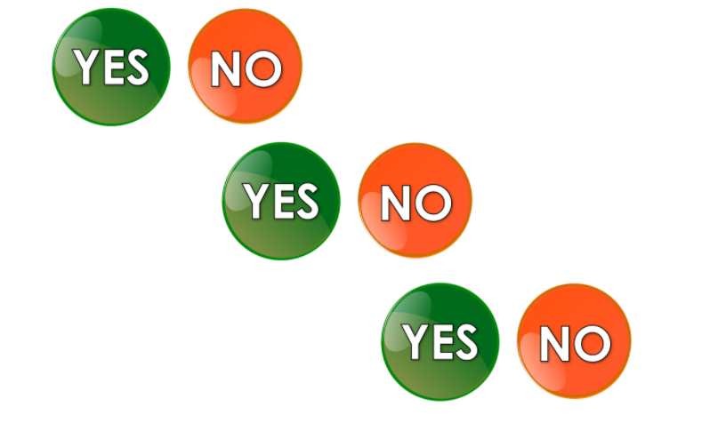
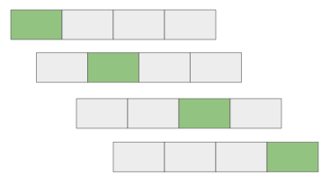
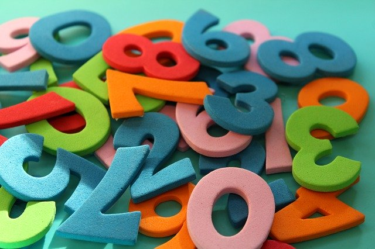

---
false
marp: true

---

# Multiclass Classification

<!--
As we continue our journey into classification we will now move into multiclass classification. Multiclass classification is a classification problem where there are more than two classes.

Yes, we know, multi means more than one, not more than two.

"Multiclass classification" is common nomenclature in machine learning for classifiers that need to distinguish between more than two classes and "binary classification" is reserved for classifiers that work with only two classes.

If you think about it, there isn't really a single-class classifier since predicting if a given data point in a particular class or not is binary classification problem. So binary is the "smallest" classification problem. 

-->

---

# Multiclass Classification: OvA OvO

<!--
An easy way to perform multiclass classification is to simply string together binary predictions and choose the best match. This is "One vs. All" (OvA) classification. For each class, you train a single classifier, where the samples of that class are positive and all other samples (from any other class) are negative. For each datapoint, the model will return a confidence label (i.e. the probabitliy that this particular datapoint belongs to each class). That is, you'll have probabilities p_{1}, p_{2}, ..., p_{k}, where p_{i} is the probability that the datapoint belongs to class i, and p_{i} is obtained from a One vs. All classifier for class i. 

Another option is to individually pair each class with every other class "One vs. One" (OvO) competition (it might be helpful to think of these as head-to-head matchups). If there are k total classes, then we will train k-1 individual classifiers for each class, c_{i}. In total, we train k(k-1)/2 individual classifiers. To aggregate the data from all these classifiers and predict a class for a particular datapoint, we give a class +1 for each time it wins a head-to-head matchup, and the class with the most points is the one we choose in the end.  

Often this complexity is hidden from us, but it is important to know a little of what is going on under the hood.

Some models, such as decision trees and random forests don't have to be structured in this manner.

Image Details:
* [yesno_yesno.png](https://pixabay.com/illustrations/yes-no-button-orange-green-icon-1713011/): Pixabay License
-->

---

# Lab: The Dataset

<!--
The dataset that we'll be using in the examples in this colab is the "Iris Dataset". The dataset comes packaged with scikit-learn and contains feature measurements of three different species of iris flowers. This is a classic machine learning dataset that you'll see in many machine learning examples. The features are sepal length, sepal width, petal length, and petal width, and our target is the species of iris flower (class 1: Iris Setosa, class 2: Iris Versicolour, class 3: Iris Virginica).

Image Details:
* [iris.jpg](https://pixabay.com/photos/iris-germanica-baardiris-purple-4215370/): Pixabay License
-->

---

# Lab: Cross-Fold Validation

<!--
In this lab we will introduce the concept of cross-fold validation. Cross-fold validation is a way to train on your entire dataset (minus final validation). The algorithm divides your dataset into even groups and then holds out one-at-a-time for validation while training on the remaining data. This can be very useful to evaluate the model performance on unseen data. 

Here is an outline of the procedure. 

1. Randomly shuffle the training data.
1. Split the dataset into k groups. For each group do the following. 
    1. Use the group as a test set.
    1. Use the remaining data as a training set.
    1. Train a model on the training data and evaluate using the test set.
    1. Record the model's overall performance (with whatever metric you're using), and scrap the model.
    1. Repeat for all k groups. 

This can be really useful on small datasets. It allows us to get a much better idea of model performance. 

Image Details:
* [cross_fold.png](http://www.google.com): Copyright Google
-->

---

# Lab: Digit Identification

<!--
For our final exercise in the lab we'll create a classifier that identifies digits in a popular handwritten digits dataset, MNST. This exercise will have minimal guidance and will allow you to really demonstrate your machine learning skills.

Image Details:
* [digits.png](https://pixabay.com/photos/digits-counting-mathematics-4014181/): Pixabay License
-->

---

# Your Turn

<!--
Let's get to the lab!
-->