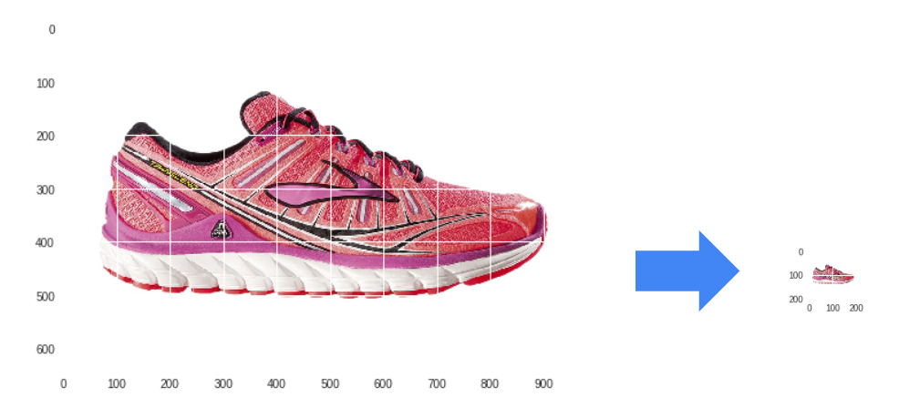
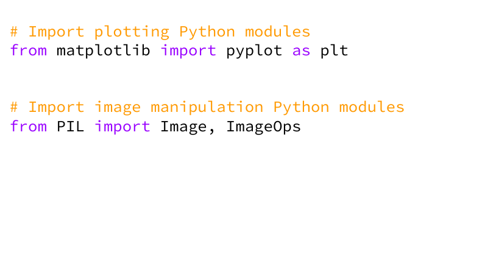
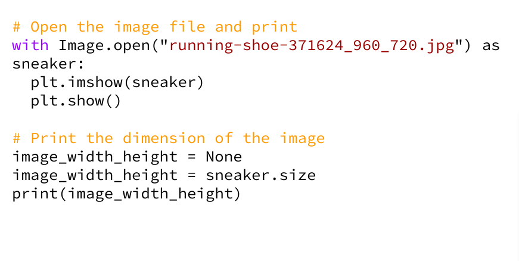
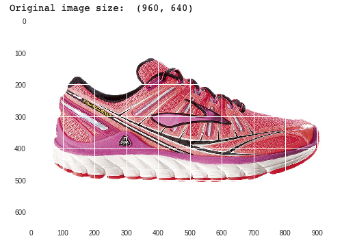
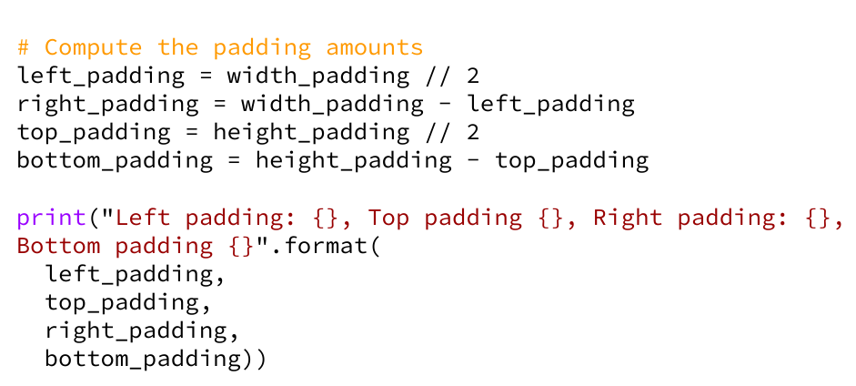
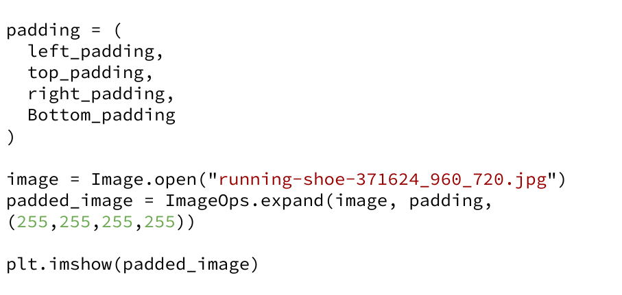
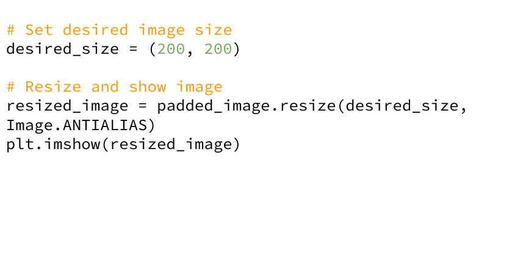
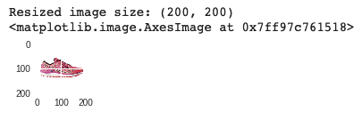

# Image Manipulation in Python

---

# Resizing an image

<!--
There are times when working with input data that consists of images, one needs to manipulate the images to ensure they are a good quality input to feed to  your ML model. For example: resizing the images to a uniform dimension or colorspace.
-->

---

# Python modules

<!--
Matplotlib
* We’ll use the matplotlib Python library that you have already used for creating charts. But in this exercise, we’ll use it to plot an image, instead of chart.

PIL (Python Imaging Library)
* Free library for the Python programming language that adds support for opening, manipulating, and saving many different image file formats
* A newer fork of PIL is called Pillow
-->

# Open and plot an image and its dimension

<!--
Open an image file: using PIL, open the image specified in the image file path.

Plot the image: using Matplotlib, show the image so we can see how the image looks like and its dimension.
-->

---

<!--
It’s a sneaker!
Rectangular shape
Dimension is 960 by 640 pixels

Remember the goal is to end up with a thumbnail image which is square and with 200 by 200 pixels dimension.

Question for students:
How do we get there?
If the image is resized from rectangular (960x640) to square (200x200), what happens to the image?

There are a variety of ways, and one way is to pad the image in the original dimension into a square shape, then sized down into the correct dimension.

Let’s see how to do that in code.
-->

---

# Compute delta width and height

<!--
How do we figure how much to pad the image to make it square shape?
First, determine the longest dimension between the width and height of the original image.
Figure out how much padding is needed in the height and width of the image.  In this case, we need to pad the image’s height to match the image’s width, since the width is larger than the height.
-->

---

# Compute the amount of paddings

<!--
But wait!  In order to keep the shoes centered on the image, we need to pad the height both at the top as well as at the bottom, thus HALF the needed pad will be added to the bottom and the other half to the top of the image.
-->

---

# Pad the image

<!--
Alright, we are ready to do the padding. We use the PIL module again to do the padding by passing in the original image, padding figures in pixels (left, top, right, bottom), and the background color of the padding pixels.
-->

---

# Resize the image

<!--
Now we need just to reduce the dimension into a thumbnail size of 200x200 pixels.
-->

---

<!--
Again, we use the PIL module to do so by passing in the desired_size.
-->

---

# The final image

<!--
Here’s the final image.
-->

---

# Your Turn

[Maniupating an Image in Python](https://colab.sandbox.google.com/drive/180O8QlkmoqI90h8zyCDiTfLq9egrauhb){.big}
