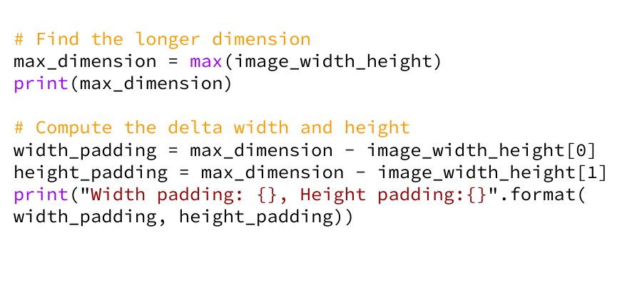

---

marp: true

---

# Image Manipulation in Python

---

# Resizing an image

<!--
It is common to have input data that consists of images. Just like with tabular data, we still need to perform data cleaning and exploration, and this often involves manipulating the images to ensure they are in a good form for your ML model. For example, we may want to resize the images to a uniform dimension or colorspace.

Our goal in this lecture is to discuss how to take a rectangular image that is 960 by 640 pixels and produce a thumbnail that is 200 by 200 pixels. 

Image Details:
* [imagemaninpy1.png](http://www.google.com): Copyright Google  
-->

---

# Python modules

<!--

We’ll use the matplotlib Python library that you have already used for creating charts. But in this exercise, we’ll use it to plot an image, instead of a chart.

PIL (Python Imaging Library) is a free library for the Python programming language that adds support for opening, manipulating, and saving many different image file formats. A newer fork of PIL is called Pillow, so don't be confused if you see it referred to by either name.

Image Details:
* [imagemaninpy2.png](http://www.google.com): Copyright Google  
-->

---

# Open and plot an image and its dimensions

<!--

In the first block of code, we open the image using PIL. In this case, the image is in the same directory as our Python project and the name is running-shoe-371624_960_720.jpg. We then plot the image using Matplotlib. 

In the second block of code, we inspect the dimensions of the image. 

Image Details:
* [imagemaninpy3.png](http://www.google.com): Copyright Google  
-->

---

<!--
Remember, the goal is to end up with a thumbnail image which is square and with dimensions of 200 by 200 pixels.

Questions for students:
* How do we get there?
* If the image is resized from rectangular (960x640) to square (200x200), what happens to the image?

There are a variety of ways to avoid skewing the image when changing the dimensions. One common technique is called padding. Here we will pad the original image in the vertical direction so that it's square in shape. We will then size it down to 200 by 200 pixels. 

Let’s see how to do that in code.

Image Details:
* [imagemaninpy4.png](http://www.google.com): Copyright Google  
-->

---

# Compute delta width and height

<!--
How do we figure out how much to pad the image to make it a square?

First, determine the largest dimension (width or height) of the original image.

Then, figure out how much padding is needed in the height and width of the image. In this case, we need to pad the image’s height to match the image’s width, since the width is larger than the height.

Image Details:
* [imagemaninpy5.png](http://www.google.com): Copyright Google  
-->

---

# Compute the amount of paddings

<!--
But wait!  In order to keep the shoes centered on the image, we need to pad the height both at the top as well as at the bottom, thus HALF the required padding will be added to the bottom and the other half to the top of the image.

Image Details:
* [imagemaninpy6.png](http://www.google.com): Copyright Google  
-->

---

# Pad the image

<!--
Alright, we are ready to do the padding. We use the PIL module again to do the padding by passing in the original image, padding figures in pixels (left, top, right, bottom), and the background color of the padding pixels.

Image Details:
* [imagemaninpy7.png](http://www.google.com): Copyright Google  
-->

---

# Resize the image

<!--
Now we need just to reduce the dimension into a thumbnail size of 200x200 pixels.

Image Details:
* [imagemaninpy8.png](http://www.google.com): Copyright Google  
-->

---

# Resize the image

<!--
Again, we use the PIL module to do so by passing in the desired_size.

Image Details:
* [imagemaninpy9.png](http://www.google.com): Copyright Google  
-->

---

# The final image

<!--
Here’s the final image.

Image Details:
* [imagemaninpy10.png](http://www.google.com): Copyright Google  
-->

---

# Your Turn

<!--
Let's practice in the lab. 
-->
