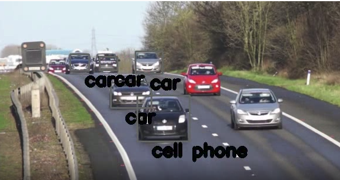

---

marp: true

---

# Video Processing Project

<!--
We are about to combine many of the skills that we have learned over the past few units. We will take a video file and a pre-trained model and we will build bouding boxes around items in each frame of the video.
-->

---

# Video Processing Project

<!--
Here you can see a single frame of a video showing a road with a bunch of cars. A machine learning model (like the one you will use) has identified many of the cars in the image and labeled them as "car." One was strangely labeled as a cell phone -- models are not perfect. 

In this project, we will process a video frame-by-frame and create bounding boxes around items found in those image by the third-party model.

Image Details:
* [boxes.png](https://pixabay.com/videos/cars-motorway-speed-motion-traffic-1900/): Pixabay License
-->

---

# Your Turn

<!--
In this lab you will exercise many of your Python and modelling skills. Let's go!
-->