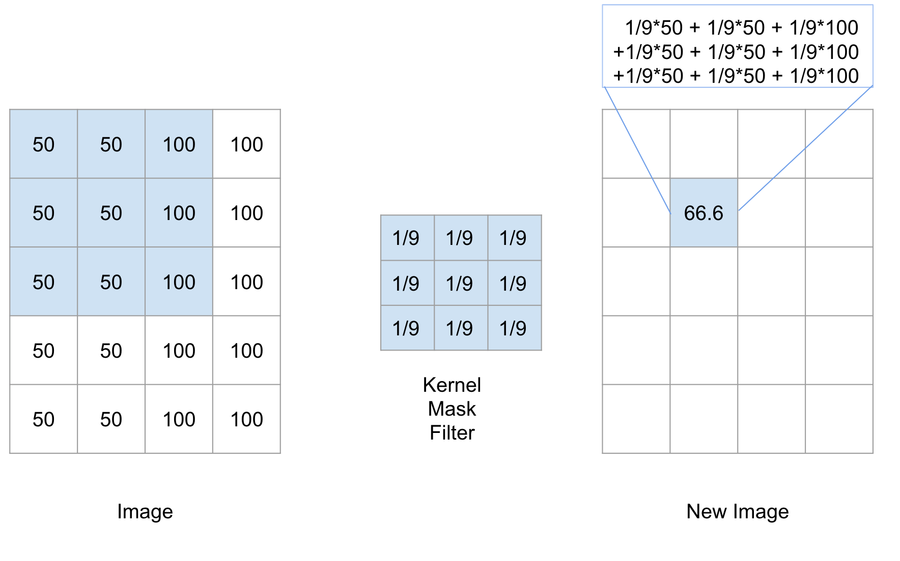
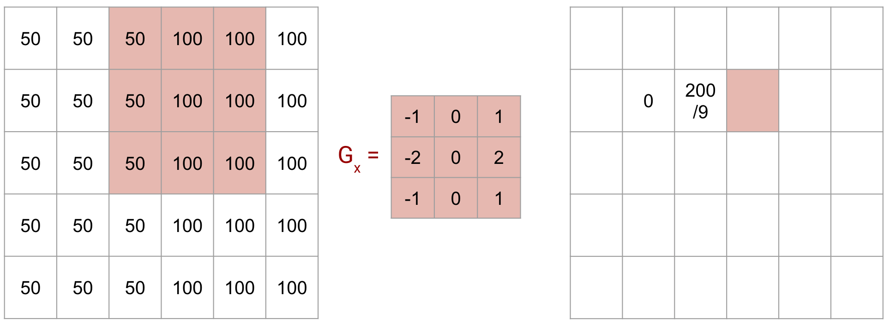

# Convolutional Neural Networks

---

<!--

Like neural networks, convolutional neural networks were inspired by biology. 

In the 1960's Hubel and Wiesel showed that the visual cortex in cats and monkeys contain neurons that fire individually in response to small regions in the field of view. 

Visual cortex; small receptive field; overlap; react to different line orientations; can stack

Image Details:
* [conNN02.jpg](https://pixabay.com/photos/eye-iris-pupil-vision-eyeball-3221498/): Pixabay License
-->

---

<!--
For a given neuron, the visual space that affects whether or not that neuron will fire is known as its "receptive field." 

Neurons that are spatially close together often have similar and overlapping receptive fields. 

Our eyes and brains then take the information from each of these small receptive fields and melds them together into the images that we see. 

Image Details:
* [conNN03.jpg](https://pixabay.com/illustrations/grid-block-cube-square-design-684983/): Pixabay License
-->

---

<!--

In the 1980's, researchers were inspired by the visual cortex and used these ideas to create convolutional neural networks. 

A convolutional neural network is simply a neural network with additional (or different) types of layers. There are convolutional layers, downsampling layers, and pooling layers. 

Image Details:
* [conNN01.png](https://pixabay.com/illustrations/wallpapper-music-colors-80-s-778185/): Pixabay License
-->

---

<!--
You can stack these layers different numbers of these layers in various orders to achieve different results during training.

Image Details:
* [conNN05.jpg](https://pixabay.com/photos/pancake-crepes-eat-food-crepe-640869/): Pixabay License
-->

---

<!--
Recall the simplest building block for a typical neural network, the perceptron. 

Image Details:
* [conNN13.png](https://towardsdatascience.com/introducing-deep-learning-and-neural-networks-deep-learning-for-rookies-1-bd68f9cf5883): Unlicensed 
-->

---

# Issues with Multi-Layer Perceptron (plain ANN)

<!--
If we are dealing with image data, small (and often insignificant) changes to the training data, can yield large (and often incorrect) changes to the learned parameters in the model. 

For example, consider a problem where you want to identify a cat in an image. If the cat is translated to a different part of the image, then the model will adjust different weights to recognize the cat. But the cat being on the left or right of an image isn't really a defining feature of a cat, right? We'd prefer to recognize things like ears, fur, etc. 

Image Details:
* [conNN15.png](??): Unlicensed 
-->

---

<!--
In a convolutional neural network, we first feed our data into convolutional, downsampling, and pooling layers. The results are then fed into a fully connected neural network like we have seen before. 

Image Details:
* [conNN14.png](??): Unlicensed 
-->

---

# Convolution 

A way to analyze influence of nearby pixels using a filter

(filters are also called kernels, masks, convolution matrices)

---

<!--
Let's look at a simple example. Imagine we have the image on the left. It's just a rectangle with two halves shaded different colors. 

The intensity of each pixel is recorded on the right. This is how we typically work with image data. 

Image Details:
* [conNN16.png](http://www.google.com): Copyright Google
-->

---

<!--
We'll apply this 3x3 filter to the image. 

It's a filter that adds a blurring effect. 

Image Details:
* [conNN17.png](http://www.google.com): Copyright Google
-->

---

<!--
We'll apply this 3x3 filter to the image. 

It's a filter that adds a blurring effect. 

Image Details:
* [conNN18.png](http://www.google.com): Copyright Google
-->

---

<!--
Let's use the 3x3 filter to calculate the new value for this pixel. 

Image Details:
* [conNN19.png](http://www.google.com): Copyright Google
-->

---

<!--
First, we think of centering the filter on the pixel. Then we multiply the values in the filter by the values in the image. And finally, we add up the result. 

As you can see, the new pixel value is slightly lower than 100, but higher than 50. So the intensity is getting muted a little. This is because our filter is averaging the instensity of all the pixels around the center point. That is why this filter results in a blurring effect. 

Image Details:
* [conNN20.png](http://www.google.com): Copyright Google
-->

---

<!--
You may be wondering what happens if we're at the edge. There are different ways to handle this. But it's common to pad the original image with 0's around the edges. That way, those values drop out in the average.  

Image Details:
* [conNN21.png](http://www.google.com): Copyright Google
-->

---

<!--
Here you can see that we only used the part of the filter that is relevant to the image. 

Image Details:
* [conNN22.png](http://www.google.com): Copyright Google
-->

---

# Line Detectors

<!--
Here are two very common kernels that can be used to detect lines in an image. 

Overall the goal is to detect sharp changes in intensity. 

Image Details:
* [conNN23.png](http://www.google.com): Copyright Google
-->

---

<!--
Here are two very common kernels that can be used to detect lines in an image. 

Overall the goal is to detect sharp changes in intensity. 

Image Details:
* [conNN24.png](http://www.google.com): Copyright Google
-->

---

<!--

***

Image Details:
* [conNN25.png](http://www.google.com): Copyright Google
-->

---

<!--

***

Image Details:
* [conNN26.png](http://www.google.com): Copyright Google
-->

---

<!--

***

Image Details:
* [conNN27.png](http://www.google.com): Copyright Google
-->

---

<!--

***

Image Details:
* [conNN28.png](http://www.google.com): Copyright Google
-->

---

<!--

***

Image Details:
* [conNN29.png](http://www.google.com): Copyright Google
-->

---

<!--

***

Image Details:
* [conNN30.png](http://www.google.com): Copyright Google
-->

---

<!--

***

Image Details:
* [conNN31.png](http://www.google.com): Copyright Google
-->

---

<!--

***

Image Details:
* [conNN31.png](http://www.google.com): Copyright Google
-->

---

# LeNet-5

<!--
LeNet

Image Details:
* [conNN07.png](http://yann.lecun.com/exdb/publis/pdf/lecun-01a.pdf): Unlicensed
-->

---

<!--
Convolutional Layers

Image Details:
* [conNN08.png](http://yann.lecun.com/exdb/publis/pdf/lecun-01a.pdf): Unlicensed
-->

---

<!--
Image Details:
* [conNN09.png](http://yann.lecun.com/exdb/publis/pdf/lecun-01a.pdf): Unlicensed
-->
---

<!--
Feature Maps

Image Details:
* [conNN10.png](http://yann.lecun.com/exdb/publis/pdf/lecun-01a.pdf): Unlicensed
-->

---

<!--
Pooling

Image Details:
* [conNN11.png](http://yann.lecun.com/exdb/publis/pdf/lecun-01a.pdf): Unlicensed
-->

---

# GoogLe-Net

<!--
GoogLe-Net
http://yann.lecun.com/exdb/publis/pdf/lecun-01a.pdf

Image Details:
* [conNN12.png](http://yann.lecun.com/exdb/publis/pdf/lecun-01a.pdf): Unlicensed
-->

---

# Why?

<!--
Too many connections on large images
Recognize shapes anywhere in an image
-->
