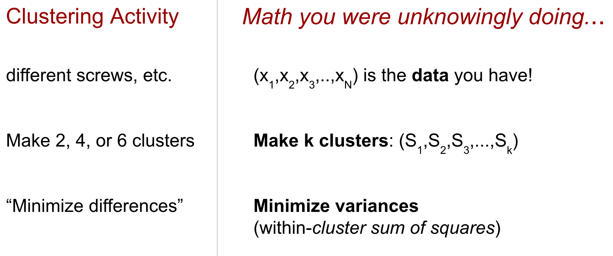
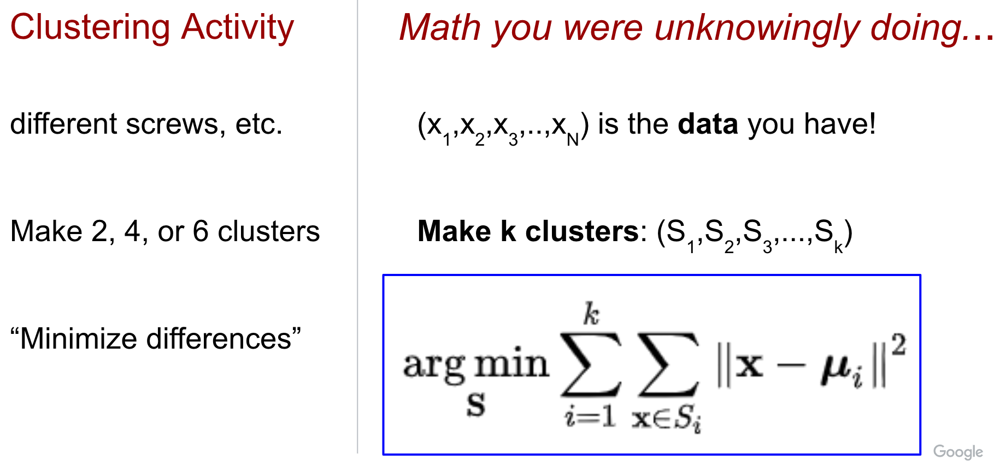
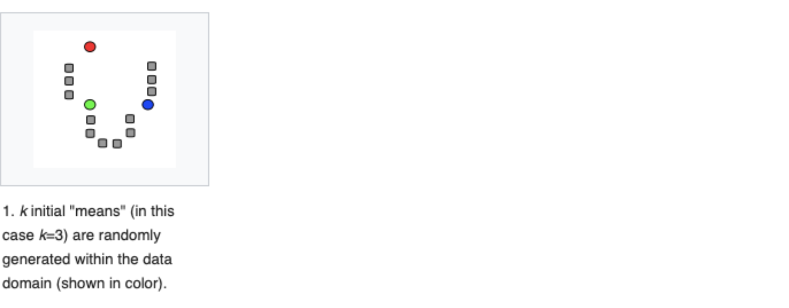
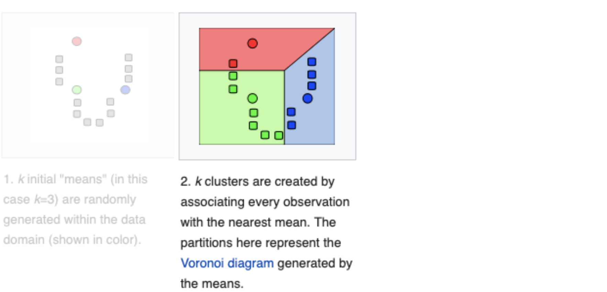
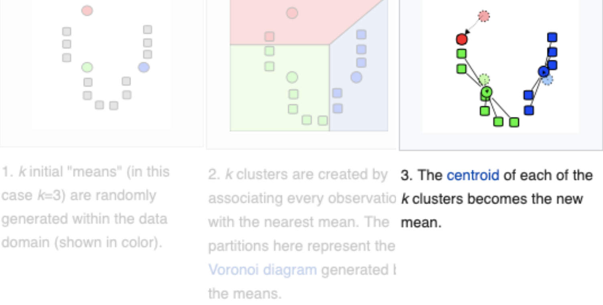
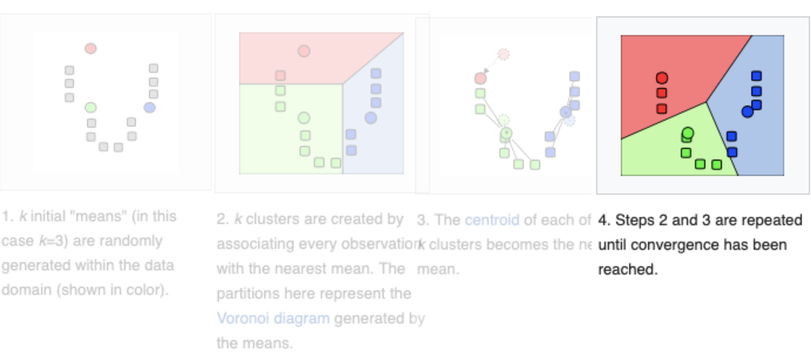
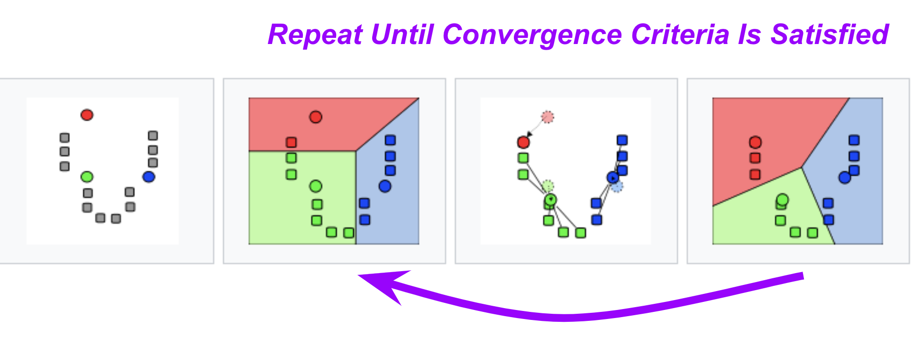

---

marp: true

---

<style>
img[alt~="center"] {
  display: block;
  margin: 0 auto;
}
</style>

# k-means 

<!--
k-means clustering is an unsupervised machine learning algorithm that can be used to group items into clusters.

So far we have only worked with supervised algorithms. Supervised algorithms have training data with labels that identify the numeric value or class for each item. These algorithms train on labeled data to build a model that can be used to make predictions.

k-means clustering is different. The training data is not labeled. Unlabeled training data is fed into the model, which attempts to find relationships in the data and create clusters based on those relationships. Once these clusters are formed, predictions can be made about which cluster new data items belong to.

k-means is the most common clustering algorithm. You performed a k-means clustering during the screw/fastener exercise.

Let's relate k-means back to what you did in the screw/fastener exercise. 
-->

---

# k-means Mathematics



<!--
The pile of screws and other fasteners on your desk made up your dataset. You can think of labeling each screw as x_{1}, x_{2}, ... x_{n}. So the total number of items in your pile was n. 

When you were asked to make 2, 4, or 6 clusters, this played the role of k. This is a hyperparameter of the model. 

Finally, you were trying to create clusters with "similar" items. That is, they shared some traits. You may have chosen a distance metric based on color (dark screw in one cluster, chrome screw in another, etc.). Or based on shape (1-inch screws in one cluster, 2-inch screws in another, etc.). These choices played the role of your distance metric. When grouping similar items, you were attempting to minimize the variance within each cluster. 

Image Details:
* [kmeans01.png](http://www.google.com): Copyright Google
-->

---

# k-means Mathematics



<!--
More formally, this is the actual mathematical formula for minimizing the variance within each cluster. 

Image Details:
* [kmeans02.png](http://www.google.com): Copyright Google
-->

---

# k-means Algorithm



<!--
Let's take a closer look at each step in the k-means algorithm. 

We choose our hyperparameter k (i.e. the number of clusters). In this case, k = 3. Then three points are randomly generated within the data. These are our initial "means" often called "centroids." 

Image Details:
* [kmeans03.png](https://brilliant.org/wiki/k-means-clustering/): Unlicensed
-->

---


# k-means Algorithm



<!--
Now, clusters are created around each of those three means. Every datapoint is put into a cluster based on which of the three centroids it's closest to, where close is defined by our distance metric. In this problem, the distance metric is just Euclidean distance in the plane. 

Image Details:
* [kmeans04.png](https://brilliant.org/wiki/k-means-clustering/): Unlicensed
-->

---


# k-means Algorithm



<!--
We now have three clusters. But if we just stopped here, then the model wouldn't be a "learning algorithm." The task now is to iteratively refine the model. 

We compute the arithmetic mean of each of the three clusters. These values become the new centroids. 

Image Details:
* [kmeans05.png](https://brilliant.org/wiki/k-means-clustering/): Unlicensed
-->

---

# k-means Algorithm



<!--
Again, every datapoint is put into a cluster based on which of the three centroids it's closest to.

Image Details:
* [kmeans06.png](https://brilliant.org/wiki/k-means-clustering/): Unlicensed
-->

---

# k-means Algorithm



<!--
We repeat steps two and three (recalculating the centroids and re-clustering around those centroids) until convergence is reached. Convergence is typically measured by very little or no change in the centroids. In other words, the assignment of datapoints to clusters is not changing with more iterations. 

Image Details:
* [kmeans07.png](https://brilliant.org/wiki/k-means-clustering/): Unlicensed
-->

---

# Lab

Using Black Friday data to segment shopping customers.


<!--
Businesses often segment their customers into groups for marketing purposes. Often these segments are based on some characteristic of the customer: age, gender, spending bracket, etc. These segments are created based on assumptions that marketers have about their customers.

In this lab, we will use k-means clustering to find customer segments instead of relying on traditional segmentation methods.

Image Details:
* [blackfriday.jpg](https://pixabay.com/photos/family-shopping-center-purchase-2923690/): Pixabay License

-->

---

# Lab

```python
    from sklearn.cluster import KMeans

    model = KMeans(n_clusters=10)
```

<!--

There are many hyperparameters that we can set when using scikit-learn's KMeans function. But n_clusters is the most important, as it denotes the number of clusters (i.e. centroids) we want. 

You can see more details in scikit-learn's documentation. 

https://scikit-learn.org/stable/modules/generated/sklearn.cluster.KMeans.html

-->
---

# Your Turn

<!--
Now let's explore the k-means lab.
-->
