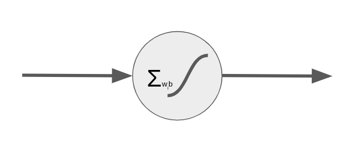
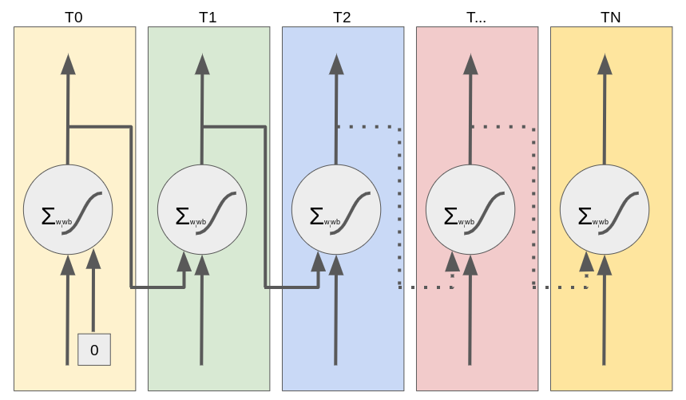
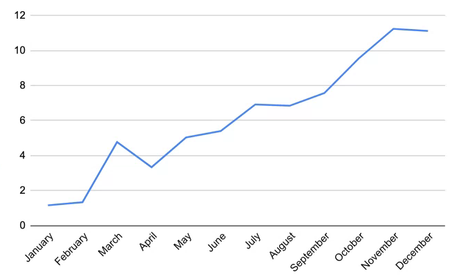
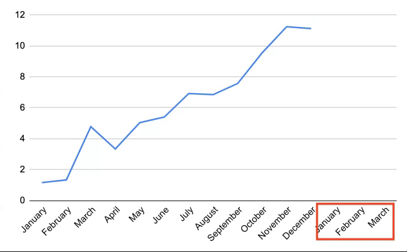

# Recurrent Neural Networks (RNNs)

<!--
We have encountered numerous deep neural networks throughout this course. In previous tracks we've covered, training data flowed through the network (feedforward), and then adjustments were made to the weights in the network from the last layer through the first (backpropagation).

Just to name a few, we've used dense layers, dropout layers, convolutional layers, and pooling layers. In this unit we will learn about recurrent neural networks, which are not strictly feedforward networks.
-->

---

# Feedforward Neuron

<!--
Here we see a typical feedforward neuron. Depending on the size of the layers before and after, one or more weights feed into the neuron. These are multiplied by the bias, summed, and then passed through an activation function. The resultant value is then passed to the nodes in the next layer of the network.

Image Details:
* [ff_neuron.png](https://www.google.com): Copyright Google
-->

---

# Recurrent Neuron

<!--
Here is a recurrent neuron. You can see that the recurrent neuron looks a lot like a feedforward neuron, except that it also feeds its output back into its inputs.

Imagine we have a fully connected layer that is 10 nodes wide before this neuron. In a typical feedforward, fully-connected network, we would expect 10 inputs, one for each of the nodes in the previous layer. In this case we'll actually have 11 inputs: one for each of the nodes in the previous layer and the output of the node itself.

What does this do? This gives the neuron memory over time. It allows you to pass a series of data points into the network over time.

Image Details:
* [r_neuron.png](https://www.google.com): Copyright Google
-->

---

# Recurrent Neuron Over Time

<!--
This is what it would look like to "unroll" the flow of data through a recurrent neuron over time. You can see that it typically starts out with a seeded input value of zero for its backfeed. At each point in the series, the neuron both passes data to the next layer of neurons and passes data forward in time to itself the next time it fires.

Also note that we're looking at a single neuron in a layer with one input and one output. In reality you'll have wide layers, so imagine multiple recurrent nodes side by side, each with multiple inputs and outputs.

Image Details:
* [unrolled.png](https://www.google.com): Copyright Google
-->

---

# Long Short Term Memory Neuron

<!--
With a typical recurrent neural network, the network tends to have a very short memory. As the sequences passing through the network get longer, the network forgets what it first saw. There have been a few strategies to get around this, one of which is the "long short term memory" (LSTM) neuron.

On this slide you can see a very simplified LSTM cell. If you look at the horizontal center, you can see the standard neuron: X-in, y-out. However, instead of having a single feedback like a standard recurrent neuron, this neuron passes two weights back to itself. One represents the long-term member, and the other represents the short-term member.

You can see that the short-term state gets mixed with the weights in a set of activation functions labelled A1 through A4. The outputs of these functions, as well as the long-term state, then get passed through a series of gates that ultimately lead to the output of a new y, c, and h value.

The numbered gates in order are:

1. The forget gate
2. The input gate
3. Addition of the forget and input gate
4. The output gate

LSTM cells are often higher-performing than standard recurrent cells. They also often train faster than standard recurrent cells.

Image Details:
* [lstm_neuron.png](https://www.google.com): Copyright Google
-->

---

# Other RNN Neurons

* Gated Recurrent Unit Neuron (GRU)
* Convolutional Neurons

<!--
The LSTM cell is pretty complex. There is an alternative called the "Gated Recurrent Unit" (GRU) neuron. The GRU has a single feedback channel that manages both short- and long-term state.

Another type of neuron that performs very well for sequence tasks alongside, or in place of, LSTM and GRU neurons are convolutional neurons. We'll see a convolutional neuron in action in our lab.
-->

---

# What Are RNNs Good For?

* Language Translation
* Sequence Prediction
* Sequence Generation
* Tagging
* Summarization
* *... and more!*

<!--
Recurrent neural networks are useful for solving a variety of problems. They are commonly used on problems where there is a sequence of data that needs to be processed. For example, they can convert from one language to another. They are also useful in sequence prediction. For example, you might use an RNN to try to predict stock prices or temperatures over time. Since they also work so well with sequences, they can be used to generate sequences such as musical notes or strokes on a canvas. They can also process data such as video and "tag" those videos. Another application is summarization. A RNN can ingest a large amount of text and create a summary about that text.

There are many many more applications of RNNs.
-->

---

# Sequence Prediction

<!--
One application that RNNs are particularly good at is sequence prediction. Our lab will actually be a sequence prediction lab.

So far in this course, all of our predictions have assumed the data are time-independent. That is, we could shuffle around all the data points and prediction points in time, and nothing would change.

For example, consider the model we used earlier to predict height from shoe size. The dataset we used was all the students in the class. Now, if we shuffle around all those students, and take the data points in a different order, the model doesn't change.
-->

---

# Time Series Data

<!--
In this unit, we will look at sequence prediction. In sequence prediction the input data is an *ordered* set of data, most commonly a time series. A time series is a set of data where the index is a date. Since dates have an inherent ordering, time
series are ordered data.

Image Details:
* [time_series.png](https://opensource.google/docs/copyright/): Copyright Google

-->

---

# What are we predicting?

<!--
Sequence prediction is about predicting what happens next in a sequence. For example, if we have a year's worth of data, we may
want to know what happens in Q1 of the next year.

Image Details:
* [time_series_2.png](http://www.google.com): Copyright Google

-->

---

# RNNs for Sequence Prediction

- Sequence prediction is traditionally done using a statistical approach
- Machine learning and RNNs specifically give us a new tool for sequence prediction that contains less assumptions

<!--
The standard approach to sequence prediction for several years was a statistical one (like Markov chains or ARIMA). 

*There may not be a need to go into detail, but you could mention Markov Chains or ARIMA time series forecasting. Suffice to say, these approaches often require a lot of assumptions, such as a transition matrix of probabilities, or a normal distribution of noise.*

RNNs allow the data to "speak for themselves." Using an RNN is a largely non-parametric approach. The downside is that RNNs usually need more data to make good predictions.

-->

---

# Examples

<!--

*Walk students through the following examples. These are just a few examples. There are many more, so feel free to elaborate on these and/or add others.*

-->

---

# Examples

<!--
One of the most common examples of sequence prediction is predicting stock prices. Stock prices are notoriously volatile, but a lot of people are involved in the practice of trying to predict them. There are entire industries based on this practice.

Image Details:
* [stock_paper.png](https://unsplash.com/photos/IT6aov1ScW0): Unsplash License

-->

---

# Examples

<!--
Predicting the weather based on previous days of weather could also be an important application of sequence prediction. While most meteorological systems use a parametric approach based on input data (such as air pressure, cloud cover, etc.), a sequence prediction model can go surprisingly far.

Image Details:
* [rain_forecast.png](https://unsplash.com/photos/zNGPmIVPQf4): Unsplash License
-->

---

# Examples

<!--
You may want to predict the number of travelers at a train station on a given day, given the previous data of how many travelers were there each day. RNNs pick up on things like varieties of seasonality (e.g., weekday vs weekend, holiday season) and noise.

However, especially for time series with seasonality, we need to have enough data. For example, if we only have data for October and November, we won't do very well at predicting December because it is a holiday month; we would ideally have data for December of the previous year (if not multiple years).

Image Details:
* [train_station.jpg](https://www.pexels.com/photo/grayscale-photography-of-people-walking-in-train-station-735795/): Pexels License
-->

---

# Your Turn

<!--
In the lab we'll use a recurrent neural network to predict a sequence of vibration readings from an engine. We'll see how to apply TensorFlow with Keras to build, test, and tune your model.
-->
