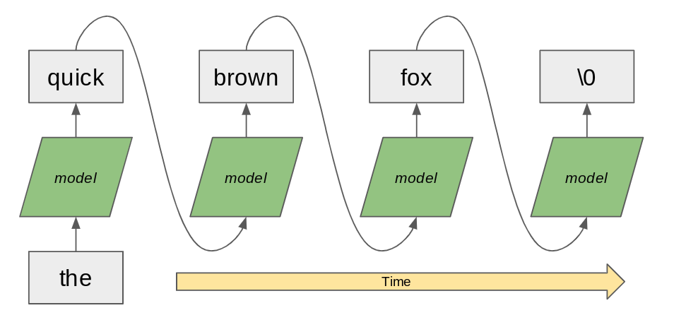
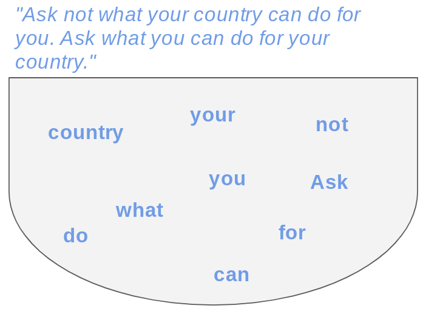
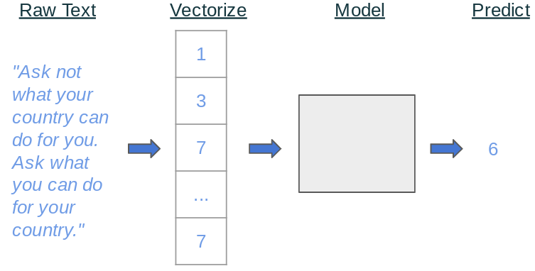

<style>
img[alt~="center"] {
  display: block;
  margin: 0 auto;
}
</style>

<!-- footer: Copyright 2020 Google, LLC. -->

# Natural Language Processing 

<!--
This unit is about natural language processing.
-->

---

# What is Natural Language Processing?


<!--
So what is natural language processing?

What are some applications of NLP in your everyday life? *Prompt the group to respond.*

Image Details
* [res/open-book.jpg](https://www.pexels.com/photo/open-textbook-762687/): Pexels License
-->

---

# What is Natural Language Processing?

* autocorrect
* translation
* parsing text
* chatbots
* question answering
* speech recognition
* *... and so much more!*

<!--
Here are some examples of what is considered natural language processing. You have likely interacted with systems that perform these tasks before.

There is some argument regarding whether speech recognition should actually be considered NLP. It is possible to convert sound waves into words without actually understanding what those words are. This is technically "processing" of natural language, but it falls short of "Natural Language Understanding." However, many speech recognition systems actually attempt to understand the speech in order to correctly predict ambiguous words like "there," "their," and "they're."
-->

---

# Character vs. Word-Level Models


<!--
Models can process text at different levels. For example, you'll see some language generation models that use a character-by-character approach such as the RNN shown in this slide.

Image Details:
* [character-model.png](https://opensource.google/docs/copyright/): Copyright Google
-->

---

# Character vs. Word-Level Models



<!--
Here is a word-based model. It looks structurally like the character-based model except that it works at the word level.

Which is better?

It depends. For some languages and use cases, the character-based approach works well. In practice, you see more word-based models, especially for English and similar languages. The models typically perform well and are quicker to train than character-based models.

Image Details:
* [word-model.png](https://opensource.google/docs/copyright/): Copyright Google
-->

---

# Text Processing


## Regular Expression (Regex)

* pattern used to match character combinations in strings

regex | matches
------|---------
`[wW]ood`   | **w**ood, **W**ood
`beg.n`     | beg**i**n, beg**u**n, beg**3**n
`o+h`       | **o**h, **ooooo**h
`[^a-zA-Z]` | a single non-alpha character

<!--
Before machine learning, NLP problems were usually solved by pattern matching. Even now, these text processing techniques can be very important in processing messy natural language. 

Regular expressions are widely used in text processing. Imagine needing to extract all the email addresses from a block of text or remove prefixes/suffixes from a word. A regex defines a pattern that is used to match certain character combinations, following a set of rules. In this table we show a few examples of pattern matching rules:
* “.” matches any single character
* “+” matches 1 or more of the previous character
* “[^...]” negates the rest of the pattern in the brackets

Regex rules can be very powerful but also very complex. Many guides exist for effectively using regexes: https://www.rexegg.com/regex-quickstart.html
-->

---

# Text Processing

## Minimum edit distance (Levenshtein distance)

* minimum # edits needed to change one string into the other


<!--
Another important concept for text processing is minimum edit distance, also called Levenshtein distance. This is especially useful for autocorrect tools and evaluating systems that generate language, e.g., translation. There are many open source Python implementations of this metric that you can use.

Image Details:
* [distance.png](https://opensource.google/docs/copyright/): Copyright Google
-->

---

# Feature Extraction

n-grams
* consider sequences of n words instead of one word at a time

TFIDF (term frequency - inverse document frequency)
* determine how important a word is to a document
* discount more common words (“and”, “the”)

<!--
Before neural networks, the first step in NLP was “feature extraction," or transforming raw text into informative features. The idea is that just the individual words in a text do not fully capture the meaning of the text.

One very common feature extraction technique is n-grams, which consider n-word sequences instead of just individual words. In the original sentence “that movie was not horrible," the word “horrible” may cause a model to predict very strong negative emotion. But, if we extract bigrams (2-grams), then we would correctly pair “not horrible," which is a much milder emotion.

Another common technique is TFIDF, which calculates how important a word is to a text. This often has the effect of ignoring more common words like “the” and letting the model focus on more unique words in the text.
-->

---

# Feature Extraction: spaCy

```python
spacy_model = en_core_web_md.load()

tokens = spacy_model("applied machine learning")

for token in tokens:
  print(token.text, token.pos_)
```

Token | Part of Speech
------|---------------
applied | `VERB`
machine | `NOUN`
learning | `VERB`

<!--
There are many more linguistic features that you can extract from text. The Python library spaCy has advanced NLP tools. It converts text into a collection of “token” objects, each of which contains useful annotations such as part of speech (pos) and named entities (ent_type).

In this example spaCy breaks “applied machine learning” into three tokens: two verbs (VERB) and a noun (NOUN).

* It may be interesting to point out that if we instead used "Applied Machine Learning" with capital letters, the code would have returned: 
Applied - adjective
Machine - proper noun
Learning - proper noun*

-->

---

# Language Modeling: Bag-of-Words



<!--
To build models for NLP tasks, we must have some notion of how words fit together into sentences and text. Language modeling refers to determining how likely a certain sentence is. The simplest language modeling approach is a bag-of-words: treat a sentence like an unordered collection (set) of words.

Take an example movie review, "I love love loved it!", and another, "I HATED it :-(".  As humans, we could deduce which review corresponded to a positive sentiment and which review corresponded to a negative sentiment, even if we looked at these sentences out of order (e.g., "it! I loved love love" and "HATED :-( I it").  So bag-of-words is like saying, "I'm pretty sure I can glean the meaning of sentences, with words in any order, so why bother keeping track of the order? Sounds like more work to me."

But can you think of an example or two where this strategy would fail? Especially consider if you're trying to predict more than just two sentiments ("good" and "bad"). *Prompt class for discussion.*

Image Details:
* [bag-of-words.png](https://opensource.google/docs/copyright/): Copyright Google
-->

---

# Language Modeling: Sequential Words


<!--
Bag-of-words approaches are surprisingly successful on many tasks (email spam filter, sentiment analysis) and are less computationally intensive.

But fundamentally we know that the order of words matters. Harder NLP tasks build upon sequential approaches, which preserve the order of words in a text. This is exactly what RNNs are useful for. Recurrent Neural Networks handle this well.

Image Details:
* [sequential-words.png](https://opensource.google/docs/copyright/): Copyright Google
-->

---

# NLP Processing



<!--
The typical process for an NLP task is:
1. Raw text
2. Transform to feature vectors (either through feature extraction or embeddings)
3. Run through some model
4. Perform supervised task

Image Details:
* [pipeline.png](https://opensource.google/docs/copyright/): Copyright Google
-->

---

# Your Turn

<!--
In this lab we will perform sentiment analysis on reviews as an example. After that we'll write a classifier that determines if a piece of text was written by Jane Austen or Charles Dickens.
-->
