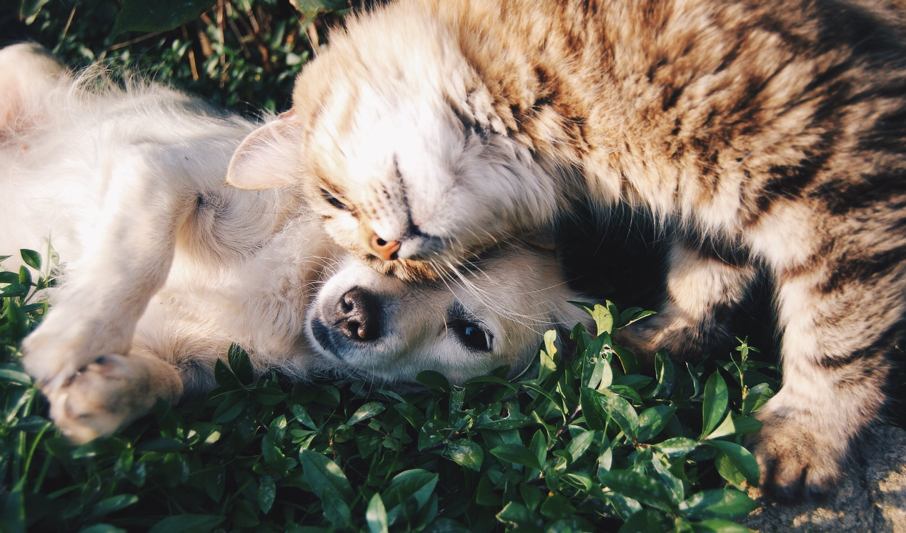

# Transfer Learning

<!--
One of the major downsides of non-parametric approaches (and many of the algorithms we have learned are non-parametric; that
is, they only rely on the data, not on any underlying assumptions about the data) is that we often need a ton of data for the
model to start making sense. Since these models rely purely on historical data for predictions, we need to train a model to
learn from scratch.

-->

---

# Cat Or Dog?

<!--
In a previous lesson, we trained an artificial neural network to tell the difference between a cat and a dog. The model (like
a human) learned from scratch what different types of cat and dog look like, and used historical data to make predictions.

This model is equivalent to a baby learning what a cat and dog look like just by seeing a ton of cats and dogs and being told
which photo is a cat and which is a dog.

But that's not really how humans learn, is it?

Image Details:
* [cat_dog.jpeg](https://www.pexels.com/photo/orange-tabby-cat-beside-fawn-short-coated-puppy-46024/): Pexels License

-->

---

# Transferring Knowledge

<!--
In reality, humans learn a different way. We are told what cats and dogs look like through various media. We learn what
sounds they make, what they look like from books and movies. The knowledge is "transferred" from others to our own brain.
We learn, for example, that:

- Cats go "meow" while dogs go "woof"
- Cats and dogs have different-looking noses and ears
- Cat claws tend to be sharper than dog claws
- Lots more

Therefore, when we do eventually have to see cats and dogs in real life, we are well prepared to know which is which. We don't
need to see thousands of them to know the difference; usually just a few will do, since we already know so much about them.

Image Details:
* [learning.jpeg](https://www.pexels.com/photo/girls-on-desk-looking-at-notebook-159823/): Pexels License

-->

---

# Transfer Learning Models

<!--
Transfer learning works the same way. We take a model that we have already trained and "plug it in" to our new model. For
example, we may have a model that knows how to tell the difference between a bunch of animals. This may not have a very high
accuracy when the sample contains only cats and dogs, but we can use what we know in the pre-existing model, train it on just a
few new cat vs dog data points, and have a great model to tell the difference between cats and dogs.

Image Details:
* [usb.jpeg](https://www.pexels.com/photo/person-inserting-usb-cable-on-usb-port-3531858/): Pexels License

-->

---

# Your Turn!

<!--
Direct students to the colab, where they will use transfer learning to build a model to tell the difference between cats and
dogs.

-->
