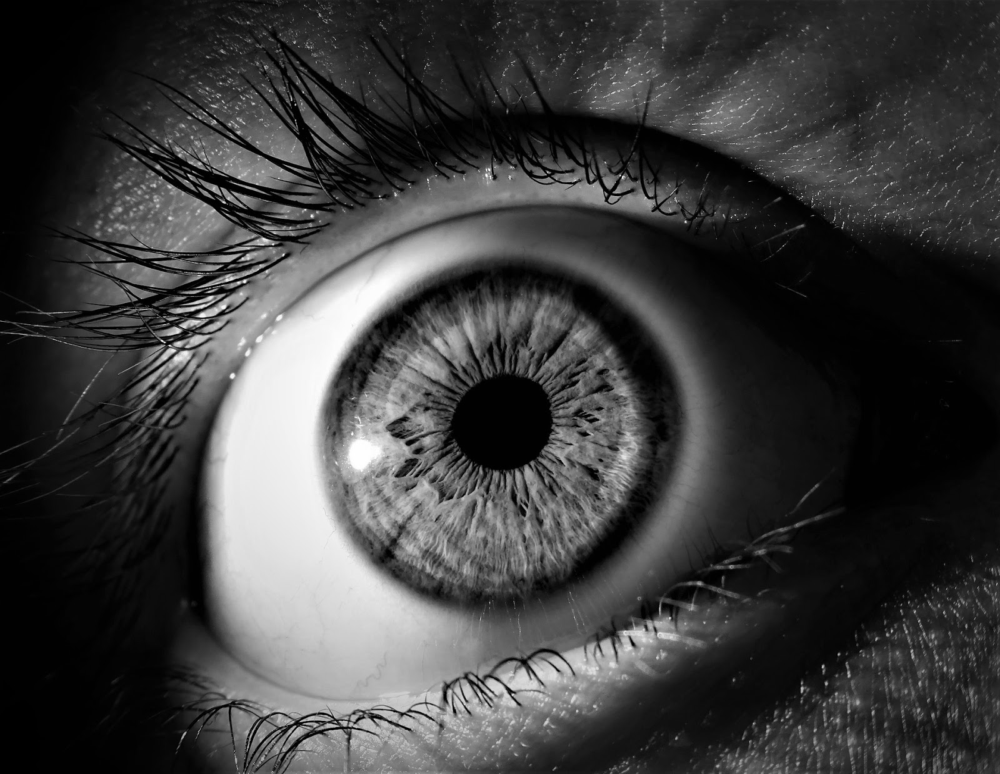
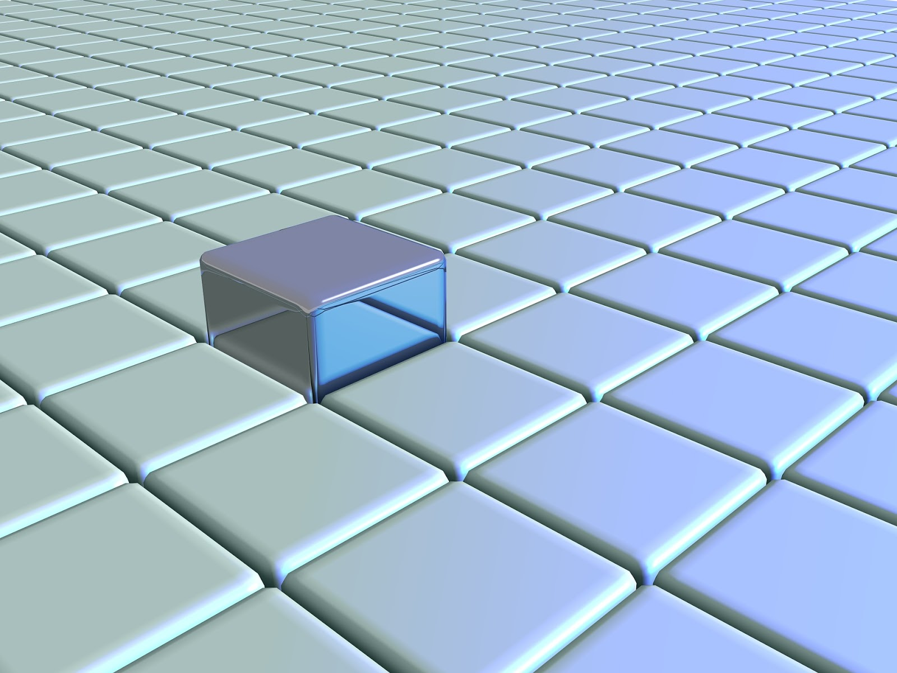
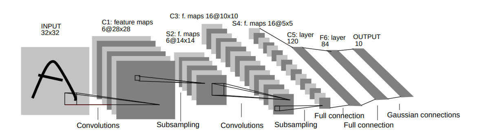

# Convolutional Neural Networks

---

<!--
Biological science from the 80s

Image Details:
* [conNN01.png](https://pixabay.com/illustrations/wallpapper-music-colors-80-s-778185/): Pixabay License
-->

---

<!--
Visual cortex; small receptive field; overlap; react to different line orientations; can stack

Image Details:
* [conNN02.jpg](https://pixabay.com/photos/eye-iris-pupil-vision-eyeball-3221498/): Pixabay License
-->

---

<!--
Small receptive field

Image Details:
* [conNN03.jpg](https://pixabay.com/illustrations/grid-block-cube-square-design-684983/): Pixabay License
-->

---

<!--
Overlap

Image Details:
* [conNN04.png](https://pixabay.com/vectors/circles-colors-primary-red-blue-27975/): Pixabay License
-->

---

<!--
Stack

Image Details:
* [conNN05.jpg](https://pixabay.com/photos/pancake-crepes-eat-food-crepe-640869/): Pixabay License
-->

---

<!--
Lines

Image Details:
* [conNN06.jpg](https://pixabay.com/photos/industry-strommast-power-line-pylon-3112436/): Pixabay License
-->

---

# LeNet-5

<!--
LeNet

Image Details:
* [conNN07.png](http://yann.lecun.com/exdb/publis/pdf/lecun-01a.pdf): Unlicensed
-->

---

<!--
Convolutional Layers

Image Details:
* [conNN08.png](http://yann.lecun.com/exdb/publis/pdf/lecun-01a.pdf): Unlicensed
-->

---

<!--
Image Details:
* [conNN09.png](http://yann.lecun.com/exdb/publis/pdf/lecun-01a.pdf): Unlicensed
-->
---

<!--
Feature Maps

Image Details:
* [conNN10.png](http://yann.lecun.com/exdb/publis/pdf/lecun-01a.pdf): Unlicensed
-->

---

<!--
Pooling

Image Details:
* [conNN11.png](http://yann.lecun.com/exdb/publis/pdf/lecun-01a.pdf): Unlicensed
-->

---

# GoogLe-Net

<!--
GoogLe-Net
http://yann.lecun.com/exdb/publis/pdf/lecun-01a.pdf

Image Details:
* [conNN12.png](http://yann.lecun.com/exdb/publis/pdf/lecun-01a.pdf): Unlicensed
-->

---

# Why?

<!--
Too many connections on large images
Recognize shapes anywhere in an image
-->
