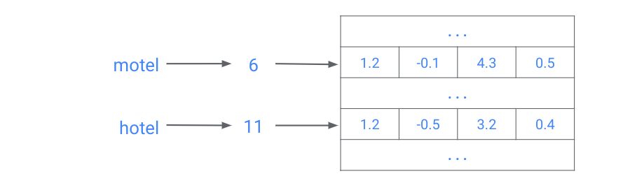
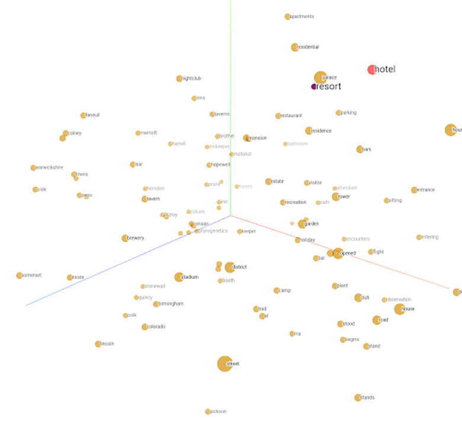

<style>
img[alt~="center"] {
  display: block;
  margin: 0 auto;
}
</style>

# Embeddings

---

# One-hot encodings


<!--
Suppose we’re working with input data with a large number of possible categories, such as words. Our machine learning models can’t work directly on words; they need to take a vector of numbers as input. Traditionally we could do this using a “one-hot encoding” (as shown). 

The dimension of the vectors is the number of possible items. In this case that's words. Each column in the vector corresponds to a different word. In this example the sixth position in a vector corresponds to the word "motel," so "motel" is encoded as a vector with five leading 0's, a 1 in the 6th position and 0's everywhere after. Similarly, the 11th position corresponds to the word "hotel." 

But hotel and motel are very similar words. They are spelled similarly AND they have similar meaning. When thinking about the vector encodings of these two words, it seems natural to expect that they will be close together in space. 

This has two main problems:
1) Similar items don’t necessarily have similar encodings (“hotel in Quito” may not lead to similar search results as “motel in Quito”).
2) We may need huge vectors to encode all possible items.

Image Details:
* [embeddings01.png](http://www.google.com): Unlicensed 
-->

---

# Embeddings

* Efficient, dense representation
* Similar items have similar encodings


<!--
Instead of restricting ourselves to 0's and 1's, we can fill the vectors with real numbers. This will give us more flexibility, and will allow similar words to have similar encodings. 

The embedding dimension is a hyperparameter that is specified by the user. Embeddings can be used for dimensionality reduction. In particular, if we specify an embedding dimension that is lower than the total number of items (i.e., words) in your dataset, then we have reduced the total dimension of our dataset. 

In this simple example, "hotel" and "motel" are words coming from a dataset containing 15 total words. When we did a simple one-hot encoding, our encodings for "hotel" and "motel" were each 1x15 vectors. That means they come from a 15-dimensional vector space. Now, after using an embedding, we see that we have four dimensional encodings for both "hotel" and "motel."

Higher dimension = more descriptive, but the model takes more data and more time to learn.

Image Details:
* [embeddings02.png](http://www.google.com): Unlicensed 
-->

---

# Using embeddings

```python
import tensorflow as tf
from tensorflow import keras

embedding_layer = keras.layers.Embedding(15, 4)
```

<!--
The first number, 15, is the number of possible items.
The second number, 4, is your chosen embedding size.

Instead of manually specifying embedding values, we can train them. (They are treated similarly to weights learned by the model during training.)

No separate training process is needed; they are treated as another hidden layer.

-->

---

# Using embeddings

```python
import tensorflow as tf
from tensorflow import keras

embedding_layer = keras.layers.Embedding(15, 4)
```



<!--
Similar to a Python dictionary or hash table, the embedding layer acts as a “lookup table” where each item has a unique index that is used to look up its corresponding embedding. This particular table has 15 rows, corresponding to unique items, and 4 columns, one for each embedding dimension. You’ll investigate this more in the colab.

Image Details:
* [embeddings04.png](http://www.google.com): Unlicensed
-->

---



<!--
One of the big advantages of embeddings is that they can meaningfully represent items and relationships between items in a way we can easily visualize. Here we can see the embeddings for “hotel” and “resort” are fairly close. Based on the dataset used to train these embeddings, this means these two words are used in similar contexts.

Image Details:
* [embeddings05.png](http://www.google.com): Unlicensed
-->

---

# Embeddings in practice

* You can either train your own or use pre-trained embeddings
* Not just words! You can embed:
  * entire books
  * medical labels
  * images
  * any discrete data

---
  
# Your Turn
  
<!--
Let’s work on the Embeddings colab, where we can apply these skills to:
* Training your own embeddings
* Visualizing your trained embeddings
-->
