# K Nearest Neighbors

<!--
So far we have learned about:
* Regression (straight-line)
* Polynomial Regression
* Classification
* scikit-learn
* TensorFlow
...and many more concepts and tools used in machine learning.

In this unit we are going to combine the concepts about classification that we recently learned and apply them using the scikit-learn toolkit.
-->

---

K Nearest Neighbors (KNN)

One of the simplest **supervised** machine learning algorithms used mostly for classification. 

---

K Nearest Neighbors (KNN)

One of the simplest **supervised** machine learning algorithms used mostly for classification. 

[Note: We can also use KNN for regression (example in Colab).]

---

Example: classify as red or white wine {.big} 

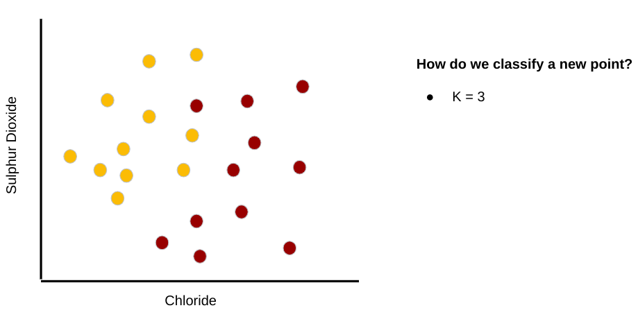

---

Example: classify as red or white wine {.big} 

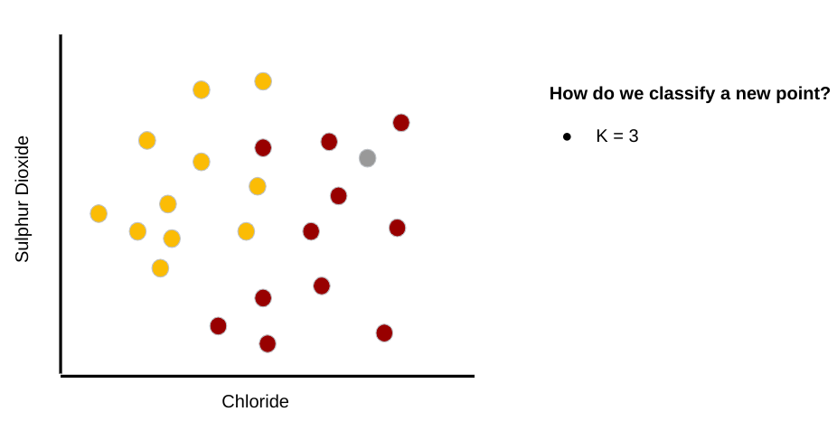

---

Example: classify as red or white wine {.big} 

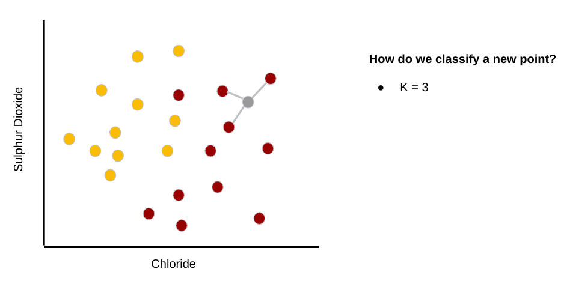

---

Example: classify as red or white wine {.big} 

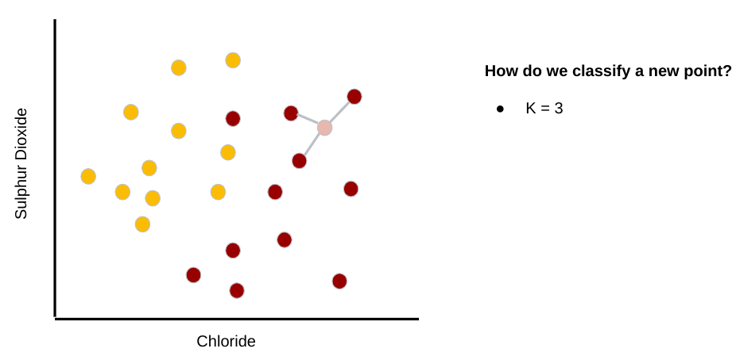

---

Example: classify as red or white wine {.big} 

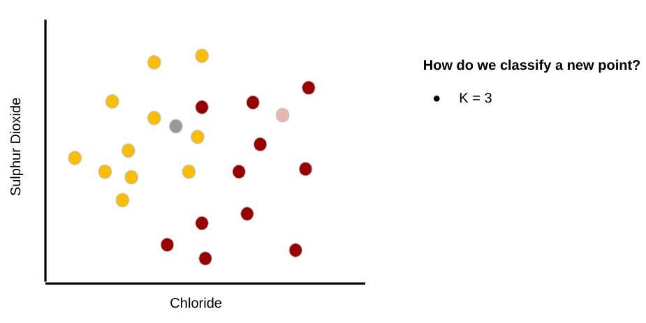

---

Example: classify as red or white wine {.big} 

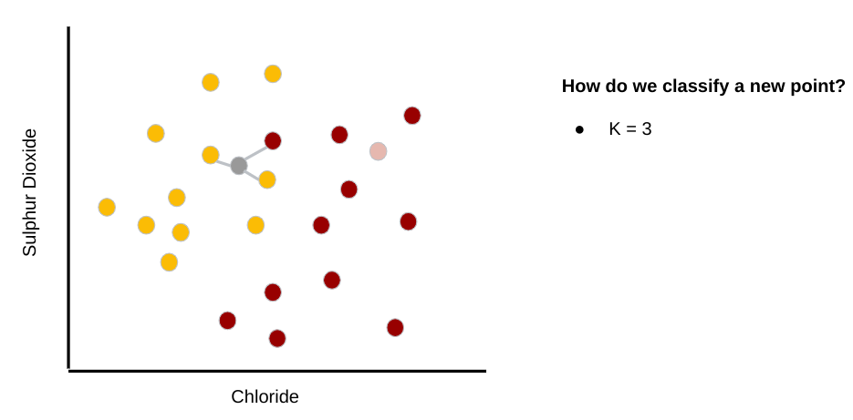

---

Example: classify as red or white wine {.big} 

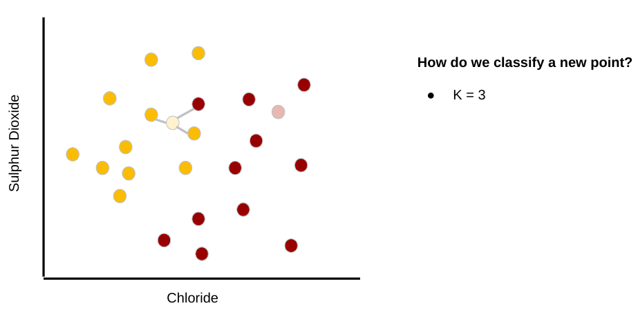

---

Example: classify as red or white wine {.big} 

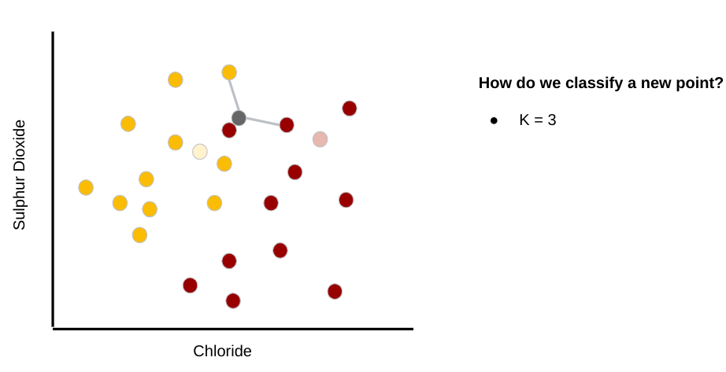

---

Example: classify as red or white wine {.big} 

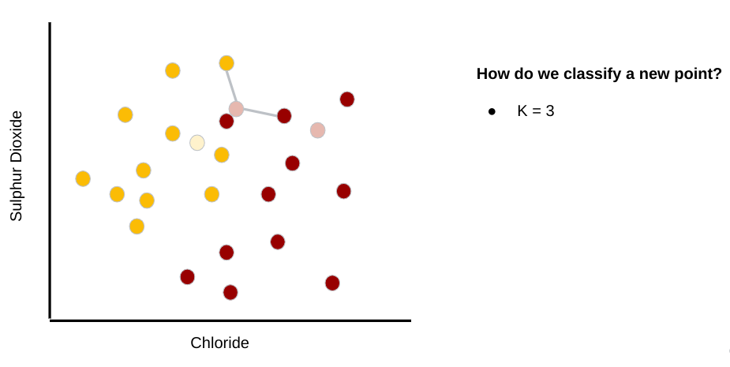

---

Example: classify as red or white wine {.big} 

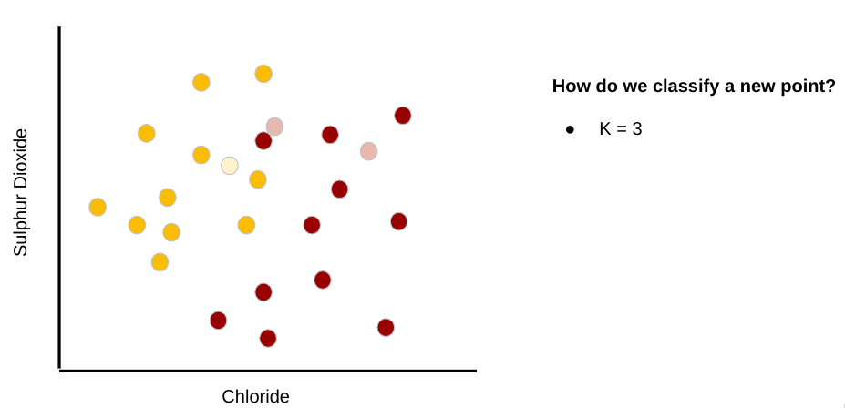

---

Example: classify as red or white wine {.big} 

---

Example: classify as red or white wine {.big} 

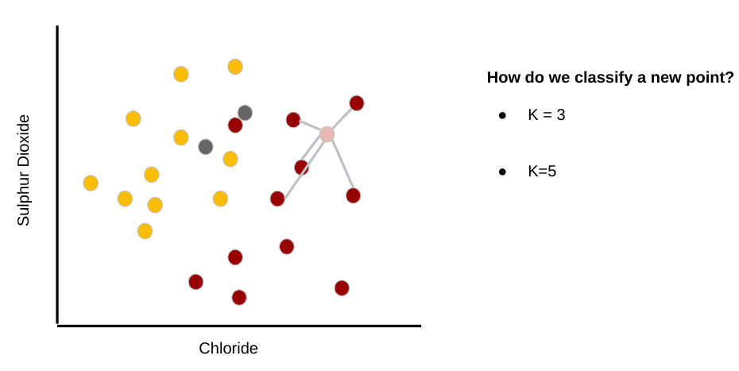

---

Example: classify as red or white wine {.big} 

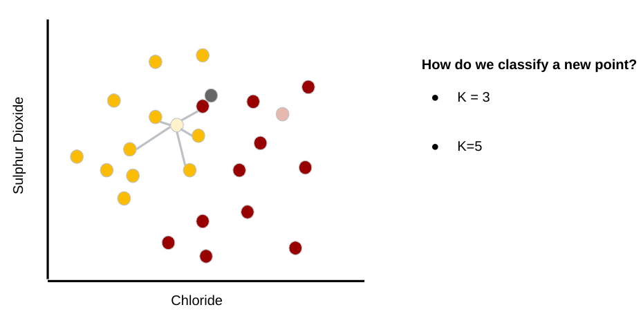

---

Example: classify as red or white wine {.big} 

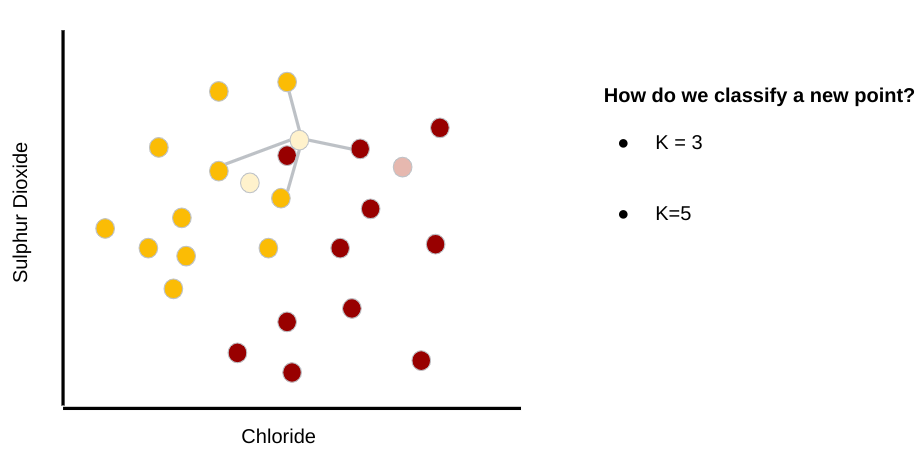

---

Example: classify as red or white wine {.big} 

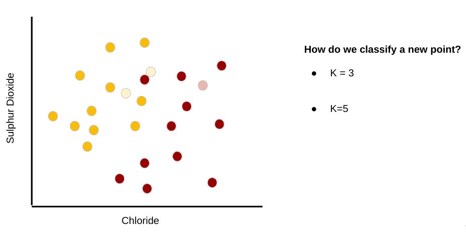

---

# How do we choose K?

* Small K -- > noise has a higher influence
* Large K -- > computationally expensive

---

# How do we choose K?

* Small K -- > noise has a higher influence
* Large K -- > computationally expensive

**SOME OPTIONS**:
* Let K = sqrt(m) (where m is the sample size)
* Try K=1, 2, 3, 4, 5, …. with multi training/testing compare F1, accuracy, etc.
* Try different K and use cross-validation (Colab to come!)
* Use a clustering algorithm (Colabs to come!)
* And more!

---

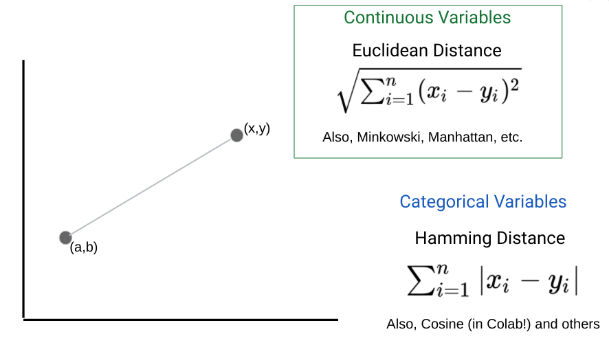

---

# When to use KNN?

KNN is a “lazy learner” algorithm - it doesn’t learn a discriminative function from the training set (no generalization until query is made).

Use when:
* Dataset is relatively small 
* Dataset is relatively noise-free

---

# Overfitting

**QUESTION**:

How might you run the risk of overfitting with KNN?

---

# Overfitting

---

# Drawing decision boundary

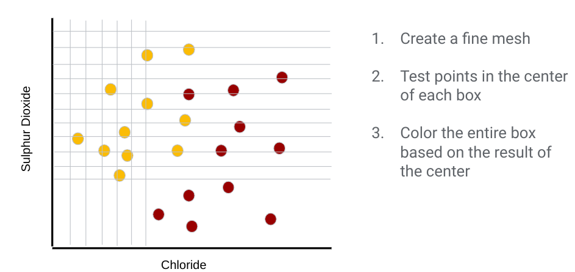
