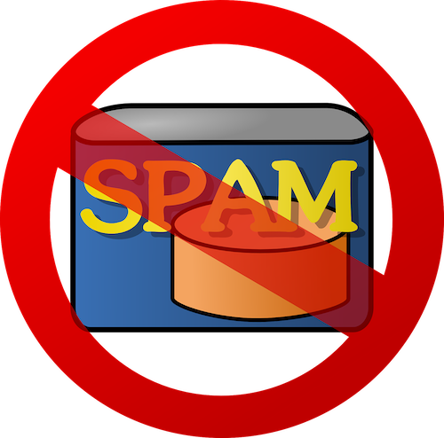

# Naive Bayes

<!--
This unit is about an algorithm called "Naive Bayes". It is one of the most popular classifier algorithms, especially for spam
detection and filtering.

-->

---

# Spam Detection

<!--
One of the most common uses of Naive Bayes is in spam detection. It is one of the simplest algorithms to use for detecting
"spammy" language in a block of text (for example, an email).

Image Details:
* [no_spam.png](https://pixabay.com/vectors/email-mail-spam-message-e-mail-29853/): Pixabay License

-->

---

# Bayes' Theorem

Given two events $A$ and $B$:

> $$ P(A|B) = \frac{P(B|A) P(A)}{P(B)} $$

<!--
Don't need to go too into detail on Bayes Theorem. Just know that it is based on conditional probability of one event given
another, and it is the basis of the Naive Bayes algorithm, as well as the entire field of Bayesian Statistics!

Bayes' Theorem allows us to calculate the probability of one event (A) given another event (B), if we know the probability of
the reverse conditionality, B given A.

-->

## Why "Naive"?

- Bayes' Theorem assumes events are independent
- This assumption works pretty well for Naive Bayes

<!--
The "naive" assumption can actually be extended from independence to low multicollinearity, or "almost" independence. This is
never actually true, and can be cause for error. Naive Bayes does not perform well for more complex tasks; NLP is usually a
better choice. But for spam detection, Naive Bayes works well.

-->

---

## The Naive Bayes Classifier

<!--
The Naive Bayes classifier is one of the simplest but most effective classifiers.

The classifier calculates the conditional probability of seeing all of the options, given the data, and just chooses the option
with the highest probability.

Image Details:
[sorting_eggs.jpeg](https://unsplash.com/photos/BiZ-_6kNjbI): Unsplash License

-->

## The Naive Bayes Spam Filterer

> $$ P(spam|word) = \frac{P(word|spam) P(spam)}{P(word|spam)P(spam) + P(word|ham)P(ham)} $$

<!--
Walk students through this formula.

- "spam" is the event a given email is spam. $P(spam)$ is usually set as a threshold, e.g. 5% of all emails are spam.
- "word" is the event of seeing a given word. $P(word|spam)$ and $P(word|ham)$ are usually set by the user. For example,
"GIVEAWAY" is likely to be a spammy word. These can also be set using historical data.
- "ham" is the event a given email is not spam. $P(ham)$ is $1 - P(spam)$.

-->

---

## Your Turn!

<!--
Direct students to the colab.

-->
