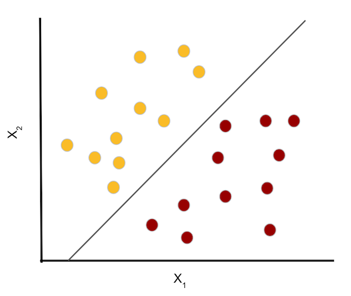

# Support Vector Machines
<!--
Support vector machines (SVM) can be used for both classification and regression tasks, but classification is far more common. In this lecture, we will focus on using SVM for classification. The lab also focuses mainly on classification, but does include a regression example. 
-->

---

# Linear Classification 
## Hyperplane 
In p-dimensional space, a hyperplane is a plane of p-1 dimensions. 

* In two dimensions, a hyperplane is a line. 
* In three dimensions, a hyperplane is a typical plane (2-dimensional).

## Goal - use a hyperplane to separate data. 
<!--

-->

---

# Hyperplane Decision Boundary 

<!--
Here we have two classes of observations. Class 1 is shown in yellow, and class 2 is shown in red. They are linearly separated by the hyperplane (line) X_{2} - m*X_[1} - b = 0

-->

---

---

<!--
Image Details:
* [supvecmac01.png](http://www.oreilly.com): Unlicensed
-->
---

<!--
Image Details:
* [supvecmac02.png](http://www.oreilly.com): Unlicensed
-->
---

# Soft vs. Hard Margin

<!--
Image Details:
* [supvecmac03.png](http://www.oreilly.com): Unlicensed
-->
---

# C Hyperparameter

<!--
Smaller values allow more data in the highway and create wider highways.

Image Details:
* [supvecmac04.png](http://www.oreilly.com): Unlicensed
-->

---

# Regression

<!--
The support vectors are the distances between the data points and the margin.

Image Details:
* [supvecmac05.png](http://www.oreilly.com): Unlicensed
-->

---

# Kernal Trick

[Kernal Trick](https://www.youtube.com/watch?time_continue=2&v=3liCbRZPrZA&feature=emb_logo)

<!--When Linear SVM won’t work, the kernel trick finds a hyperplane boundary in a higher dimension, for low computational power.

Source: https://www.youtube.com/watch?time_continue=2&v=3liCbRZPrZA&feature=emb_logo
-->
