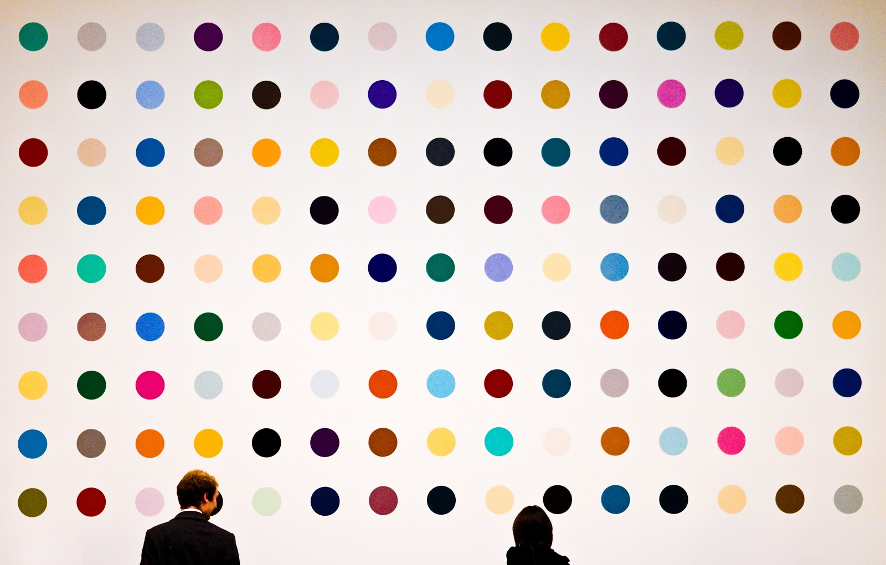

# Final Project Ideation

<!--
Now that we've gone over the goals, expectations, timeline, and deliverables for our capstone project, let's brainstorm what topics or questions we may want to explore as the focus of the project.
-->

---

# Brainstorming

1.  Defer judgment
1.  Encourage wild ideas
1.  Build on the ideas of others
1.  Stay focused on the topic
1.  One idea and one conversation at a time
1.  Be visual
1.  Go for quantity

<!--
We’ll do two rounds of brainstorming. The first is very general, capturing as many ideas as possible. The second will be more specific, helping us narrow in on our exact idea.

First, I'd like for us all to agree on some norms for this exercise:
* Brainstorming should be completely judgement free.
* Crazy ideas are more than welcome! Even if it's infeasible they'd get accomplished in the next few weeks, they may inspire another great and more realistic idea.
* Each idea gets its own post-it note. We want to ensure every idea gets its fair shake.
* Let's have one conversation and share one idea at a time, so that people don't get spoken over or have their ideas minimized.
* Feel free to make your ideas visual, with a drawing instead of text. 

Can you think of any other norms we should all agree upon before diving in?

*Pass out markers and post-it notes. Set a timer for three minutes* 

Take the next three minutes to write down as many ideas as possible about what could be an idea for your capstone project. Go!

Image Details:
* [projectideation01.jpg](https://pixabay.com/photos/thought-idea-innovation-imagination-2123970/): Pixabay License
-->

---

# Group Ideas by Theme

<!--
Now we'll share out our ideas and, once everyone has shared, start to group the ideas together by theme.

*Ask students to come up and share their ideas, one by one, sticking their post-it notes on the whiteboard. Make sure there’s a large, clean area devoted to this activity. If your classroom is very large, you may consider asking all students to get up and gather around the whiteboard, so it’s easier to hear each other and so it’s more dynamic. Make sure to enforce the “one conversation at a time" rule so students feel heard. Anyone can start, and others should jump in and share similar ideas or build on the ideas of one another. As they share out, ask them to start roughly clustering similar ideas, if possible. 

*After everyone shares their ideas, give them five minutes to group the ideas by theme. Encourage them to create or revise clusters and use markers to identify each cluster.

Image Details:
* [projectideation02.jpg](https://unsplash.com/photos/bjemWZcNF34): Unsplash License
-->

---

# Narrow Your Problem and Brainstorm Again

## How Might We...?

<!--
Now it’s time to narrow down a problem and brainstorm the idea that they are going to pitch.
Each student should pick a theme or idea from the previous step and frame it as a “how might we” problem.
For example, suppose one of the ideas was “identify skin cancer,” which was grouped in the “healthcare” cluster. One might frame this problem as “How might we use machine learning to identify photos of skin cancer?” or yet “How might we make it easier for people to detect skin cancer early?”
This can then eventually become the idea for a mobile app that allows you to take pictures or moles or skin tags, and get a confidence interval of how likely that is to be skin cancer (All About Moles was one of the capstone projects for the pilot at Mills College)

Everyone should have the problem statement written down on a post-it note in front of them (one for each student, as this portion is also individual).
Then, set the timer for another 3 minutes and ask them to come up with ideas to solve that problem. It’s important to stay focused on the problem that they wrote down.

They will use these ideas to create a pitch. The best ideas will be selected and we will only form groups at the very end.

Next step: pitch your idea.

-->

---

# Pitch

The **WHO**
* Always start by introducing yourself.

The **WHAT**
* Describe your idea in one sentence.
* Tell people what makes your idea stand out, not in what way it’s similar to other things.
* Example: “Ridiculous Fishing is a game about fishing with machine guns.”

The **WHY**
* What’s the value proposition of your idea?

<!--
First, go over how to create a pitch. They will have 2 minutes to convey their idea and convince others of how awesome it is. A pitch must have:

Who: In one or 2 sentences, say who you are with a focus on what makes you qualified to lead the project that you’re proposing. More than that, you want to describe yourself in a way that the person will remember why you’re the most qualified person to make this happen.
What: This is the meat of the pitch. Describe your idea in one sentence.
Why: This is all about the value proposition. What are you adding, what are users getting they wouldn’t get otherwise? How will “what you’re pitching” achieve the value proposition. What is the reason for you to be offering them this value proposition. What are your reasons? Why should I care?

Image Details:
* [projectideation04.png](https://pixabay.com/vectors/fight-fist-mic-microphone-music-1296057/): Pixabay License
-->

---

# Create Your Pitch

<!--

Distribute the self-stick flipchart paper and give them 15-20 minutes to create their pitch.
The who/what/why should be clearly stated on each paper (including the student’s name, this will be helpful during group formation).
Drawings and visual representations are always encouraged!

Image Details:
 * [projectideation05.png](https://pixabay.com/vectors/pixel-cells-idea-visualization-3976295/): Pixabay License
-->

---

# Pitch

{.background}

<!--
Leave 45-60 minutes for pitches. Each pitch is 2 minutes.
Assign a person to keep the timing.
Assign someone to put the posters up after each presentation. The posters should be clustered by themes, eg, put all posters of healthcare related ideas on 1 wall or corner, all posters with education related ideas on another, etc.

Image Details:
* [projectideation06.jpg](https://pixabay.com/photos/audio-concert-mic-microphone-music-2941753/): Pixabay License
-->

---

# Vote

{.background}

<!--
After the pitches, distribute 3 dot stickers to each person. Give them 15 minutes to go around and review the ideas, ask questions, and vote. They can use their 3 votes however they want: they can vote in 1, 2, or 3 projects, and they may or may not vote on their own project. Their vote should reflect which projects they’d like to work on.

Image Details:
* [projectideation07.jpg](https://unsplash.com/photos/11gPy_c8R8Y): Unspalsh License
-->

---

# Vote

<!--
We will form groups of 3 or 4. (make this a hard rule!)
Select the x most voted ideas and discard the posters that weren’t selected, where x is the number of groups. (Depending on the number of students, figure out how many groups of 3 or 4 you can form).

Announce the winning ideas and explain the group sizes and how many groups there needs to be. Given the constraints, let them go around the room and talk to their peers to form groups. Once a group is formed, write down their names and project, and give them the rest of the time to brainstorm and organize.

Image Details:
* [projectideation08.jpg](https://pixabay.com/photos/team-teamwork-together-strategy-3393037/): Pixabay License
-->
