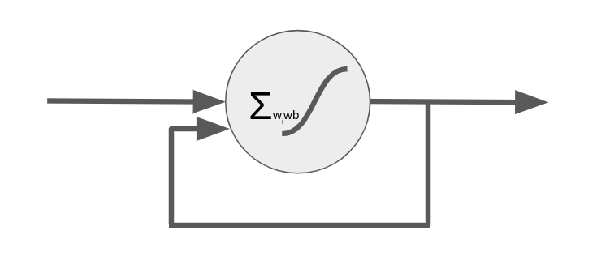
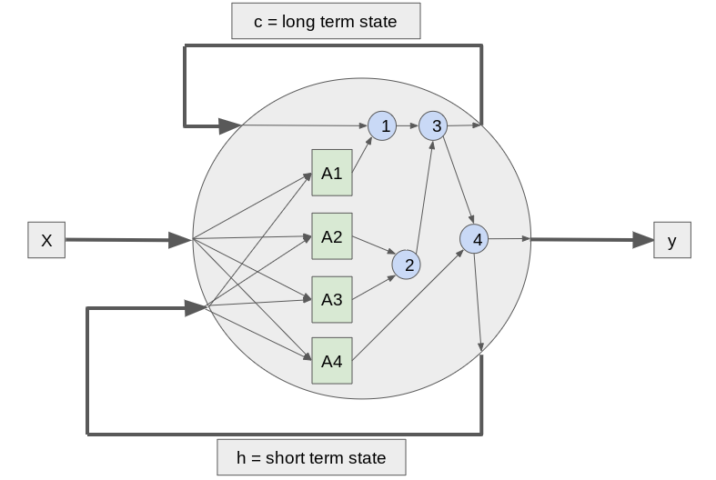

---

marp: true

---

# Recurrent Neural Networks (RNNs)

<!--
We have encountered numerous deep neural networks throughout this course. In previous tracks training data flowed through the network (feedfoward) and then adjustments were made to the weights in the network from the last layer through the first (backpropigation).

We've used dense layers, dropout layers, convolutional layers, and pooling layers, just to name a few. In this unit we will learn about recurrent neural networks, which are not strictly feed forward networks.
-->

---

# Feedforward Neuron

<!--
Here we see a typical feedforward neuron. Depending on the size of the layers before and after, one or more weights feeds into the neuron. These are multiplied by the bias, summed, and then passed through an activation function. The resultant value is then passed to the nodes in the next layer of the network.

Image Details:
* [ff_neuron.png](https://www.google.com): Copyright Google
-->

---

# Recurrent Neuron

<!--
Here is a recurrent neuron. You can see that the recurrent neuron looks a lot like a feedforward neuron except that it also feeds its output back into its inputs.

Imagine that you had a fully connected layer 10 nodes wide before this neuron. In a typical feedforward fully connected network we would expect 10 inputs, 1 for each of the nodes in the previous layer. In this case we actually will have 11 inputs: 1 for each of the nodes in the previous layer and the output of the node itself.

What does this do? This gives the neuron memory over time. It allows you to pass a series of data points into the network over time.

Image Details:
* [r_neuron.png](https://www.google.com): Copyright Google
-->

---

# Recurrent Neuron Over Time

<!--
This is what it would look like to "unroll" the flow of data through a recurrent neuron over time. You can see that it typically starts out with a seeded input value of zero for it's backfeed. At each point in the series the neuron both passes data to the next layer of neurons and passes data forward in time to itself the next time it fires.

Also note that we are looking at a single neuron in a layer with one input and one ouput. In reality you'll have wide layers so imagine multiple recurrent nodes side-by-side, each with multiple inputs and outputs.

Image Details:
* [unrolled.png](https://www.google.com): Copyright Google
-->

---

# Long Short Term Memory Neuron

<!--
With a typically recurrent neural network the network tends to have a very short memory. As the sequences passing through the network get longer, the network forgets what it first saw. There have been a few stratigies to get around this, one of which is the "long short term memory", LSTM, neuron.

In this slide you can see a very simplified LSTM cell. If you look at the horizontal center you can see the standard neuron: X-in, y-out. However, instead of having a single feedback like a standard recurrent neuron, this neuron passes two weights back to itself. One represents long-term member and the other short term.

You can see that the short term state gets mixed with the weights ina set of activition functions labelled A1 through A4. The outputs of these functions, as well as the long term state then get passed through a series of gates that utilmately lean to the output of a new y, c, and h value.

The gates in order are:

1. The forget gate
2. The input gate
3. Addition of the forget and input gate
4. The output gate

LSTM cells often are higher performing and faster training than standard recurrent cells.

Image Details:
* [lstm_neuron.png](https://www.google.com): Copyright Google
-->

---

# Other RNN Neurons

* Gated Recurrent Unit Neuron (GRU)
* Convolutional Neurons

<!--
The LSTM cell is pretty complex. There is an alternative called the "Gated Recurrent Unit", GRU, neuron. The GRU has a single feedback channel that manages both short and long term state.

Another type of neuron that performs very well for sequence tasks alongside, or in place of, LSTM and GRU neurons are convolutional neurons. We'll see a convolutional neuron in action in our lab.
-->

---

# Your Turn

<!--
In the lab you'll use a recurrent neural network to predict a sequence of vibration readings from an engine. You'll learn how to apply TensorFlow Keras to easily build, test, and tune your model.
-->