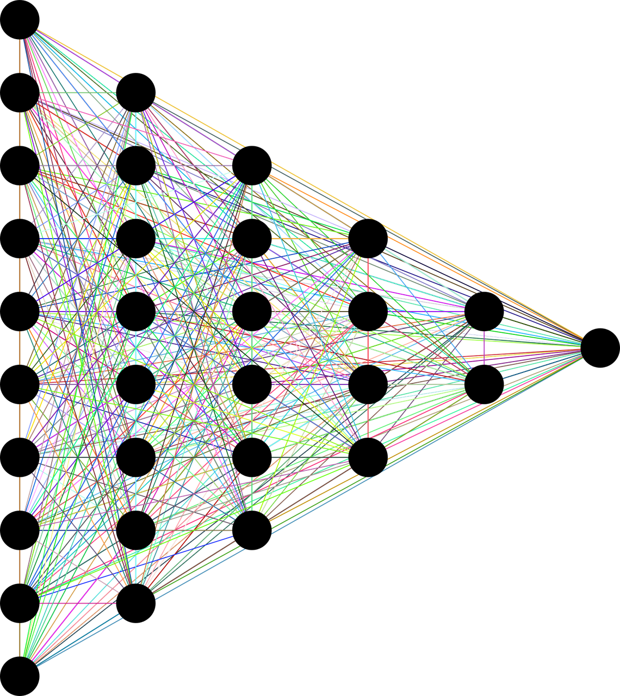

# Deep Neural Networks (DNNs)

<!--
This lesson goes into an example on "Deep Neural Networks" or DNNs. DNNs are a very popular machine learning tool these days,
and are constantly being made better and better by newer implementations and newer algorithms.

Students have already seen forms of neural networks (e.g. convolutional NNs) in this class so far. Artificial neural networks
are based on the premise that, just like a human brain, an algorithm can "learn".

-->

---

# Cat Or Dog?

<!--
A common application of a deep neural network is image recognition. For example, we could use a DNN to identify whether 
pictures of pets are cats or dogs.

You might think that you just "know" what a cat and dog is, based on look, feel, sound etc. But we all had to learn this for
ourselves. In a similar way, we can "train" a model to learn, the same way our brain does: with data. We all have a mental
database as to what a cat should look like, and what a dog should look like. These databases have been learned over time, based
on several cats and dogs that we have seen or heard or touched.

In the same way, we can teach a machine to be able to learn what a cat and dog look like, just based on data. We do not tell
the computer any rules, we just let it learn by itself. This is called a "non-parametric" approach, since we are not giving
the computer any parameters to use; we are just letting it learn based on data.

Image Details:
* [cat_and_dog.jpg](https://pixabay.com/photos/dog-cat-pets-animals-friends-2606759/): Pixabay License

-->

# "Deep" Learning

<!--
What makes "deep" neural networks special is that there are multiple layers between the output layer and the input layer. This
allows the algorithm to model more complex relationships better, like non-linear relationships or multi-class classification.
Moreover, the non-parametric approach makes it easier to "plug and play". You can just "plug" your data and hit "play" on a
DNN, and it can generate predictions.

Image Details:
* [neural_network.png](https://pixabay.com/vectors/neural-network-thought-mind-mental-3816319/): Pixabay License

-->

# Applications (just a few)

- Image recognition (e.g. cat or dog)
- Natural language processing, such as sentiment analysis, translation
- Recommendation systems like YouTube and online shopping
- Image/film colorization and restoration
- Bioinformatics such as "the biological passport" recognition

<!--
See [here](https://en.wikipedia.org/wiki/Deep_learning#Applications) for some inspiration.

-->

---

## Your Turn!

<!--
Direct students to the colab.

-->
