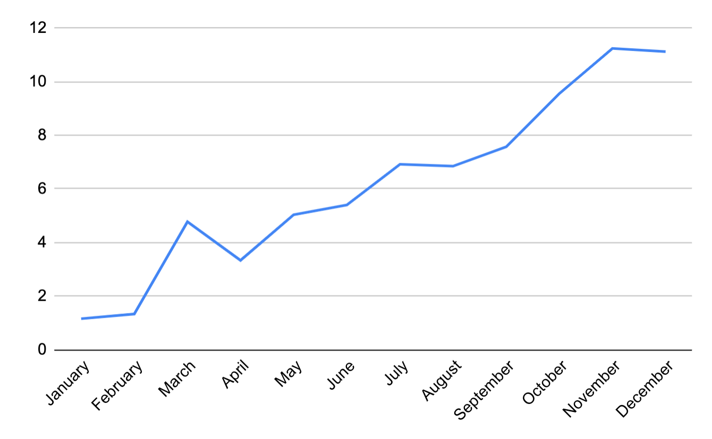
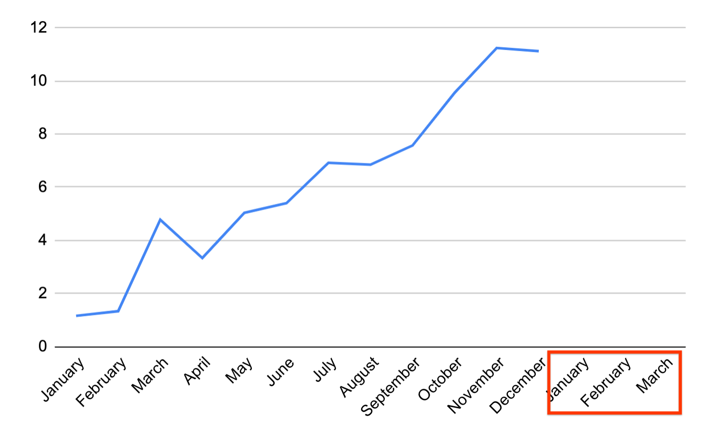
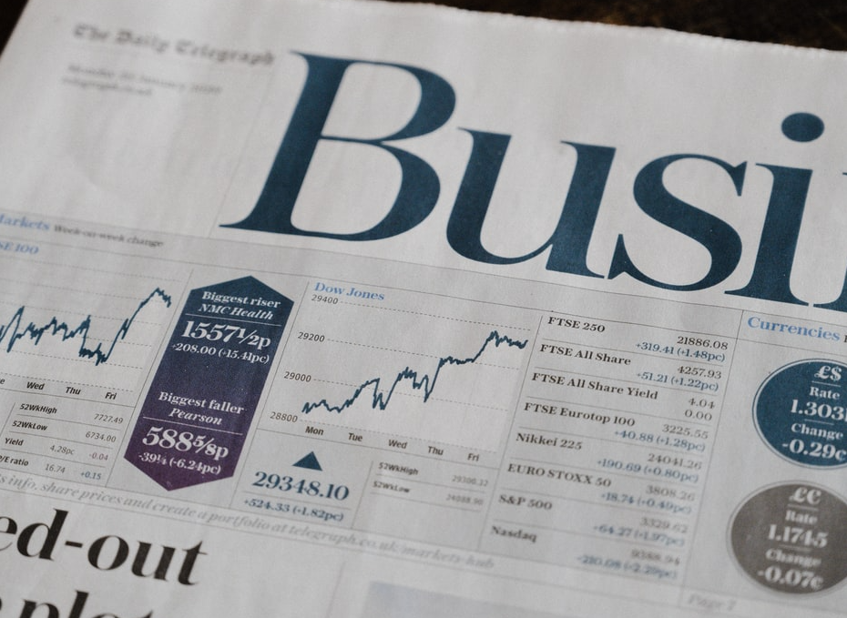
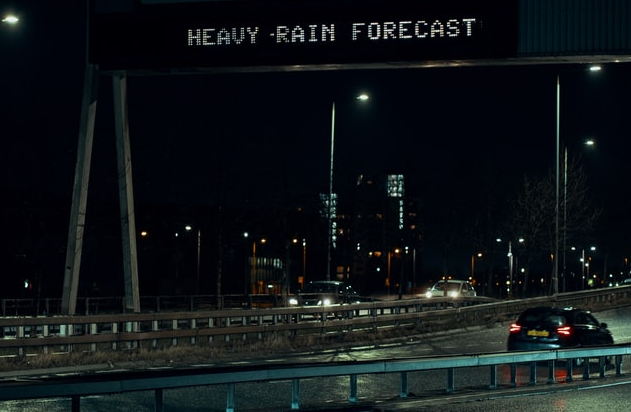

# Sequence Prediction

<!--
So far in this course, all of our predictions have assumed the data are time-independent. That is, we could shuffle around all
the data points and prediction points in time, and nothing would change.

For example, consider the model we used earlier to predict height from shoe size. The dataset we used was all the students in
the class. Now, if we shuffle around all those students, and take the data points in a different order, the model doesn't
change.

-->

---

# Time Series Data

<!--
In this class, we will look at sequence prediction. In sequence prediction, the input data is an *ordered* set of data, most
commonly a time series. A time series is a set of data where the index is a date. Since dates have an inherent ordering, time
series are ordered data.

Image Details:
* [time_series.png](http://www.google.com): Copyright Google

-->

# What does sequence prediction predict?

<!--
Sequence prediction is about predicting what happens next in a sequence. For example, if we have a years worth of data, we may
want to know what happens in Q1 of the next year.

Image Details:
* [time_series_2.png](http://www.google.com): Copyright Google

-->

# RNNs for Sequence Prediction

- Sequence prediction is traditionally done using a statistical approach
- Machine learning and RNNs specifically give us a new tool for sequence prediction that contains less assumptions

<!--
The standard approach to sequence prediction for several years was a statistical one. (No need, to go into detail but you could
mention Markov Chains or ARIMA time series forecasting. Suffice to say, these approaches often require a lot of assumptions,
such as a transition matrix of probabilities, or a normal distribution of noise.) RNNs allow the data to "speak for itself", it
is a largely non-parametric approach. The downside is that it usually needs more data to make good predictions.

-->

# Examples

<!--
Walk the students through the following examples. These are just a few examples, there are many more, so feel free to elaborate
on these and/or add some others.

-->

---

# Examples

<!--
One of the most common examples of sequence prediction is predicting stock prices. Stock prices are notoriously volatile but
also incredibly important for many people to predict. (There are entire industries based on this practice.)

Image Details:
* [stock_paper.png](https://unsplash.com/photos/IT6aov1ScW0): Unsplash License

-->

---

# Examples

<!--
Predicting the weather based on previous days of weather could also be an important application of sequence prediction. While
most meteorogical systems use a parametric approach based on input data (such as air pressure, cloud cover etc.), a sequence
prediction model can go surprisingly far.

Image Details:
* [rain_forecast.png](https://unsplash.com/photos/zNGPmIVPQf4): Unsplash License

-->

# Examples

<!--
You may want to predict the number of travellers at a train station on a given day, given the previous data of how many
travellers each day. RNNs pick up on things like varieties of seasonality (e.g. weekday vs weekend, holiday season) and noise.
However, especially for time series with seasonality, we need to have enough data. For example, if we only have data for
October and November, we won't do very well at predicting December (since it is a holiday month); we would ideally have data
for December of the previous year.

Image Details:
* [train_station.jpg](https://www.pexels.com/photo/grayscale-photography-of-people-walking-in-train-station-735795/): Pexels License

-->

---

# Your Turn!

<!--
Direct students to the colab, where they will apply an RNN to predict a stock price.

-->
