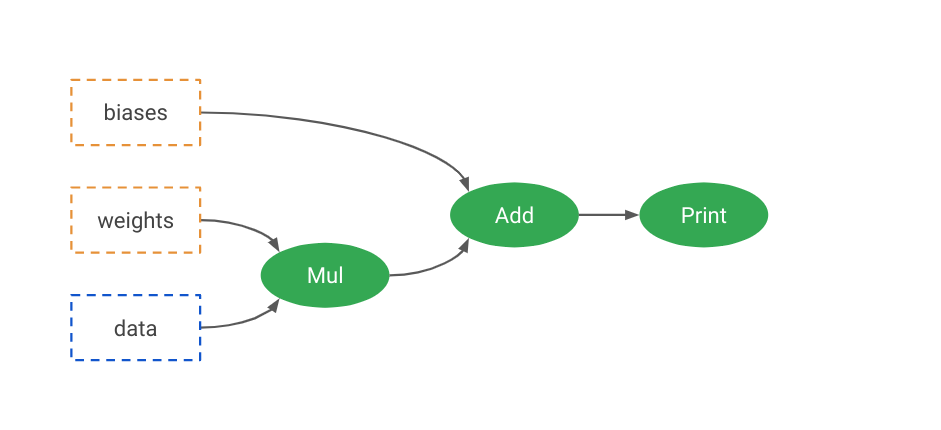
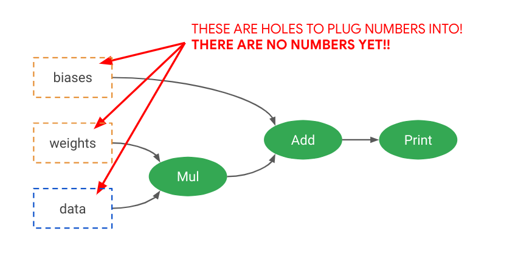
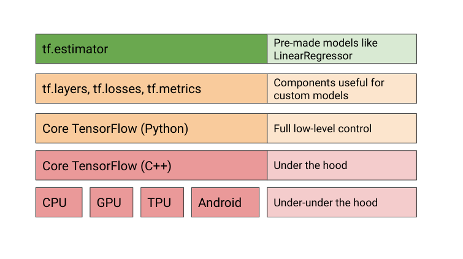

# Intro to TensorFlow

---

# High-level overview

* TensorFlow is an open-source, high-performance Python library for number crunchin’
  * ….like Pandas and Numpy?
* Specifically designed with ML in mind!
  * Differentiates between numbers that are trained, constant, and fed in from a dataset
  * Distributes work across how ever many machines you have
  * Can use specialized hardware under the hood (like GPUs and TPUs)
  * Good at running in both fancy-super-computer and constrained-resource environments
  * Allows us to train in the datacenter and predict on the smartphone

---

# The catch: programming with it is weird

---

# A tensor is an N-dimensional array of data

<!--
So where does the name TensorFlow come from?

In math, a simple number like 3 or 5 is called a scalar.
A vector is a one-dimensional array of numbers.
In physics, a vector is something with magnitude and direction.
But in Computer Science, you use vector to mean 1D arrays.

A two-dimensional array is a matrix. A three-dimensional array? We just call it a 3D tensor. So scalar, vector, matrix, 3D Tensor, 4D Tensor, etc.

A tensor is an n-dimensional array of data. So, your data in TensorFlow are tensors. They flow through the graph. Hence, TensorFlow.

Image Details:
* [res/introtensorflow1.png](http://www.oreilly.com): Unlicensed
-->

---
# TensorFlow describes the ML algorithm as a graph

<!--
Image Details:
* [res/introtensorflow2.png](http://www.oreilly.com): Unlicensed
-->
---

# TensorFlow describes the ML algorithm as a graph

<!--
Image Details:
* [res/introtensorflow3.png](http://www.oreilly.com): Unlicensed
-->
---

# TensorFlow describes the ML algorithm as a graph

<!--
Image Details:
* [res/introtensorflow4.png](http://www.oreilly.com): Unlicensed
-->
---

# Lazy execution

* Python code using TensorFlow generally separates into two phases:
  * Create the TensorFlow graph
  * Connect our data to the start of the graph and let it flow through

* This is called lazy execution
  * Because the code that creates the graph isn’t doing any number crunching itself
  * Only after the graph is built and connected to data does any computation get done

---

<!--
Source: https://www.youtube.com/watch?v=lQvcoOzmLqs

Image Details:
* [res/introtensorflow5.png](http://www.oreilly.com): Unlicensed
-->

---

Example {.big}

<!--
Code block:

import tensorflow as tf

x = tf.placeholder(tf.float32, shape=3)
y = tf.placeholder(tf.float32, shape=3)
z = tf.add(x, y)

sess = tf.Session()
result = sess.run(z, {x:[3,5,7], y:[1,2,3]})
sess.close()

print(result)

Image Details:
* [res/introtensorflow6.png](http://www.oreilly.com): Unlicensed
-->

---

# Placeholders vs. Variables vs. Constants

<!--
Image Details:
* [res/introtensorflow7.png](http://www.oreilly.com): Unlicensed
-->
---

# TensorFlow is separated into abstraction layers

<!--
Image Details:
* [res/introtensorflow8.png](http://www.oreilly.com): Unlicensed
-->
---

<!--
Image Details:
* [res/introtensorflow8a.png](http://www.oreilly.com): Unlicensed
-->
---

<!--
Image Details:
* [res/introtensorflow9.png](http://www.oreilly.com): Unlicensed
-->
---

# Pre-made estimators that can all be dropped into a TensorFlow graph interchangably!

# Pick an estimator, train, predict

<!--
Here is a summary of the Estimator API so far.
You used Feature columns to get our data into a shape our model can understand.
You instantiated a LinearRegressor based on these columns.
You called train to train the model for 100 steps. Training data is provided through a data input function.
You called predict to get predictions and the data for that was again provided through a data input function. You will get to those in more detail later in this course.
-->
<!--
Image Details:
* [res/introtensorflow10.png](http://www.oreilly.com): Unlicensed
* [res/introtensorflow11.png](http://www.oreilly.com): Unlicensed
-->

---

# Feature columns tell the model what inputs to expect

<!--
Image Details:
* [res/introtensorflow12.png](http://www.oreilly.com): Unlicensed
-->
---

# Training: feed in training input data and train

<!--
Image Details:
* [res/introtensorflow13.png](http://www.oreilly.com): Unlicensed
-->
---

# Predictions: Once trained, the model can be used for prediction

<!--
Once trained, the model can be used for predictions. You will need an input function that provides data for the prediction, here a 1500 sqf house and an 1800 sqf apartment. The predict function in the Estimator API returns a Python generator which you can use to iterate through the predictions.

Image Details:
* [res/introtensorflow14.png](http://www.oreilly.com): Unlicensed
-->

---

# We can feed numpy arrays and Pandas dataframes to directly into our Estimator

<!--
Image Details:
* [res/introtensorflow15.png](http://www.oreilly.com): Unlicensed
-->
---

# Under the hood: what des an input function do?

<!--
Tensorflow works with a deferred execution principle. All the tf.something commands that you write in Python do not actually process data. They build a graph of operations in memory. This graph will be executed when you train or predict. When you instantiate an Estimator like LinearRegressor, the same thing happens. A Tensorflow graph is created in memory, representing your model. Now the problem is to connect it to a data source. That is what input functions are for. The contract in an input function is to return one Tensorflow node, representing the features and labels expected by the model. This node will be connected to the inputs of the model and its responsibility is to deliver a fresh batch of data every time it is executed, during training or inference.

That is what the Dataset API is useful for. It generates for you input nodes that deliver one batch of data at each training step and they also make sure the data is loaded progressively and never saturates the memory. When you call dataset.make_iterator.get_next, you are not really getting the next element in the Dataset, you are getting a Tensorflow node, that, each time it gets executed during training, returns a batch of training data.
Let’s recap: input functions are called, when a model is instantiated. They return a pair of Tensorflow nodes to be attached to the inputs of your model. And these nodes are responsible for pumping data into your model during training or inference.

There are a couple of misconceptions about input function that need to be cleared out:
No, an input function is not called every time your model needs data. It is called only once. At model creation time.
And no, input functions are not expected to return actual data, even if that is what it looks like when you write them. They return Tensorflow nodes. And these nodes return data when they get executed.
You can actually place arbitrarily complex code in the input function to transform your data, as long as you bear in mind that it will only run once. Whatever transformations you want to apply and whether you use the Dataset API or not, make sure they are expressed in tf.something commands that generate a Tensorflow graph. That is how you get your transformations to be applied to each batch of data as it is loaded into your model, even if the input function itself is called only once.

Image Details:
* [res/introtensorflow16.png](http://www.oreilly.com): Unlicensed
-->
