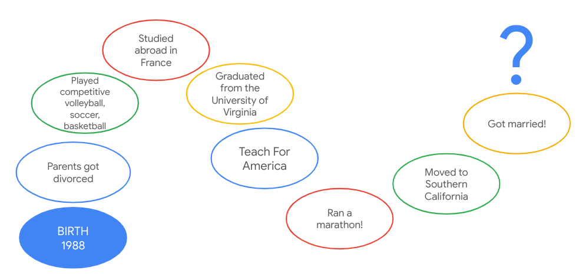

---

marp: true

---

# Career Development: Life Paths

<!--
Today we’re going to learn a bit more about each other by creating and sharing a visual representation of our lives thus far.

Why do you think it's important for us to learn more about each other’s unique backgrounds and experiences? 

*Elicit student contributions and respond to them.*

This session provides an opportunity for us to share a bit about ourselves and how we got to where and who we are today. With that said, what you decide to share is entirely up to you.
-->

---

# What Is a Life Path?

A life path is a visual mapping of the significant events or time periods that have occurred in your life. What significant events or time periods have made you who you are today? By mapping out these defining moments, a life path facilitates personal reflection and maybe solidifies (or questions!) your previously held values and goals.

<!--
A life path is a visual mapping of the significant events or time periods that have occurred in your life. By mapping out these defining moments, a life path facilitates personal reflection and maybe solidifies (or questions!) your previously held values and goals. In your life path you can share personal, familial, academic, social, professional, or other time periods or milestones that feel important to you. Everyone’s will be different, and we ask that you all be respectful and accepting of what others choose to share, regardless of how similar or different it is to yours.
-->

---

# How It Works

<!--
You can draw as little or as much as you want to but you will only have two minutes to present.  If you aren’t comfortable with symbols or art, feel free to substitute with written words instead. Again, it’s up to you to disclose as much or as little as you want.

Image Details:
* [lifepaths01.png](https://opensource.google/docs/copyright/): Copyright Google
-->

---

# Life Path Example

<!--

*Facilitator should prep this slide with their own life path prior to presenting and/or show this sample life path.*

*Facilitator should alter this slide to include their own life path and present it to the class as an example. It is important to include at least one life event or time period that is objectively not happy or positive in order to demonstrate vulnerability and/or growth from adversity.*

Here’s my life path. First, ___ … Last, ____. Thank you for listening. 

Image Details:
* [lifepaths02.png](https://opensource.google/docs/copyright/): Copyright Google
-->

---

# Instructor Life Paths

<insert photos and names of technical instructors>

<!--
Now our instructors will take a few moments to share their own life paths.

*Each technical instructor should present their previously-created life paths, each for two minutes.*

*Facilitator models thanking the instructors for presenting. Either make a point of saying a brief, encouraging remark about each person’s life path while presenting OR simply say “thank you for sharing.” Try not to remark about some people’s life paths but not others.*

Image Details:
* [lifepaths03.png](https://opensource.google/docs/copyright/): Copyright Google
-->

---

# Activity

1. Think of important events or time periods that have shaped your life thus far.
1. Take 10 minutes to create a map of your own life path.
1. Be prepared to share with the group (<2 minutes per person).

<!--
Now you’ll each take 10 minutes, markers, and chart paper to construct your own life path with your own events and/or time periods. (An additional five minutes may be necessary.)

Please only include information and events you’re comfortable sharing with the class, as we will each present for 1-2 minutes.

Source: Photo by Ludovic Fremondiere on Unsplash
Image Details:
* [lifepaths04.jpg](https://unsplash.com/photos/J8VWeMr5_Tg): Unsplash License
-->

---

# Let's Share

<!--
Let’s share!

*Allow each student up to two minutes for their life path presentations. It’s best to ask for an initial volunteer and then have the person sitting next to them go second, following from there until everyone has presented. This will save substantial time.*
-->

---

# Thank You

<!--
Thank you all for participating in this exercise and sharing these details about your unique life path. I hope you’ve learned a little bit about each person and maybe something about yourself by taking this time to examine what’s brought you to this point and time today.

What’s something you’re taking away from this experience? [Elicit 1-3 student contributions and respond to them.]
-->

---

# Next Steps

Please come prepared to our next session with a copy (online is fine) of your current technical or general resume.

<!--
Our next session will be a resume workshop. Please come prepared with a copy - online or printed out - of your current technical resume. If you haven’t yet created a technical resume, bring whatever resume you currently have!
-->

---

