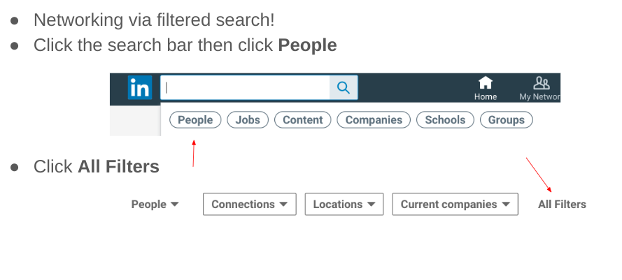
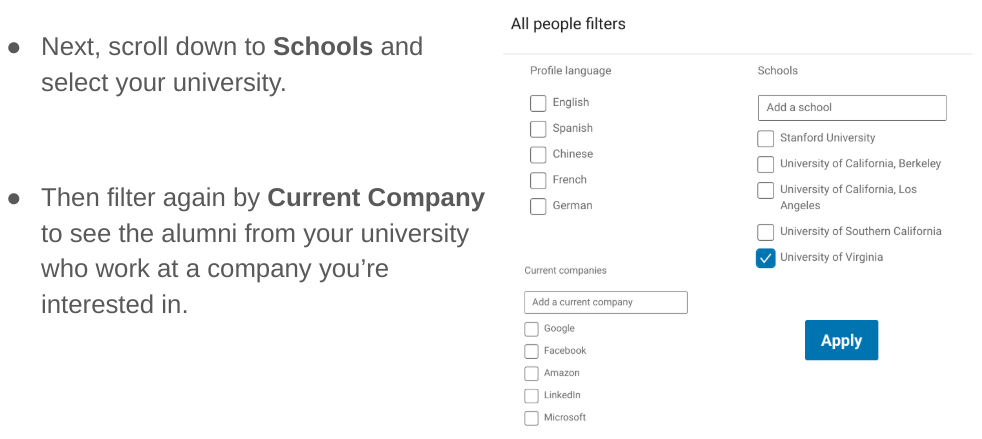
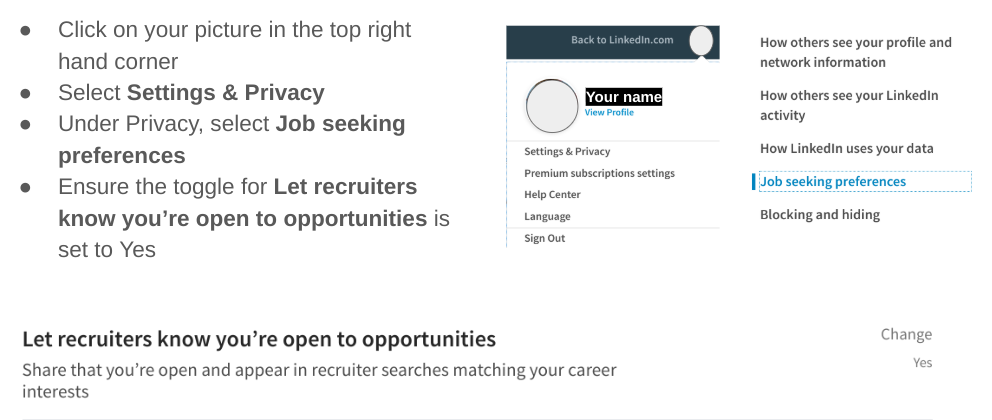
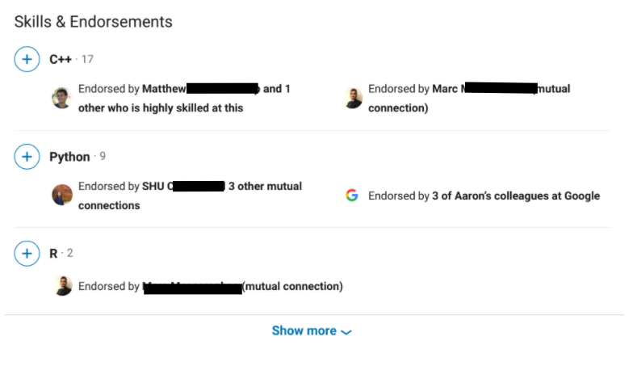
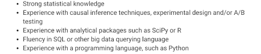
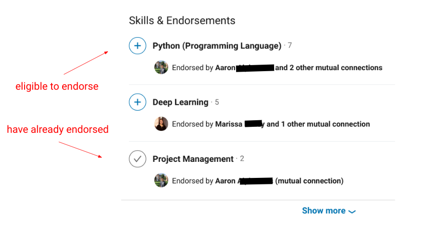
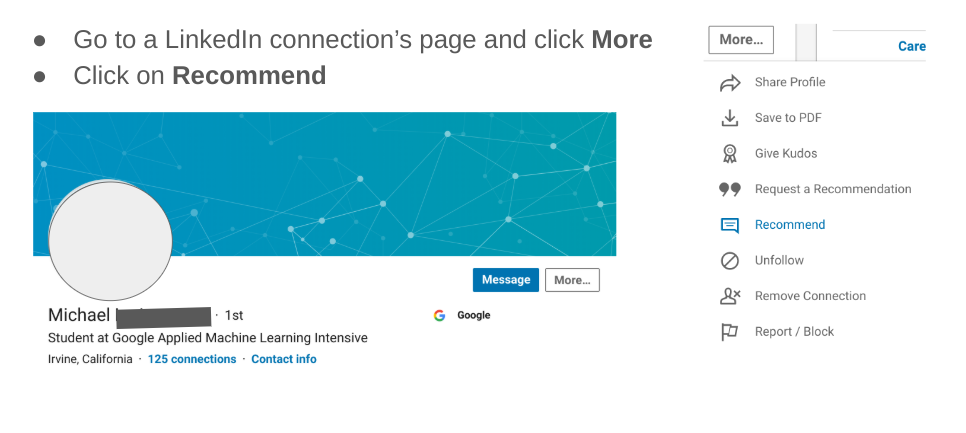
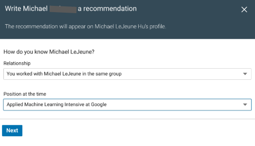
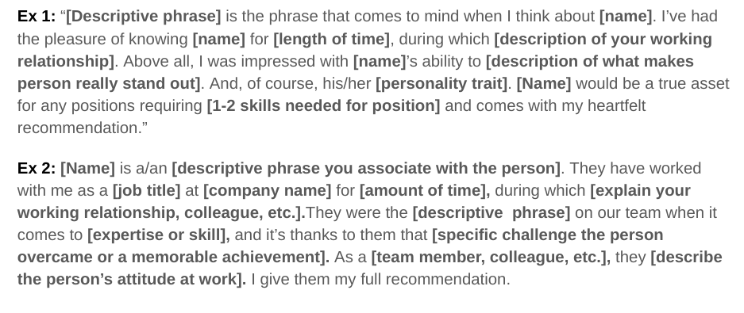

# Career Development: LinkedIn Essentials for Technical Students

<!--
Today we’re talking about the incredible tool that is LinkedIn. I hope you’ve all made time to create or update your LinkedIn profile since our presentation about the Art of Networking because we’ll be using them later today. Please have your laptops out but closed until we get to that session. Let’s get to it!

[Optional: give a story or personal anecdote about the power of LinkedIn.]

I’m curious to know your thoughts about LinkedIn. How often do you log into your LinkedIn? How do you use LinkedIn while you’re logged in? What are some things you’re unsure about regarding how to use LinkedIn? [elicit student responses] Today we’re going to go over some essential best practices for using LinkedIn as a technical student and hopefully answer some of these questions you have. The information in here can be applied to any college student on LinkedIn, but certain pieces of advice are most relevant to technical college students looking for technical roles. 
-->

---

# Agenda

* Why Use LinkedIn?
* LinkedIn vs. Your Resume
* Building Connections on LinkedIn
* Stand Out to Recruiters 
* Skills, Endorsements, Recommendations
* Q&A

<!--
Here’s our agenda for today’s session. We’ll talk about why we should even have a LinkedIn profile, the differences between a resume and LinkedIn, how to start building connections on LinkedIn, how to stand out to recruiters, and information about how to have your skills and experiences come to life with endorsements and recommendations from your LinkedIn connections. 
-->

# Why use LinkedIn?

* Professional way to stay connected with friends, former colleagues, etc
* Modern day resume available to a wide audience
* Receive notifications of job recommendations
* Help prepare for interviews
* Make connections with college alumni in desired field
* Keep up to date with recent trends and research in your field

<!--
Let's begin with why it’s worth having and maintaining a LinkedIn profile. There are a lot of reasons to use LinkedIn, and some of them are listed here. It’s a great way to stay in touch with classmates, former colleagues, and others. It’s also a fantastic way of making yourself accessible to recruiters who are looking to hire exceptional talent. Hiring technology has come a long way since paper resumes, so why not make your skills and experiences known to a wide range of people looking to connect and looking  to hire? Also, once you develop a network of LinkedIn connections from your field, LinkedIn will also serve as a fantastic way to keep up to date with the latest trends and research in your profession.
-->

---

# LinkedIn vs. Your Resume {.big}

<!--
I get asked this question a lot: “My LinkedIn is just my resume, right?” We’ll get into how LinkedIn and your resume are the same and how they’re different to give a thorough answer to that question. Let’s start with the similarities.
-->

---

# How LinkedIn is *similar* to a resume 

* Experience section
    * List every employer, position, and when you worked there. Flesh it all out as you can.  
* Education section
    * List where you go to school. This is a great way for people to find you and for you to find others!
* Skills section
    * Include technical skills AND non-technical skills. Keywords are critical on LinkedIn.
  
<!--
* Similar to a resume, your LinkedIn profile also includes an experience section. Your profile doesn’t need to be totally fleshed out to make an experience section. Even if you have just the role, that’s something! Fill it out as you can, but definitely list each of your experiences and how long you’ve worked at them -- starting with your college experiences and after. The only exception is if you earned an extremely prestigious award in high school, like National Merit Semifinalist or Gates Scholarship.
* Similar to a resume, your LinkedIn also includes an education section. Say where you go to school. This is a major way to connect with people, which we’ll get to later.
* Similar to your resume, your LinkedIn also includes a skills section. Technical folks should include softer skills here in addition to technical skills. We will get to this later, but it’s important to take time to endorse other people, and then they will reciprocate. Are these endorsements the most reliable barometer of your skill sets? No, but it does convey what people THINK you’re good at, which is very important. Keyword optimization is critical here and other places on your LinkedIn, too. If recruiters are looking for a programming language, skills is a great place for you to list it. A good hack is to look at the job descriptions for the roles you want and make sure those skills show up somewhere on your LinkedIn if you have them. (It doesn’t have to be in the skills section.)
-->

---

# How LinkedIn is *different* from a resume

* About me section
   * Be self-absorbed in a professional way. Talk about who you are, what you do, what you want to do.
* Include a picture
   * Profiles with pictures get looked at more.
   * You should be the only person in the photo.
   * Photo should be a headshot or top half of your body.
   * Formality is industry-dependent.
* Recommendations from others

<!--
- Unlike resumes, your LinkedIn has an “about me” section. Be selfish in a professional way. It’s a place for you to talk about who you are and what you do. It’s also a fantastic place to include keywords that you haven’t found the right space for in other parts of your LinkedIn page. Like the idea of Gestalt therapy, we are each more than the sum of our parts, so weave some golden thread through what drives you to do all the things you do. Is your professional purpose to make the world a better place, to serve others, to innovate, to re-imagine and re-create a system? This section is a place for you to showcase that.
- Unlike resumes, your LinkedIn should probably have a picture. It’s a fact that profiles with a picture get looked at more. With that said, some students are worried about discrimination and choose not to post a photo. Unfortunately that fear of discrimination is understandable. It’s ultimately up to you. If you do use a photo, remember to use a headshot. There’s no need to see the rest of your body, and it’s important to have just you in the photo. Think about your industry and make a conscious choice about your headshot. It might be fine for a person in tech or graphic designer to be more informal in a headshot, but if you’re going into finance in NYC, that’s probably not the best route. Finance and business professionals, and those aspiring to become them, should wear business attire in their LinkedIn picture.
- Unlike resumes, you can have recommendations from people on your LinkedIn. It’s not completely necessary but worth considering. The best way to get one is to give one. Why not reach out to someone and say, “I was sitting in a LinkedIn presentation today and it was kind of boring. But I started thinking about how much I enjoyed working with you and wanted to say so. I’m currently _______ and would love if you could write me a recommendation back if you don’t mind.”  Super easy!
-->

---

# How LinkedIn is *different* from a resume

* It can be as long as you want
   * Don’t skimp on truthful keywords or skills!
* It’s not targeted
   * You can’t have multiple versions of your LinkedIn, so it needs to serve all functions for you
* It should have a headline
   * Your headline should include all of your professional/academic work in a phrase
    * ex: Mount Holyoke senior computer science major looking for full-time data science role
    * ex: Howard University ‘19 alum seeking full-time technical program management (TPM) role
    * ex: UVA MS in computer science candidate seeking summer 2020 SWE internship

<!--
- Unlike resumes, your LinkedIn can be as long as you want. Use this opportunity to use as many keywords and you possibly can. I knew a college student who never thought of working in tech get a job at Google. But because her LinkedIn page included that she speaks, reads, and writes German, she got contacted by a Google recruiter and now works there. 
- Unlike a resume, your LinkedIn is not targeted. At a career fair you frequently control what companies get your resume and, sometimes, what roles you’re considered for. You can give different versions of your resume as needed. That’s far from the case with LinkedIn. Your one LinkedIn profile has to serve all of your functions, which is a blessing and a curse. 
- Unlike a resume, you have a headline on your LinkedIn! If you take nothing else from this presentation, it should be this: use your headline for your current job title. You can incorporate all the aspects of your professional roles or your official title. Recruiters use this to look for prospective candidates. For example, my friend who works as a career counselor at a university but also teaches graduate school courses in career counseling and does resume/cover letter work. Therefore, her headline says she’s a “career development professional.” You can be a UCLA student interested in AI or a Cal Poly SLO senior seeking an entry level data analyst role. Use the headline to be totally transparent about your job search as a senior in college or graduating graduate student because when you’re a professional working for an organization and job searching, you can’t often be transparent that you’re looking.
-->

---

# Building Connections on LinkedIn

* Who is it appropriate to add? {.big}
* Searching for new connections {.big}
* Writing to people you found on LinkedIn {.big}

<!--
Now let’s dive into how to build connections on LinkedIn. You’ll have a pretty unexciting LinkedIN newsfeed if you aren’t connected to, or following, anyone else!
-->

---

# Who is it appropriate to add on LinkedIn?

* If Facebook is your inner circle, think of LinkedIn as an inner circle PLUS the people it would be awkward to add on Facebook (professors, managers, leaders of this program).
* If you’ve met them, add them. If you haven’t, don’t... for now!
* If they’re a working professional, it’s nice to include a personalized message.
* If you’re not sure if you should add them, ask them!

<!--
Consider Facebook, Instagram, and SnapChat friends as your personal inner circle. LinkedIn is a personal inner circle PLUS all the people who would be awkward to add on Facebook and these other social media platforms (leaders of this program, your professors, etc).  
* Think: 
  * 1.) Have I met them? If no, don't add them. 
  * 2.) If yes and you went to HS with them and haven’t talked since? Add them! You never know the connection you'll get. you never know when your mom is connected to someone you want to chat with about a role at the company where they’ve worked  

* Do you need to send a personalized message when you add people on LinkedIn?
  * If it’s a college peer or a peer in this program you clearly know, you don’t need to send a personalized message. 
   * If the someone isn't your school peer, send a personalized message. Doesn't need to be long. Ask recruiters you meet if it’s okay to add them on LinkedIn. That recruiter may move companies or become a resource for you one day. If you’re not sure if you should add someone, ask them!
-->

---

# How do I search for new people to connect with?

<!--
A helpful group of people to connect with is alumni from your university who are working at a company where you may want to work some day. The easiest way to find and connect with those folks is by using the search function on LinkedIn. Please open your computers and log into your LinkedIn profiles for this section of the presentation so you can follow along. [Allow 1-2 minutes for students to log into their LinkedIn profiles.]

Begin typing in the search bar at the top of your page. Click People. Then click All Filters.
-->

---

# How do I search for new people to connect with?

* Next, scroll down to Schools and select your university.
* Then filter again by Current Company to see the alumni from your university who work at a company you’re interested in.

---

# Writing to people you found on LinkedIn

**What to do**

*  Say how you found them
*  Say why you’re writing to them
*  Say what you want to talk about specifically
*  Give multiple options for connecting (phone, Google Hangout, email, whatever works best for THEM)
*  Be brief

.

{.column}

**What not to do**

*  Ask for a job
*  Ask for everything 
*  Forget to show gratitude 

.

<!--
*  Remember when I said you shouldn’t add people you don’t know on LinkedIn? That’s true if you’re not going to reach out to them to attempt to make a meaningful connection. If you’d like to spend time speaking with someone about their work, potentially in the form of an informational interview, you can reach out to them in a thoughtful, professional manner via LinkedIn to see if they’d be willing to make time for you.  Here are some best practices for writing to people you found on LinkedIn:

* WHAT TO DO
Say how you found them. All you need is half a sentence -- “I found you on UF's LinkedIn page…”
Say why are you writing them. Again, another half sentence -- “... and I’m writing because I’m interested in the work you do at Twitter.”
Say what you want to talk about. Use 1-2 sentences to explain what you want to discuss with or learn from them. Remember from our networking presentation, clear is kind. Do not be vague. 
Give multiple options for connecting -- phone, Skype, email -- whatever works best for THEM. You are asking a favor of another person. In this case it doesn't matter your preference. 
Be brief, make sure your subject line makes sense, goal is to get them to reply

* WHAT NOT TO DO:
Ask, “Can you give me a job?” That is not appropriate to ask. You’re seeking to learn from their experiences.
Ask for everything. Their time is valuable!
Forget to show gratitude. Thank them for responding. Thank them for making time to connect if they’re able. Thank them after chatting with them, which is a great opportunity for follow-up questions. 
-->

---

# Stand out to recruiters on LinkedIn

*  Let them know you’re looking {.big}
*  Update your skills {.big}
*  Endorse and recommend your connections {.big}

<!--
Now that we’ve gone over some basics regarding building out your LinkedIn profile and making connections with others, let’s talk about how you can stand out (in a good way!) to recruiters who might be looking to fill roles with someone who has your skill set and experience.
-->

---

# Make sure recruiters know you're looking

<!--
This may seem simple, but the first thing you want to do is ensure recruiters know you’re looking for a job. You can do that by going to Settings & Privacy, selecting Job seeking preferences, and making sure the toggle for Let Recruiters know you’re open to opportunities is set to Yes.
-->

---

# Update your skills

<!--
Now that it’s clear to recruiters that you’re open to opportunities, let’s talk about what skills you should list on your LinkedIn so your employability and uniqueness are on display!
First, some basics. LinkedIn allows you to list 25 skills and allows your connections can endorse you for those skills. Your endorsers can even indicate HOW skilled you are at them. The three skills with the most endorsements from other people will be the ones prominently featured on your LinkedIn profile page when others look. They can still click and see the others. 
-->

---

# Update your skills

*  Scroll down on your own profile page to Skills & Endorsements
*  Click Add a new skill
*  Keyword optimization is critical. Look at the job descriptions for the roles you want and ensure those skills show up on your LinkedIn if you have them
*  Below are some of the required skills for a Data Scientist role open at Snapchat:

<!--
This may seem intuitive, but it’s important to choose skills that reflect the required skills and job requirements for the roles you’re looking for. Obviously you should be truthful about the skills and experiences you have as well.
-->

---

# Your turn!

Spend **3 minutes** updating your skills section -- 

from this summer and previously developed skills you haven’t added yet.

Be truthful. If there are topics we haven’t covered yet, take a picture of the following slide and save for future updates.

<!--
Let’s update your skills section! But first, what are some skills you should add? [Progress to next slide.]
-->

---

# What new skills can you add to your LinkedIn?

*  HTML
*  Web app development
*  Data engineering
*  SciKit Learn
*  TensorFlow
*  Image classification
*  SQL
*  Python
*  Webscraping/Webcrawling
*  BigQuery
*  Google Cloud
*  APIs
*  Deep Learning
*  Regression
*  Classification
*  JavaScript

<!--
What are some new skills you can add to your LinkedIn after your time at AMLI this summer? Here’s a list of some we’ve come up with. Are there others? What about “softer” skills? Are there other skills missing from your LinkedIn that you have but haven’t included yet? Add those, too!
-->

---

# Endorse & recommend your connections

What’s the difference?

<!--
What’s the difference between LinkedIn endorsements and LinkedIn recommendations? 
A skill endorsement is a one-click way for your connections to endorse the skills listed on your profile. There isn't an automatic way to request an endorsement and only skills already listed can be endorsed. A written recommendation isn't included with this feature.
A recommendation is a written statement of endorsement received from a connection. You can request recommendations from your connections, as well as proactively recommend your connections.
-->

# *Endorse* & recommend your groupmates

<!--
Endorsements are quick and easy one-clicks you can utilize to vouch that your LinkedIn connection has a particular skill or set of skills. You simply go to a LinkedIn connection’s profile page, scroll down to their skills section, and click on the + symbol next to the skill you want to endorse. Once a check mark appears in the circle, you’ve successfully endorsed them. Endorsements frequently serve a “you scratch my back, I’ll scratch yours function,” so hopefully the person you endorsed will return the favor and endorse you for skills they know you have.
-->

---

# Your turn!

Spend **2 minutes** providing endorsements for your group members.

<!--
Let’s practice! Spend the next two minutes providing endorsements for your group members. Please only endorse them for skills you know they have, and remember it is unlikely someone is highly skilled on a platform they first interacted with last week. Once you’ve finished, you can begin endorsing other program participants for skills you know they have.
-->

---

# Endorse and *recommend* your groupmates

*  Go to a LinkedIn connection’s page and click More
*  Click on Recommend

<!--
Let’s move onto recommendations. To create a LinkedIn recommendation for someone, go to their page and click More then Recommend. 
-->

---

# Endorse and *recommend* your groupmates

*  Indicate how you know Michael and what his position was at the time.
*  Write your recommendation!
*  Aim for at least 3-5 sentences.
*  Look up examples online if you need assistance.

<!--
To leave a recommendation on LinkedIn, that person must have AMLI listed as an experience or you won’t be able to comment on your work with them throughout this program. 

At this stage you’ll indicate what your relationship is with the person and what their position was at the time.

From here you will have an opportunity to write a recommendation about that person. You should aim for the recommendation to be no more than one paragraph, ideally 3-5 sentences. 
-->

---

# Endorse and *recommend* your groupmates

*  Explain how you know the person
*  Show, don’t tell 
*  Don’t forget “soft” skills and personality characteristics
*  End with a hearty recommendation
*  It shouldn’t be more than a paragraph

<!--
In your recommendation it’s important that you explain how you know the person. You should also make a point of not just saying someone has a certain characteristic or set of skills; you should use this opportunity to provide at least one example of a time that skill or characteristic has been put on display or something you’re consistently impressed with about their work. Don’t be afraid to include soft skills or personality characteristics that are appropriate and helpful for that person if a potential employer were looking at their LinkedIn. For example, if it’s true, it’s appropriate to say someone is extremely collaborative and generous with their time, always helping out teammates with their work. It’s not appropriate to say they must be fun to be around because they’ve dated four of your friends. 
-->

---

# Endorse and *recommend* your groupmates

<!--
Here are some templates as starting points for writing recommendations. What do you notice about these recommendations?

[Potential student responses: it’s concise, to the point, explains how the person knew them, includes personality and hard skills a person brought to their work, etc]
-->

---

# Your turn!

Spend **12 minutes** providing recommendations for your group members. 

<!--
Let’s practice! Spend the next 12 minutes providing written recommendations for your group members. Please try to deviate from the EXACT wording in the prior slide, as our recommendations would lose weight if they appear canned. You don’t want a whole page of recommendations that are the same. Please let me know if you need help, as I’ll be walking around the room to help you.
-->

---

# Let's recap

*  LinkedIn profiles serve a number of functions, including helping stay in touch with peers and building new connections.
*  Your resume and LinkedIn share similarities but are not the same.
*  Keywords, skills, endorsements, your picture, about me section, and your headline are all ways to stand out to recruiters.

<!--
We’ve gone over a lot today. Let’s recap some highlights. First, LinkedIn has grown to fill a number of different important functions for students and professionals, including staying in touch with colleagues, former managers, professors, and important people in your field. Your resume shares some similarities with your resume, but they’re also different. What are some of those differences or similarities? [Elicit answers from students.] Last, recruiters are looking for people with your skills, and you can make it easier for them to find you by maximizing the potential of these sections. List your skills. Include endorsements. Create an about me and headline section. 

What else stood out to you today as something you’ll take with you?
-->

---

# Next steps

Prior to our next session, please take time to review the following article in Harvard Business Review:
[Harvard Business Review: Find the Coaching in Criticism](https://hbr.org/2014/01/find-the-coaching-in-criticism)

<!--
Prior to our next session, please take time to read the following article: Harvard Business Review: Finding the Coaching in Criticism.
-->

---
