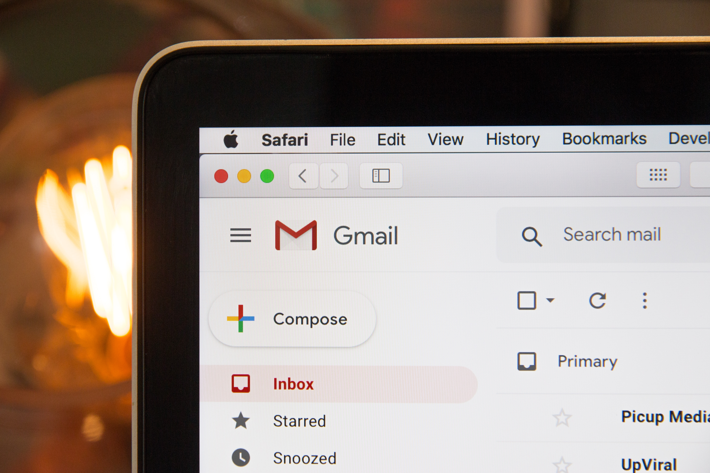
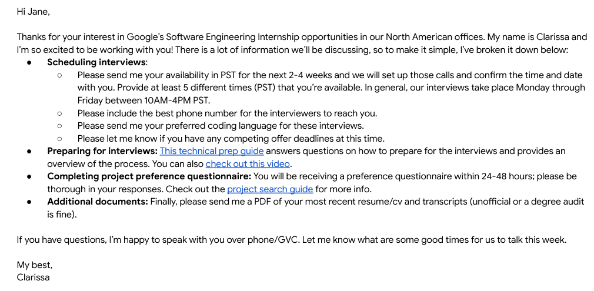
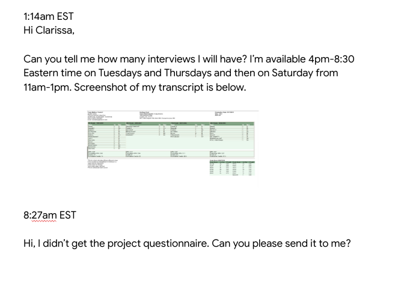
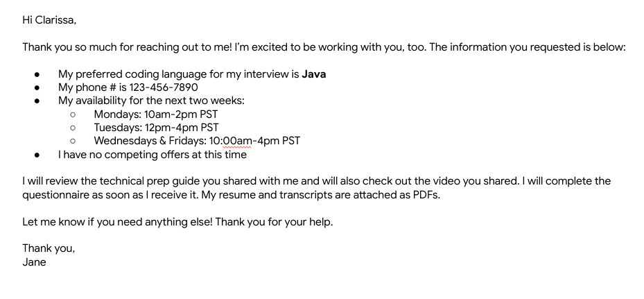
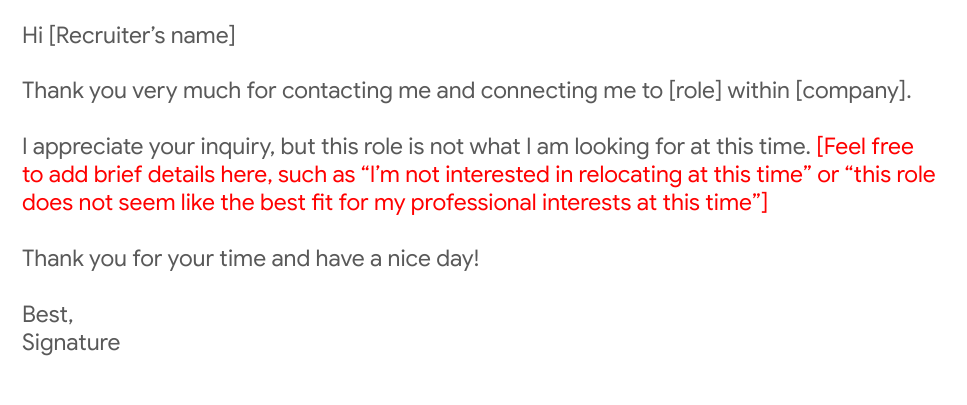

# CD-07: Communicating with Recruiters

<!--
Who, whether for an internship or job, has had experience working with a recruiter? What was the process like? [Elicit student responses and discussion.]

Did you ever experience uncertainty about how often you should reach out to your recruiter or what you should/shouldn’t share? [Elicit student responses.]

Hopefully this discussion clears up some of that uncertainty and provides you with some best practices for communicating with recruiters that you can apply right away. Whether you’ve never worked with a recruiter or have worked with many, this session is for you. Let’s get started!
-->

---

# Agenda

* Role of your recruiter
* Effectively communicating with your recruiter
* How to navigate interview scheduling
* Sample emails to recruiters
* Q&A

<!--
First we’ll go over the role your recruiter serves in your hiring process. This can slightly differ by employer but is generally similar across the board. Then we’ll talk about how to effectively communicate with your recruiter and how to navigate all the minor and major details of scheduling and participating in interviews. Then we’ll close out with some sample emails to recruiters and Q&A.
-->

---

# Role of your recruiter

* Your recruiter is your advocate and partner - they WANT to get you hired
* Main point of contact at the company
* Guide you throughout the process and keep you updated
* Be friendly, gracious and thoughtful when talking to your recruiter

<!--
* Your recruiter is your advocate and partner.  Be kind, respectful, friendly, and honest in your communications. They’re there to help you, provide you with helpful resources, and to guide you through the overall process.
* While you may also be in touch with a hiring manager, your recruiter is typically your main point of contact during an interview process with a company. Make sure to keep them in the loop with any updates that affect your candidacy.
* Your recruiter will also guide you through the process and keep you updated. They will provide you with regular updates, so keep an eye on your inbox! Only your recruiter - not your referral or friend. They can keep you updated on your stage of the interview/hiring process. You should always respond to your recruiter within 48 hours at most.
* Tip: It’s always good to express your thanks and show your appreciation. Your recruiters work hard to ensure that your process is as informative, timely, and smooth as possible. Show your positivity and gratitude - it can go a long way!
-->

---

# Effective communication

<!--
Let’s move on to some guidelines for effectively communicating with your recruiter.

Image Details:
* [commrecruiter01.jpg](https://unsplash.com/photos/3Mhgvrk4tjM): Unsplash License
-->

---

Tips for communicating with your recruiter {.big}

* Read all emails from top to bottom
* Answer all questions and provide all of the requested information
* Schedule time to speak with your recruiter as needed
* Respond to emails in a timely manner, 24-48 hours is best

<!--
It is super important that you follow these tips when communicating with recruiters:
* Read all emails from top to bottom: Recruiter emails oftentimes have a lot of information in them, and they don’t want you to miss anything! Be sure to scroll down and look for FAQs in case they’ve included them. Save your emails with recruiters to refer back to them as needed. Also make sure to read through all links or attached materials.
* Answer all the questions and provide all requested information to save time; a lot of inefficiency is caused by emailing back and forth unnecessarily, and you don’t want to slow down your process if you can avoid it!
* Some recruiters will have a link to their calendars in their emails to you so you can choose a good time that works best for you. Otherwise, they will ask you for your availability. Be aware of times zones - and make explicit plans. Make sure the contact details you provide are accurate and up-to-date and you are sure on who will be contacting whom, in the case of a follow up call, Skype, or GVC session.
* Recruiters try to respond to candidates as soon as possible. It’s important you do the same! Things can move pretty quickly at most companies, and you want to make sure you are keeping you recruiter posted with the most up to date information possible. At the same time, you want to be mindful of work-life balance. Keep in mind recruiters won’t be responding to emails late at night or during weekends and holidays; take this into account when emailing.
-->

---

When to contact your recruiter {.big}

* Your university’s recruiting deadlines (if any)
* Offer deadlines with other companies
* Major update to your resume
* Sustained period without updates

<!--
Students often ask, “Should I update my recruiter about that?” Here are some guidelines for when you definitely want to communicate with your recruiter:

University deadlines: Some universities have specific guidelines on when its students can or should accept internship or full-time job offers. These guidelines exist to serve YOU and make sure you have sufficient time to make the best decision for yourself. Check to see if your university has “NACE Guidelines” and mark your calendar accordingly.

Company deadlines: If you’re interviewing with another company and receive an offer, let your recruiter know! You’ll hear recruiters refer to this as a “competing offer.” Having a competing offer can sometimes speed up the offer process at the other places where you’re interviewing. It would be a shame if you had to accept an offer with other possibilities on the table, so it’s important to be transparent with your recruiter to let them know if you have other offers or may soon.

Major update on your resume (e.g., new skill, award, conference, publication, etc.) - send it as a PDF!

When you haven’t heard from your recruiter in a while (~2 weeks)

Recruiters will usually give you a timeline of when you’ll hear from them next.
If you haven’t heard from them in a while, don’t worry! They likely have NOT forgotten about you. Don’t be afraid to send them an email if it has been 1-2 weeks since you last heard from them.

TIP: Always be truthful, open and honest with your recruiter! If they have the full picture of your status and options, they can guide your process with a company more comprehensively.

-->

# Interviews

<!--
Now let’s move on to scheduling and going through interviews at a company.

Image Details:
* [commrecruiter02.jpg](https://unsplash.com/photos/YXemfQiPR_E): Unsplash License
-->

---

Scheduling your interviews {.big}

* Provide a range of times that will work for you around class, when you will be relaxed and most focused
* Make sure that for phone interviews, you are sure of contact information and format
* Ensure you know the difference between an interview and informational chat

<!--
* At most companies, recruiters will schedule your interviews, or they will introduce you to a recruiting coordinator. Recruiting coordinators partner with recruiters and candidates to schedule your interviews
* Generally, companies interview between 10am-4pm PST, Monday through Friday.
  * Everyone wants you to feel comfortable and at your best!
  * Provide times that work for you and your class schedule.
  * Make sure you know the format of any interview, as well as who will be contacting who  and when - if you’ll be using a format you’re not that familiar with, like coding on a Google doc, then practice ( we will address this specifically in a later session that touches on best practices in phone interviews)
* Sometimes, depending on the company, a recruiter or someone else in the company may want to start with an informational chat to start, before jumping in to official interviews. These will usually consist of talking about the role, company, and your resume. Ensure you have your resume in front of you and can speak about the experiences you want to highlight most, as well as having done at least some basic research on the company. It’s common in an informational session to be asked about your knowledge of the company and what interests you about working there. Be ready to answer very general questions meant to show you are serious about the job hunt.
-->

---

Asking for help {.big}

* Let your recruiter know ASAP if you require accommodations
* Not sure what kind you need? No worries!
* Disclosing a disability is a personal decision
* Don’t be shy -- ask for help at any point during the process

<!--
First Bullet:
* At Google, we’re committed to providing equal opportunities and magical experiences for everyone throughout the hiring process, regardless of your status, and almost all companies will feel similarly
* For example: A person who is hard of hearing might not want to have phone discussions. A recruiter will ask “would you like me to connect you to our Interview Accommodations Team? They can get you set up with an ASL interpreter, a loaner laptop you can use instead of a white board, a screen reader, or more.

Second Bullet
* If you’re not sure what type of accommodations you might need, don’t worry! Our trained team of specialists on our Interview Accommodations Team will work with you directly to identify what types of accommodations you might require.

Third & Fourth Bullet
* Your conversations with your recruiter and specialists are confidential, we won’t inform interviewers or hiring teams of a disability, only of the accommodation
* Asking for help will never work against you. We want to do our best to provide you with the best opportunity possible.
-->

---

Interviews are scheduled {.big}

* If you need any accommodations during the interview process, ask your recruiter in advance.
* Rescheduling an interview
* Interviewer running late
* Follow up with a thank you

<!--
Like we mentioned earlier, if you need any accommodations for your interview, let us know as soon as possible

Rescheduling an interview
* If an interview absolutely needs to be rescheduled, let your recruiter and recruiting coordinator know on one email as soon as possible. It’s best practice to reply all to the email where your interview was originally scheduled.
* Keep rescheduling to a minimum - if you’re sick or there’s an emergency, we understand! But once your interview date is set, make sure to prepare yourself for that day
* Rescheduling multiple times might make you more anxious so it’s generally best to stick with your originally planned interview date.

Interviewer is late
* You’re waiting to start your interview and your interviewer is late! What do you do? [Elicit student responses.] Wait about 5 - 10 minutes. Interviewers are often going from meeting to meeting and conference rooms may not be booked near each other. *  After 5-10 minutes, email your recruiter and recruiting coordinator, once again on the same email, and let them know you haven’t heard from your interviewer yet. They’ll sort out what’s going on.

Thank you
* Most recruiters can’t share interviewers’ contact information with you directly, but feel free to send a note to your recruiter to pass along to your interviewer
* It’s always nice to thank your recruiting coordinator and recruiter for their help prepping you and getting you scheduled
-->

---

# Your turn

<!--
Now that we’ve gone over some important information to consider when working with your recruiter, let’s put these best practices to use!

Source: Photo by NeONBRAND on Unsplash
Image Details:
* [commrecruiter03.jpg](https://unsplash.com/photos/IhsaTDKzdwg): Unsplash License
-->

---

Example email from recruiter to candidate {.big}

<!--
[Have 1-2 student volunteers read this email from a recruiter out loud to the class.]

Image Details:
* [commrecruiter04.png](http://www.google.com): Copyright Google
-->

---

Your response {.big}

You have six minutes to drive an appropriate response to the recruiter's initial email.

<!--
Now, take six minutes to draft an appropriate response to your recruiter, Clarissa. I’ll switch the screen back so you can reference it while you type. [Revert to previous slide.]

[Give students six minutes to write and then ask for 1-2 student volunteers to read their versions. Highlight 1-2 things students did well in their response.]
-->

---

Candidate response to recruiter example {.big)

<!--
Now that we’ve read an email exchange between a recruiter and candidate, take a look at this candidate’s response to their recruiter. Can you point out what’s wrong with the candidate’s response or what’s missing in this scenario? [Elicit and respond to student contributions.]

Response should include:
* The initial email from the recruiter states that there will be two technical interviews - remember to read all emails from top to bottom!
* Availability for interviews is given in EST, not PST like recruiter requested.
* Availability for interviews is outside of general workings hours (late in the evening and on a Saturday).
* Screenshot of transcript is pasted in body of email. Recruiter requested a pdf of both transcript and resume
* Availability should be specific: for example, list dates as Tuesday, May 29
* Initial email from recruiter says that the project questionnaire will be sent out within 24-48 hours. This usually means business hours. If you still haven’t received it within 48 business hours, you should reach out to your recruiter then.
* Don’t expect an immediate response especially when it’s outside of our general working hours. Notice that this person was replying to their recruiter very early hours in EST. Remember, Googlers try to get back to everyone within 24 hours.
* This person is sending multiple emails back to back. While it’s not necessarily a bad thing, it isn’t preferred for most recruiters. Keep you emails clear and concise.
* It’s always nice to sign off with a thank you and your name! Be friendly!

Image Details:
* [commrecruiter05.png](http://www.google.com): Copyright Google
-->

---

Sample response {.big}

<!--
Here’s a good example of a positive response from a candidate to a recruiter. What are some things Jane did well here?  [Elicit and respond to student contributions]

Image Details:
* [commrecruiter06.png](http://www.google.com): Copyright Google
-->

---

What if you're NOT interested in a role? {.big}

* Hear the recruiter out, and ask questions
    * Do some homework and follow up with them promptly
* Be honest, but professional
* Keep them in your network

What would be some things to include in an email to a recruiter for a role you are NOT interested in?

<!--
* If a recruiter contacts you out of the blue, you should respond at least once. Ask clarifying questions and do some homework to see if this is at all a good match for you. You don’t want them to waste your time, but don’t waste theirs, either.
* It may not be the PERFECT role, but if it is at all interesting to you, you should go forward. You’ll learn a lot through the application process.
* But if an opportunity truly is not for you, your should respond honestly and courteously. You don’t have to write a long email or provide too much detail, but you can definitely feel free to give some feedback and you should follow up promptly.
* It is not good professional etiquette to not respond, nor to lie. For example, don’t say you have a job if you don’t.
* Remember you are still looking for a role and that people move around a lot. This recruiter could end up in a role or company years from now that could be your dream job, so you don’t want to burn bridges. Be polite, and if it seems like a good opportunity, you can ask to connect on LinkedIn or to be kept in mind for future roles that maybe be a better fit.
* Pose to audience - What would be some things to include in an email to a Recruiter for a role you are NOT interested in? [Elicit and respond to student contributions.]
-->

---

The “no, thank you” email example {.big}

<!--
This could be sent as an email or copied and pasted into LinkedIn messages. Just remember best practices of spelling the recruiter’s name correctly and making sure details are correct. If you want to connect over LinkedIn or otherwise keep this person in your contacts (even if this role is not a good fit at this time) then follow up promptly on doing so. Keep it brief. Even if you give a specific detail on why this is not a fit, you don’t have to get too specific. Remember that it is not okay to lie, so keep it honest and courteous.

Image Details:
* [commrecruiter07.png](http://www.google.com): Copyright Google
-->

---

# Let's recap

* Your recruiter is your partner and main contact within a company..
* Read all emails from top to bottom and respond within 24-48 hours.
* Be open and honest with your recruiter. Share deadlines and any important information. Ask for help.
* Proofread, be professional and thankful.

<!--
Don’t forget that you and your recruiter both want you to have a clear, efficient, and overall great hiring process - regardless of whether or not the job is a best fit for you. They are your advocate. Be sure you read all aspects of the emails they send you, links included, and respond to their emails within 48 hours at the latest. Be transparent with them about your offers and ask for help when you need it or when you feel uncertain about something. Be professional and be grateful for their time and work with you.
-->

---

# Questions?

<!--
Thank you all so much for participating today. What remaining questions do you have?
-->

