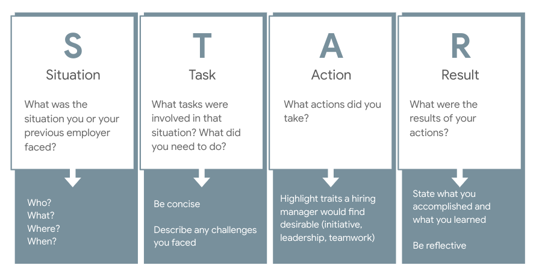

# CD-09B: Peer Behavioral Interviews

<!--
Much like our peer technical interviews, today we’re going to apply what we learned in our behavioral interview session by conducting and experiencing peer interviews. 

As with peer technical interviews, today’s session is designed to give you the opportunity to interview AND be interviewed. This time we’ll be using behavioral interview questions, so it will be a bit of a different experience. The STAR method bank you created after our last session will definitely serve you well in this one, though we will ask you not to bring it to your peer interview so we can more completely model a real-life interview scenario.

Even when you apply for technical roles, you are very likely to get at least some behavioral interview questions so an employer can discern what it would be like to work with you. While this makes interview prep more demanding for technical folks like you than non-technical folks, it’s worth it to come to your interviews fully prepared.

Let’s get started!
-->

---

# Agenda

* Peer Interviewing Background & Best Practices
* Using the Rubric
* STAR Method Review
* Giving & Receiving Feedback
* Interviews!

<!--
We’ll start by going over some best practices and the rubric we’ll use, which is different from the last one. We’ll also review the STAR Method, which you’ll be applying in your interview answers. Finally we’ll go over some reminders for giving and receiving feedback meaningfully before diving into the interviews.
-->

---

# Interviewing can be intimidating {.big}

<!--
I want to reiterate that many people struggle with nerves and maybe even some dread when it comes to interviewing. Today’s session is to provide additional interview practice to help it all feel less intimidating in real-life interviews. 
-->

---

# Peer interviewing reminders

* Switching roles and playing the part of the interviewer can make you more aware of what an interviewer is looking for
* Peer interviews provide an opportunity to practice responding to interview questions in a no-stakes setting
* Explaining what you’ve done in real-life behavioral interview questions can be hard; that’s why we practice preparing and giving STAR method answers
* Treat the interview more as a conversation than a standardized test
* Your interviewer wants you to do well

<!--
Let’s go over some peer interview reminders that we discussed last time.
[Ask a student to read one or all of these reminders aloud.]
Does anyone have questions about these?
-->

# Using the rubric

**Interviewer**

* Uses the rubric to evaluate how the candidate is doing
* Provide feedback to the candidate based on the rubric

.

{.column}

**Interviewee**

* Should also use the rubric (after the interview) to reflect on how they did, improve answers, and consider what interviewers are looking for

.

<!--
Similar to our technical interviews, today’s activity will have an “interviewer” and “interviewee,” each with a different set of questions, and you will take turns interviewing one another and giving feedback for 35 minutes.

The interviewer will be provided a rubric — slightly different from the last one —  to help evaluate the interviewee. By using the basic rubric on the back of this page to measure your mock candidate’s answers, you can also start to understand how your future interviewers will be evaluating your own answers. The rubric will help the interviewer give feedback.
-->

---

# STAR method: reminder!

<!--
Remember from our last session that the best responses to behavioral interview questions are organized along the STAR method format. In the 1-2 minutes in which you’re responding to a behavioral interview question, you should format your answer using the STAR method: describe the situation, the task or tasks, the actions you took, and the result. Most behavioral interview questions start with “Tell me about a time when…” or “Describe a time when…” so interviewers are explicitly looking for you to tell a true story about your past academic or professional experiences. Practicing your stories — like we will today —- in this order and keeping this framework in your head will help you deliver more effective, organized answers in interviews. 
-->

---

# Reminders: giving & receiving feedback

**Giving feedback**
 
* Actionable
* Example-based
* Be specific, kind and direct
* Be sure to share things that went well, as well as things that could  be improved

1. *“I would try…”* 
1. *“I liked it when you said…”*
1. *“I noticed…”*

.

{.column}

**Receiving Feedback:**

* Don’t go back and forth or argue a point; let feedback wash over you
* Only take what you want. Feedback is a suggestion, so keep the points you think are important and let the rest go.

1. *“Thanks for your feedback.”*
1. *“I appreciate your suggestion.”*

.

<!--
The interviewer will provide feedback. Take a minute to gather your thoughts, and then make sure feedback is actionable, meaning that the interviewee can take an action to improve. You should also give an explicit example, especially of exact phrasing on answers that can be improved. Be sure to be as specific as possible, be kind, and be direct (but not mean). Also mention what went well, not only what could be improved. Try using the phrases here to give feedback. The interviewee should also take notes on feedback. 

When receiving feedback, remember feedback is a gift. It’s a way for people to show investment in you. At the same time, you only need to take what you want from it. Don’t dispute what your interviewer tells you. Go over feedback on your own and see where you need more practice or might improve.
-->

---

# Directions: time to interview!

* Choose who will go first as the interviewer and interviewee
* The interviewee should not look at the questions or rubric
* The interviewer should take notes so they can give the best possible feedback after the “interview”
* Try not to “break character” so this experience is as close to a “real” interview as possible 
* Interview lasts for 20-25 minutes, and the remaining time should be used for feedback
* After the first interview and feedback session, switch roles and start again on the second set of questions

<!--
After we go over these instructions, I’ll assign your partner and we’ll get started! 

First, you’ll head to a quiet part of the building or [insert another place] and then choose who will go first as the interviewee between the two of you. The interviewee should NOT look at the questions until it’s their turn to interview. One person’s questions are on the front of the handout I’m about to give you, and the other person’s questions are on the back. The interviewer should take notes so they give the most helpful feedback after the interview. Do your best not to break character. 

The interview should last for 20-25 minutes, and the remaining time should be used for feedback. After the interview and feedback, switch roles and begin on the second set of questions. 

You have 70 total minutes and need to hold yourselves accountable for timing and switching roles. Again, please use this time wisely to create an interview experience and get feedback.

What questions do you have before we get started?

[Divide students up into pairs that have been determined based on similar technical skill level.]

[Pass out CD-09B: Peer Behavioral Interview Questions Handout, assigning each student a set of questions by either handing them 

See you all back here at ____!

[Keep this slide up while students are dispersed interviewing, and progress to the next slide when they return.]
-->

---

# Next steps

**Questions or comments?**
* What was this experience like? Anything you want to ask or share?
**Review feedback**
* Review the feedback you got today. Think about how you may rephrase some things and where you can improve.
**Additional practice**
* [30 Behavioral Interview Questions You Should Be Ready to Answer](https://www.themuse.com/advice/30-behavioral-interview-questions-you-should-be-ready-to-answer) from The Muse is an excellent source for behavioral interview questions. You’re welcome to seek out other sources as well!
**Don’t forget!**
* None of these questions asked about a specific job, company, or team. Do not forget to come to an interview prepared to answer WHY them, WHY this role, and WHY you!

<!--
[Project this slide when everyone is back in the classroom after interviewing.]

Thank you all so much for participating in two back-to-back interviews! What was this experience like? Is there anything you’d like to comment on regarding either interviewing or being interviewed? 

[Solicit student contributions, and respond to each.]

Before we close out, I encourage you to review the feedback you received today from your partner. Consider revisiting some of your answers while they’re fresh in your mind and maybe writing out improved ones to reference for next time. 

If you’d like additional practice interviewing, I’ll be passing out a second set of interview questions and suggest choosing a different partner to diversity the interview experience.

[Pass out CD-09B: Peer Behavioral Interview Questions (B) to students.]

I hope you remember this from the technical interviews, but please don’t forget to come to an interview prepared  to answer why you’re interested in that role and that company. These answers should be very specific. Also be prepared  to answer why they should choose you. Don’t underestimate the power of enthusiasm here. People are proud of where they work and want other people to feel the same way!
-->

---
