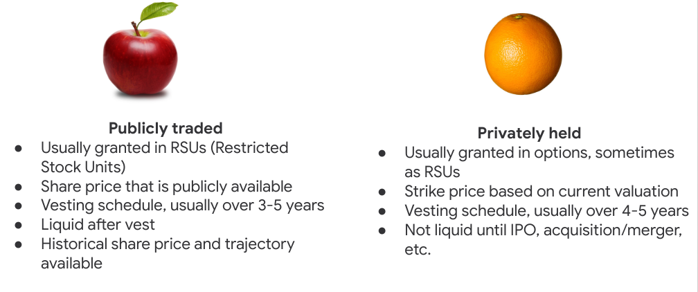

# CD-12: Navigating the Offer Process

<!--
This is our last career development session together, and I’m going to close by providing some guidance regarding what to do after you’ve successfully made it through an interview process and a company is interested in hiring you. This is a great place to be in, but it can come with its own stressors, especially if you’re considering moving to a new place, weighing different offers, and/or wondering what salary you should be aiming for.
-->

---

# Common questions in the offer process

* I’m about to be faced with one of the biggest decisions I’ve ever had to make. How do I know I’m making the right choice for me? 
* Should I aim high or play it safe with the preferred salary range I communicate?
* My offers have so many components and acronyms I don’t understand (RSU, PTO, 401k). What do all these things mean? 
* How do I go about negotiating my offers? 

<!--
These are some questions students typically have around this time, and in today’s session we aim to answer them.

[Ask four different student volunteers to read the questions on the slide.]

Can you think of other questions you have related to the process of weighing job offers and accepting a job
[Solicit student contributions and respond to each.]
--> 

---

# Agenda

1. Finding a good fit
1. Developing a salary range
1. Understanding full-time offers
1. Negotiating and making the right decision for you

<!--
Based on the questions we just discussed, here is an overview of what we’ll cover today:
Using your core values to decide which place of work is right for you
Once you’ve figured out the best potential employers for you, some best practices for developing a salary range you may communicate to them
Factors that are unique to full-time employment via the components of a job offer
How to navigate salary negotiation and ultimately signing the dotted line and making the best decision for you
--> 

---

# Different paths to success
## take these recommendations as suggestions

<!--
Before jumping in any further, I want to highlight that this session is a collection of thoughts and experiences of a few career technical recruiters who put this together. All of these are recommendations, not requirements for a successful hiring process. You are all unique people with different values, needs, location preferences, families, priorities, etc. Please take from this what you find helpful and discard what doesn’t align with your individual needs/preferences.
-->

---

# 1.) Finding a good fit

<!--
Let’s chat about what makes a company a good fit for you specifically. You might be thinking, “I’m not picky. I just need a job and health insurance!” I hear that. You may very well find yourself deciding between multiple offers when the time comes, though, and it’s important to be able to measure those offers against your own priorities and values to make the right decision for your next step.
-->

---

**What exactly is corporate culture?** {.big}

*Corporate culture* refers to the beliefs and behaviors that determine how a company's employees and management interact and handle outside business transactions. Often, corporate culture is implied, not expressly defined, and develops organically over time from the cumulative traits of the people the company hires.

Ideally corporate culture aligns with one’s personal values

<!--
Based on your understanding, how would you define “corporate culture”? [Solicit and respond to student contributions.]

[Click to allow definition to appear.]

What does corporate culture have to do with our values exercise from the last session? [Solicit and respond to student contributions.]

Yes, ideally corporate culture aligns with the personal values of the people working there. As an example, Google’s corporate culture incorporates the values of openness, innovation, comfort with ambiguity, collaboration. Another company’s might be transparency, results-focused, leadership, and specialization. Another’s might be simplicity, design, secrecy, and product excellence. We can’t always know a company’s culture from the outside, but talking with people who have worked there, speaking with recruiters, conducting informational interviews, and interning at a company are all great ways to learn about a company’s culture.

Source: *Inc.com’s encyclopedia of business terms
-->

---

**Corporate culture vs. your wants and needs** {.big}

From our last session, what is most important to you?

<!--
Thinking back to our last session’s value discussion or otherwise, what are some of the things that you find most important when thinking about your future career/employer? 

[Solicit student contributions and respond to each.]

[Click to display list.]

There are countless factors that might play into an individual’s wants and needs, and the list we looked at in our last session is much longer than this one. But these are some things people value the most when it comes to their work and workplace. This list is by no means exhaustive, but it does include some of Harvard Business Reviews “6 Components of a Great Corporate Culture” and Time’s “Top 10 reasons people stay at their jobs.” 

What on this list, or not on this list, resonates most with you?

[Solicit student contributions.]

Excellent. As we can see just from our small group, people have different priorities and values when it comes to their work. Let’s take a look at two people on the job hunt whose values differ substantially...
-->

---

**Different values at work** {.big}

<!--
This slide represents two different word clouds emphasizing the relative importance of the same set of values through the eyes of two undergraduate students looking for full-time jobs. You can see in the yellow/green cloud on the left the words that stand out: recognition, camaraderie, benefits, pay, commitment to learning. In the blue/purple cloud on the right the focus is slightly different: vision, family, values, diversity, consistency. Though some of the priorities do overlap, it is less than likely that the “perfect” or “dream” work environment for both of these students will be the same job on the same team at the same company.

Source: *Images created on tagul.com
-->

---

**Your values at work** {.big}

* Consider
  * Reflect on your values, where you’re willing to live, whether your values align with certain roles and organizations
* Identify
  * Know what your potential deal breakers might be 
* Take Action
  * Leverage career fairs, LinkedIn, former interns, recruiters, company events to learn more about companies
  
<!--
So how do you factor your values into your decision of where to work?

First, CONSIDER your values (along with your skills and career goals) when you decide where to apply. It’s not a good use of your time to apply somewhere where you wouldn’t work. Consider where you’re willing to live and the work you want to do before pursuing roles that aren’t in line.

Next, IDENTIFY any factors that are deal breakers in your job selection process. For example, if you’re applying to companies in a certain area but know that you realistically won’t move there -- that’s a deal breaker. Maybe a clear path to management is important to you. Maybe an equity-focused mission is a must-have. As you can see, these are unique to you. 

If you are still unsure if your values align with those of a company, TAKE ACTION by attending company events and connecting with current employees, if possible. This is also a great opportunity to reach out to LinkedIn connections you already have or new ones via the college/university alumni search filter we used in an earlier session. These provide an opportunity to ask strategic questions to help you determine the list of companies you want to apply to. 
-->

---

# 2.) Developing a salary range

<!--
Next we’ll talk about a topic that can be sensitive and often generates hearty debate! Some of you may have already engaged in conversations with recruiters or hiring managers about salary ranges, which makes this especially timely and relevant. If you haven’t, tuck these suggestions away for the future.

As I mentioned in the beginning of this presentation, take from these slides what feels appropriate to you and most importantly -- do your research. Your interview and application processes SHOULD involve substantial research, planning, and thought. This presentation is a jumping off point for that research and thought, not an answer to all related questions. 
-->

---

**Factors to consider** {.big}

* **Location**
    * Cost of living and labor can vary tremendously across U.S. cities
    * [NerdWallet’s Cost of Living Calculator](https://www.nerdwallet.com/cost-of-living-calculator) can help you determine what a comparable salary would be in another city given cost of living
* **Your Professional & Educational Experiences** 
    * Your salary will likely be less than someone in a similar position who has more years of work experience and/or more education
* **Industry**
    * Your potential employer also has a range in mind
    * It’s based on what they already pay people in similar roles and the pay scales of competitors. Still, do your research!

<!--
Location, Location, Location! Cost of living in a particular city can impact your desired salary range. For example, according to NerdWallet’s Cost of Living Calculator, making a pre-tax salary of $100,000 in San Francisco equates to $46,606 in Kansas City, MO because cost of living is 53% lower. That is a HUGE difference and should impact your salary range when discussing employment opportunities at companies in two different cities.

Expect that the employer has a salary range in mind based on what the company pays people currently in similar roles, as well as what they know about the pay scales of their competitors. Information is power -- and currency -- in all salary range and negotiation situations. The more you know about the company, the industry and the position, the easier it will be to provide a competitive and appropriate salary range.
-->

---

**Do your research** {.big}

* Determine how much take-home (net) pay stems from your entire (gross) income in a given city/state via [SmartAsset](https://smartasset.com/taxes/paycheck-calculator) or [PayCheckCity](https://www.paycheckcity.com/calculator/salary/)
* Spend time with your personal finances
  * student loans, rent, food, utilities, savings, emergency fund, etc
* Consult GlassDoor and related sites… with a grain of salt
* Consult friends and former classmates/colleagues who have similar roles in similar areas
* Give a range of at least $10k
* The bottom of the range should be the absolute lowest salary you would accept

<!--
I can’t overstate the importance of doing your homework here. From determining how much your take-home pay will be after withholdings and taxes to understanding your own personal finances, this can feel overwhelming but is really important.

Consult friends/colleagues and resources like GlassDoor, but do understand that those are anecdotal and not representative of a company’s pay policies and pay scales.

Keep in mind that an employer may gravitate to the the lowest part of your range and maybe… lower. For that reason, the lowest number in your range should be the absolute lowest salary you’re willing to accept. Some seasoned professionals may suggest making the bottom of the range a little higher than you would accept, but I would not recommend this for your first professional role.
-->

---

**It's OK to *not* answer** {.big}

*"I'm really interested in learning more about the role. I don't have solid salary expectations at the moment, but I'd be happy to revisit that later down the road if this still seems like a good opportunity for both of us."*

<!--
If a recruiter or hiring manager asks you for your salary range before you interview in person -- maybe during an informational phone call or phone screen --  in most cases you can politely defer this to a later conversation, potentially after interviewing. This can buy you some time to do more research. 
-->

# 3.) Full-time offers and negotiating

<!--
Next we’ll talk about some common components to tech offers, which can be quite confusing. There are a lot of buzzwords and jargon - strike price, vesting schedule, options, 401k - that I hope to make a little less intimidating. Please ask questions as you have them, and if I don’t know, I will try to find the answer!
-->

---

**Components of a typical [tech] offer** {.big}

Base Salary + Bonus + Equity = Total Compensation

<!--
When considering your salary and weighing offers, it’s important to remember that you’re weighing more than a single number. There are several things you’ll likely want to evaluate when determining your total rewards. This includes equity, potential bonus, benefits, perks and more. Let’s start by talking about salary, also known as compensation. It’s helpful to think of offers in terms of total compensation, or the sum of the base salary, the equity value and the annual bonus (+ signing bonus if there is one), which are typical (but not always present) in an offer. These numbers combined equal total compensation, and by determining this number for your offer it will help you compare offers from companies. 
-->

---

**Other perks/benefits** {.big}

* Paid time off (PTO) 
* Healthcare
* 401k matching
* Education reimbursement
* On-site services (gyms, transportation, laundry) 
* Child care & parental leave
* Legal services, mental health services, travel insurance, etc.
* Dogs in the office 
* Paid volunteer hours

<!--
In addition to base salary, equity and bonuses, some companies offer particularly stellar health insurance, free food, childcare, 401k matching, and many more perks. Ask your recruiter about these things. You might uncover a really incredible perk/amenity that aligns with your core values. 

Does anyone have any questions or comments about these?

[Solicit student contributions and respond to each.]

Source: Photo by Danielle Cerullo on Unsplash
-->

---

**Equity** {.big}

Equity is the value of shares issued by a company, often given as:

* **Restricted Stock Units (RSUs)**
  * Compensation awarded by an employer to an employee in the form of company stock, distributed according to a vesting plan, or once certain restrictions are met

**OR**

* **Options**
  * An option given by a company to an employee to buy stock in the company at a discounted or fixed price (strike price)

<!--
There are two common types of equity offered; Restricted Stock Units (RSUs) and Options. 

Restricted Stock Units are called GSUs at Google, and other companies may have unique names for them. So it’s a good idea to ask your recruiter “Is what I’m receiving a restricted stock unit, or options?” Restricted stock units are compensation awarded by an employer to an employee in the form of stock, which is distributed (or given) according to a vesting plan. Most stock isn’t given entirely up front, rather the vesting plan releases the stock to you in increments, normally over several years.

An option is a form of equity given to an employee to buy stock in the company at a discounted or fixed price.

Source: Source: National Center for Employee Ownership (NCEO) 
-->

---

**Comparing equity** {.big}

<!--
Comparing equity among publicly traded companies and privately held (or pre-IPO) is not making an apples to apples comparison. Rather, it’s more like comparing apples to oranges. 

Let’s take a look first at apples, or, publicly traded companies:

If they grant equity, it’s often in the form of RSUs, some companies call them by different names (e.g. Google calls them GSUs), but in essence restricted stock follows the same structure in that shares are granted - or GIVEN - I.e. you don’t have to purchase , the share price is public, there is a documented vesting schedule, and shares are liquid after they vest. 

What does it mean when I say liquid? 

[Solicit student responses.] The answer is, liquid means that they are yours to do what you’d like with - sell, trade, i.e. you can get cash. 

Last, with equity given at a public company, you can review the stock history and trajectory, which can aid in evaluation of worth

Now, let’s look at oranges, or, privately held companies. 

Privately held companies typically grant equity in the form of options, which as we discussed in the previous slide are the opportunity to BUY the company stock at a discounted price or set price. This set price is also known as a STRIKE price. Private companies also tend to have vesting schedules over 4-5 years. Unless sold on a secondary (aka gray) market - which is uncommon, options in privately held companies are not liquid (i.e. you can’t sell them for actual dollars) until the company has an “exit event”. 

Does anyone know what an exit event is? [Solicit student contributions, and respond to each.] The answer is an exit event is an event like an IPO, or initial public offering, or the company is acquired or merges. You can ask when a company plans to IPO, or if they have plans to merge/sell, but should be aware that generally recruiters won’t make promises here as they don’t control the market.

Employees who exercise their options and sell their shares when the company’s stock is trading significantly higher than the grant price have the potential to make a lot of money. For example, say you have the option to buy 5000 shares at $10 and sell the stock at $50, with a $50,000 investment you end up with $250,000. Beware, though, as this can go the other way, too.

Source: Sources: National Center for Employee Ownership (NCEO), Investopedia  
-->

---

**Equity questions** {.big}

* Am I receiving stock (e.g. RSUs), options, or another form of equity?
* Will I receive a dollar value, or a set number of shares?
* What is the vesting schedule? 
* What is the current stock price, and how has this stock performed historically? (available online)
* For privately held companies, is there a timeline to an exit?

<!--
Because equity can be confusing, and hard to compare across companies, here are some good questions to ask the recruiter or to research: 
As we learned, stock and options are quite different, and it’s important to understand which you are receiving
Some companies give a set dollar value of equity, and others give shares - ask which you are getting
Know what the vesting schedule is, as this varies from company to company. At some companies, the vesting schedule is even, for example, vesting at a rate of 20% over five years, and at others you may receive a lower percentage of the stock early on, and a higher percentage later
You can ask a recruiter or check online, but you’ll want to know the history of the stock’s performance to help you understand it’s value and up-side
For privately held companies, it can be hard to understand HOW and WHEN you’ll receive equity, and asking questions around exit strategies and IPO timelines can help you get a better idea if you’ll be able to exercise your options say next year as opposed to many years from now
-->

---

**401K** {.big}

A 401k is a retirement savings plan sponsored by an employer, and it allows employees to save and invest a portion of their paycheck before taxes are taken out. Taxes are paid when money is withdrawn from the account. 

**How to evaluate**:
* Will your company match my contributions? 
* Is there a tenure stipulation on how long I must work there before I receive matching?
* What is the maximum amount the company will contribute? 

<!--
Raise your hand if you know what a 401k is.

[Call on students until someone provides a correct answer.]

That’s right, a 401k is a tax deferred retirement savings plan, and some companies will match your contributions up to a certain amount. 

Let’s practice a quick calculation. The maximum amount you can contribute is 19,000 per year (as of 2019). Say your company will match 10% of your contributions up to the allowed maximum. How much is that? $1,900. So you put in $19,000 and your company puts in $1,900

Many companies contribute based on a percent, but some do a flat rate, some only contribute after you’ve been with the company for some time, so it’s important to ask the questions:
Will your company match my contributions?
If yes, is there a tenure stipulation on how long i must work there before I receive matching?
At what rate does your company match or contribute? 
What is the maximum amount your company will contribute? 

401k contributions can amount to thousands of dollars a year, so ask the questions and do the simple math! 
-->

---

**Negotiating** {.big}

* Be mindful of timing, i.e. don’t wait until the last minute
* Be clear about what’s important to you 
* As we discussed earlier, be transparent and honest 
* Understand your offers and do your due diligence 
* Have data and justification 
* Be realistic 
* Reneging an offer is a bad idea

<!--
Don’t wait until the night before your offer is due to talk to your recruiter about what’s important to you, or to start negotiating. Also, if you need to ask for an offer extension, do so as soon as possible (not the day the offer decision is due).

Take the time to ask recruiters some of the important questions we mentioned regarding 401k, equity, etc. 

Do your research if you don’t understand something! We don’t expect you to be experts, but this is YOUR offer! 

If you decide to negotiate, it’s helpful if you have data and justification. By data, I don’t mean to quote Glassdoor numbers, because sites like Glassdoor don’t always take into account tenure, and other factors, and aren’t always accurate. Having data means that you did the math, and the total compensation at company A and company B are % different, and you would like one company to match the other’s offer. Justification means that you’re coming to the company with more than “my friend got that much $$ so I think I should get that too.

Be realistic. Negotiating an offer isn’t like negotiating for some other things, where you give a pie in the sky number and just hope you’ll get half. Also, some companies cannot negotiate at all with things like PTO, or healthcare, so if the recruiter says it’s not an area they will budge on, see where they might have room to budge elsewhere. 

Does anyone know what reneging an offer means? 

[Solicit student answers and respond to each.]

Yes, reneging is when you back out of an offer you’ve already accepted. While legally you’re allowed to do this as an at-will employee, it is a terrible idea and can potentially having lasting impacts on your professional reputation. Hiring managers and recruiters put a lot of time, energy, and resources into finding and hiring you. They’ve likely rejected other candidates because you accepted your offer. If you back out they have to start the process all over again. This could put a big red flag on your candidacy, both at the company where you interviewed and with the recruiters you worked with. And those recruiters move around. All this is to say, barring emergencies, you shouldn’t regnege an offer.

What questions do you have about negotiating?

[Solicit student questions and respond to each.]
-->

---

**Mock scenario** {.big}

*You just received an offer from your dream company, and you’re super excited about joining them, except one thing: their compensation package is 15% lower than your other offers. Now what?*

<!--
In this scenario, you have an offer for a company you really want to work at, but their total compensation does not align with your other offers. 

What do you think you do here? 

[Solicit student contributions.]

Yes, you want to gather the data (i.e. the total compensation for the offer you want to accept is 15% lower than your other offers) and talk to the recruiter about why this is important to you and why this is holding you back. Be honest, give them the data and justification. 
-->

---

**You have arrived!** {.big}

Now that you have:
* Found the best fit
* Determined an appropriate salary range
* Understood your offers 

You are ready to make the right decision for YOU

<!--
Now that you’ve analyzed what’s important to you and found the companies that are the best fit for your values, you worked effectively with your recruiter, and you understood your offers, you feel ready and comfortable to make the right decision for you. Congratulations! 

This won’t all happen within an hour’s time in real life, but I do hope this session has given you some things to think about and has made you feel a bit more ahead of the offer process.  
-->

---

# Questions?

<!--
Thank you for participating and and for your engagement during this jam-packed presentation. I hope it’s been helpful and provided you with some important considerations for your job hunt. What remaining questions do you have for me before we close out? 
-->

---
