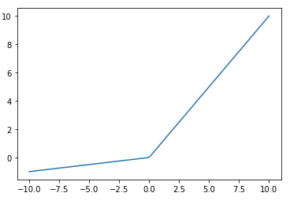

# Activation Functions

<!--

Activation functions are the a core component of neural networks. Choosing the right activation
functions, or the wrong ones for that matter, can have a big impact on the performance and training
time of your network.

-->

---

# What is being "activated"?

$$a = activation(bias + \sum_{i=0}^{n}{x_i})$$

<!--
If you think about a neural network, it is a series of layers. Each of these layers contains one or
more nodes. The layers operate one at a time, feeding data from the top of the model through to the
outputs.

When a layer runs, it passes all of it's output to each node in the next layer. This output is a
list of numbers. The receiving node sums up those numbers, along with it's own trained bias in order
to create it's output. This number that is added up has an activation function applied to it before
it is passed to the next layer though.

-->

---

# Types of Activation Functions

<!--
Let's take a look at some of the more commonly seen activation functions.

[Resource](https://en.wikipedia.org/wiki/Activation_function#Comparison_of_activation_functions)

-->

---

# Linear

<!--
The most basic activation function is the linear activation function. This function take the sum of inputs and bias, doest nothing to it, and hands the result to the next layer of the network.

That's a pretty simple activation function to understand. But what value does it provide?

This function can be useful, especially in your output layer, if you want your model to product large or negative values. Many of the activation functions that we'll see greatly restrict the range of values that they output. The linear activation function does restrict it's output range at all. Any real number can be produced by a node with this activation function.

Image Details:
* [linear.png](https://opensource.google/docs/copyright/): Copyright Google

-->

---

# Rectified Linear Unit (ReLU)

<!--
There is another linear activation function that turns out to be quite useful, the Rectified Lienar Unit (ReLU).

ReLU simply returns the input value unless that value is less than zero. In that case it returns zero.

This is also a quite simple activation, but it turns out to be quite useful in practice. Many powerful neural networks utilize ReLU activation, at least in part. It has the advantage of making training very fast; however, nodes using ReLU do run the risk of "dying" during the training process. The nodes die when they get to a state were they always produce a zero output.

Let's also think about the use of a ReLU node in a network. If the output layer consists of ReLU values, then the output of the network will be from 0 to infinity.

This works fine for models that are predicting positive values, but what if your model is predicting celsius temperatures in Antartica or some other potentially negative value?

In this case you would need to adjust the target training data to all be positive, say by adding 100 to it, and then do the reverse to the output of the model, subtract 100 from each value.

You'll find that you'll need to do this type of adjustment quite often when building models. Understanding your activation functions, espeically in your output layer, is critically important. When you know the range of values that your model can produce you can adjust your training data to fall within that range.

Image Details:
* [relu.png](https://opensource.google/docs/copyright/): Copyright Google

-->

---

# Leaky ReLU

<!--
We talked about dead nodes when discussing the ReLU activation function. One strategy that helps mitigate the dead node issue is a "leaky" ReLU. Leaky ReLUs are ReLU functions that pass through any value zero or greater. For values less than zero they apply an alpha value to them and return the result.

Image Details:
* [leaky_relu.png](https://opensource.google/docs/copyright/): Copyright Google

-->

---

# Binary Step

<!--
The binary step activation function serves as an on/off switch for a node. This function returns zero if it's input is on one side of a threshold and one if it is on the other.

At the output layer this function can be useful when you need to make a yes/no decision and don't care about the confidene of the model in that decision.

Image Details:
* [binary_step.png](https://opensource.google/docs/copyright/): Copyright Google

-->

---

# Sigmoid

<!--
Activation functions can also be non-linear. The sigmoid function works using a logistic curve.

You'll notice that the sigmoid function restricts it's output range to $(0.0, 1.0)$. This is typically not a concern in hidden layers, but needs to be considered in the output layer. You'll likely need to scale your training targets down to this range and expand your predictions back to your actual data range.

Sigmoids in the output layer can be very useful for predicting continuous values. They can also be useful we making binary classification decisions. You can build a model that outputs values from $(0.0, 1.0)$ and treat the output as a confidence in a decision where values closer to `0.0` show no confidence and  values closer to `1.0` show extreme confidence. You then experiment and set a threshold where you make your binary decision.

For example, if you were making a classifier to determine if an image contained a cat you might find that any time the model returned a value over `0.85` there was typically a cat in the image. Before making this decision you'd need to experiment, find the precision and recall for different thresholds, and choose the one that fit your use case the best.

Image Details:
* [sigmoid.png](https://opensource.google/docs/copyright/): Copyright Google

-->

---

# Hyperbolic Tangent (tanh)

<!--
Similar to sigmoid, the hyperbolic tanget, [tanh](https://www.tensorflow.org/api_docs/python/tf/keras/activations/tanh) is a non-linear activation function that can be used in your models. The biggest difference between sigmod and tanh is that tanh has an output range of $(-1.0, 1.0)$

Image Details:
* [tanh.png](https://opensource.google/docs/copyright/): Copyright Google

-->

---

# Softmax

<!--
So far all of the activation functions that we have seen operate without knowing anything about other nodes in their layer. Each node accepts input from the layer before it and passes output to the next layer in the model. The node is unaware of any other node in it's own layer and activation functions on the nodes work independently.

Softmax is a different type of activation function. Softmax is aware of nodes in the same layer and adjusts their outputs in relation to each other.

Softmax outputs values in the range of  [0.0,1.0] . If you were to sum the outputs of every node in a layer, the sum would always equal 1.0, or something very very close to 1.0.

Let's say that we had a model that tried to determine if an image contained an apple, orange, or grapefruit. If given a picture of a bright red apple, it might output [1.0, 0.0, 0.0] to show that it was highly confident that the image contained an apply. If given a picture of a yellow apply it might be a little less confident and output [0.8, 0.15, 0.05], indicating a little less confidence. If given a picture of a large orage it might output [0.05, 0.55, 0.4], showing that it was having a tough time making a decision.

It is worth noting that softmax is typically not used in hidden layers of a model. Most of the time you will see it used on the output layer.
-->

---

# Keras

<!--
These are just a few of the activation functions that you can use. Some are already developed for you in Keras. See [here](https://keras.io/api/layers/activation_layers/) for more on how Keras uses activation functions in its neural nets.

-->

---
