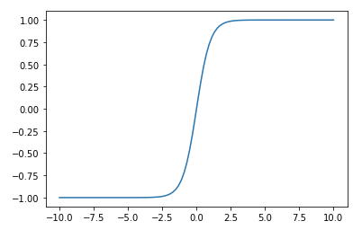

# Activation Functions

<!--
Activation functions are the "behind the scenes" cornerstone of neural networks.

-->

---

# What is being "activated"?

- A *node* in a neural network is like a signal. It can be "on" or "off".
- The *inputs* to the node are all the information being passed from previous layers to that node.
- The activation function maps all the input information to an on/off decision.

<!--
No need to go into too much detail. Suffice to say that an activation function returns 1 if the inputs signal something, and 0
otherwise.

-->

---

# Types of Activation Functions

<!--
Walk students through the most common activation functions. Direct students
[here](https://en.wikipedia.org/wiki/Activation_function#Comparison_of_activation_functions) for an exhaustive comparison of
the most popular activation functions.

-->

---

# Logistic

<!--
This is the activation function used in logistic regression. It is also known as the sigmoid function.

Image Details:
* [logistic.png](http://www.google.com): Copyright Google

-->

---

# Tanh

<!--
The tanh (or hyperbolic tangent) function is very popular for neural networks. It is what you will see in your colab.

Image Details:
* [tanh.png](http://www.google.com): Copyright Google

-->

---

# ReLU

<!--
This is the rectified linear unit (ReLu) function. It is also known as the "ramp" function, and is popular for speech
recognition.

Image Details:
* [relu.png](http://www.google.com): Copyright Google

-->

---

# Leaky ReLU

<!--
This is the leaky rectified linear unit (leaky ReLu) function. It is used alongside ReLU in keras and tensorflow increasingly.

Image Details:
* [leaky_relu.png](http://www.google.com): Copyright Google

-->

---

# Keras

Keras uses the following layers in its neural nets. All are derived from the ReLU function.

- ReLU layer
- Softmax layer
- LeakyReLU layer
- PReLU layer
- ELU layer
- ThresholdedReLU layer

<!--
See [here](https://keras.io/api/layers/activation_layers/) for more on how Keras uses activation funtions in its neural nets.

-->

---

# Your Turn!

<!--
Direct students to the colab, where they will apply an RNN to predict a stock price.

-->
