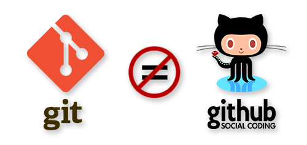
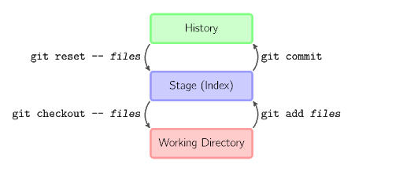
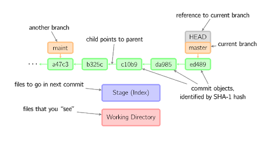
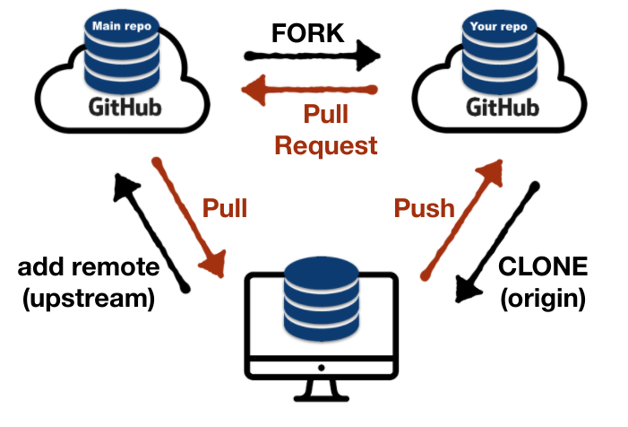
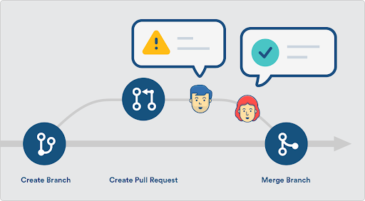
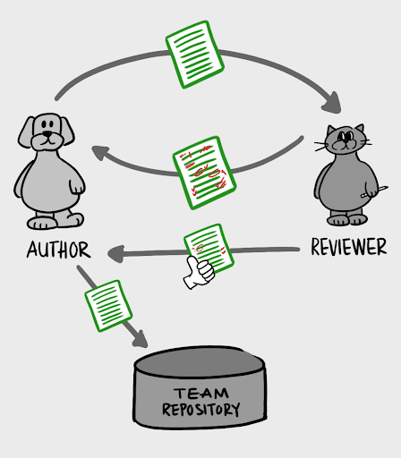
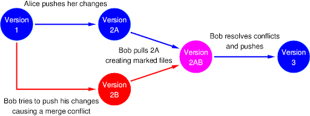

# Git and Github

---

# Why Version Control?

<!--
*Start by making sure everyone knows what is version control*

Why version control:
Is anyone not convinced you need git? 
When you’re writing an essay/book, do you make multiple versions?

Picture the following situation:
   Built feature 1, feature 2, feature 3...
Then client wants to remove a feature

Or you find a bug, but there’s no way to tell when that was introduced 
Result: you have to review everything, all of your code

Finally, when collaborating with other developers it’s tough to keep your code synced. Emailing code back and forth and merging manually should NOT be an option.

True story 1, without git: tell personal story of a bad experience that you had for not using version control

True story 2, with git: tell personal story of a good experience that you had for using version control
Alexandria class project db disaster. Imagine if we had been emailing the code back and forth?

version control gives you magical powers: 
collaborating made easy

branching: 0-risk of messing up, can try different things, can work on multiple features at the same time, can review someone else’s code without affecting yours.

checkout (adds commit or specific file/version to work tree, and also used to switch between branches)

reset (changes or deletes previous commit. Changes history)

revert (adds new commit undoing past commit. Doesn’t change history)

Image Details:
* [gitandgithub01.png](Image: codeburst.io): Copyright 
-->

---

# Git vs. GitHub

<!--
Git: Version control software.
GitHub: hosting service for version control + GitHub Pages
We use GitHub to store our repos (ie, to save our code in the cloud) Similar to Google Drive

We use git to keep track of each version of our code. 
Committing your code is like hitting a “save” button that creates a snapshot of everything we did up until that point. (== pinned vs in Colab, or Version History in Google Docs)
With git, your repo keeps a “version history” and lets you access any previous version of your code.

Alternatives to git: 
* Mercurial (open source), 
* Team Foundation Version Control (Microsoft), 
* Apache Subversion, etc

Alternatives to GitHub: 
* BitBucket, 
* GitLab, 
* SourceForge, etc

Image Details:
* [gitandgithub01.png](Image: https://jahya.net/blog/git-vs-github/): Copyright 
-->

# Contributing to An Existing Project

1 Fork
1 Clone
1 Create upstream remote
1 Pull before you Code
1 Stage and Commit
1 Send Pull Request

<!--
2 demos: Fork from org, and Push local repo to github

1st
Fork from org
Go to https://github.com/ClassTest001 
Fork
Terminal > create git_demo folder >
If first time, 
git config —list / 
git config --global user.name "Your Name” / email
cd into git_demo
Clone
Create Upstream remote
Branch 
Code (edit jupyter notebook, copy csv into folder)
Stage and Commit
status: working directory / stage (index)
log: history
Staging / add .
Send PR
Keep PR open to show code review in later slides

Image Details:
* [gitandgithub03.png](Image: GitHub Education): Copyright 
-->

# Workflow

1 $ git pull upstream master  // pull = fetch + merge
1 $ git checkout -b branch_name  // use -b to create a new branch
1 $ git status
1 $ git add file_name / $ git rm file_name
1 $ git commit -m “Message describing commit”
1 $ git push origin branch_name

<!--
Pull first, then Push
pull = fetch + merge
Day to day workflow (pull before you push, etc)

indicate that $ is not to be typed.

Image Details:
* [gitandgithub04.png](Image: thesocialmediamonthly.com): Copyright 
-->

---

1 $ git log
1 $ git status
1 $ git diff

<!--
git log
git status
git diff (default is diff between stage and working dir)

Reference: http://marklodato.github.io/visual-git-guide/index-en.html 

Image Details: 
* [gitandgithub05.png](Image: marklodato.github.io/visual-git-guide): Copyright 
-->

---

<!--
Reference: http://marklodato.github.io/visual-git-guide/index-en.html 

Image Details: 
* [gitandgithub06.png](Image: marklodato.github.io/visual-git-guide): Copyright 
-->

---

[https://github.com/ORG/REPO](https://github.com/ORG/REPO)

[https://github.com/YOU/REPO](https://github.com/YOU/REPO 

<!--
Image Details: 
* [gitandgithub07.png](Image: UNKNOWN ORIGIN): Copyright 
-->

---

# Pull Requests

<!--
Pull request (can keep pushing while pr is open)

Image Details: 
* [gitandgithub08.png](Image: Atlassian): Copyright 

-->

---

# Code Requests

<!--
demo commenting on code and requesting reviews.

Image Details: 
* [gitandgithub09.png](Image: mtlynch.io): Copyright 
-->

---

# Merge Conflicts 

<!--
Merge conflicts and how to solve them

https://github.com/MissionBit/github_demo/pulls
merge PR1, then see conflict in PR2

show conflict on terminal (pull upstream into branch pr2)
show how to solve it in sublime and VSCode

Image Details: 
* [gitandgithub10.png](Image: cs.utsa.edu): Copyright 
-->

---

# What About

Creating a new project from Scratch

or

Adding git to an existing project

<!--
create repo:
mkdir my_project
cd my_project
echo "print('Hello World\!')" > hello.py > open hello.py

git init

Go to GitHub and create new repo
$ git add remote origin url
-->

---

# Additional Resources

Worksheet 
[http://try.github.io](http://try.github.io)

---

# Questions?

---
