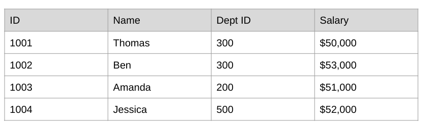
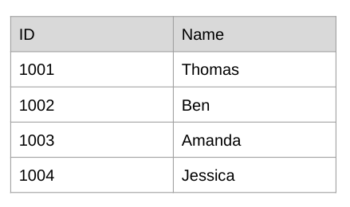
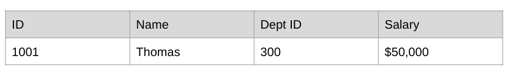
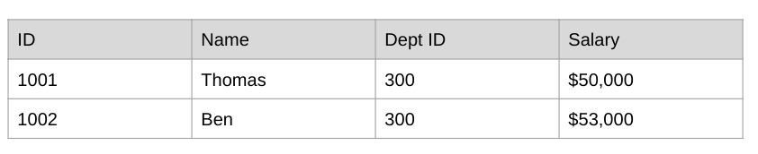
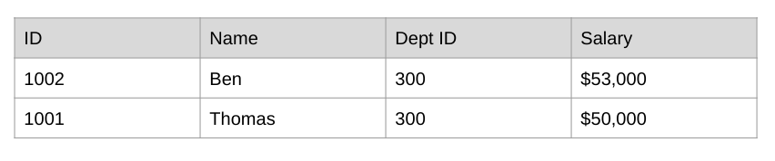
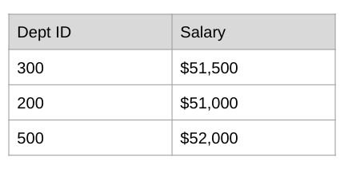
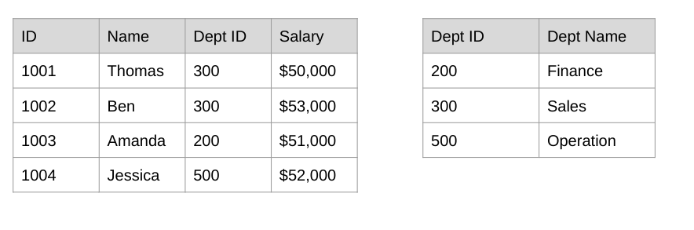
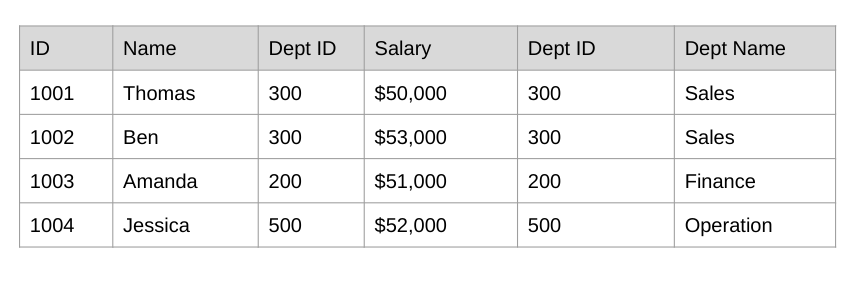
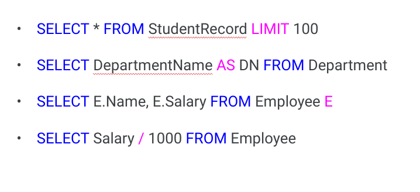

# Introduction to SQL

---

# History

* Short for Structured Query Language
* Pronounced S-Q-L or Sequel
* Developed in early 1970s in conjunction with the development of Relational Database
* Widely used and documented
* Standard?

<!--
SQL has been around since the 70s with the development of relational database.  Large companies developed a suite of tools and relational database servers, eg: Oracle, Sybase, Microsoft and Informix.  It was a popular foundation for data storage for many industries, such as Finance, Healthcare, Retail, etc.
More recently the open source MySQL is a more popular option and can be hosted in the cloud.  Cloud providers supports instances of MySQL such as AWS, Azure and Google Cloud
Standard?
* While standard SQL exists, often each vendors have added their own of extensions that it’s sometime confusing to keep track of
* For the SQL query to be portable across system, it needs to be written without using vendor specific extensions
-->

---

# Groups of operations

* Data Definition Language (DDL)
  * CREATE, DROP, ALTER

* Data Manipulation Language (DML)
  * INSERT, UPDATE, DELETE

* Data Control Language (DCL)
  * GRANT, REVOKE

<!--
* SQL queries often categorized into several type database operations
  * DDL - mainly for managing database objects -- Create & Drop (delete) table for example, Alter
  * DML - for managing rows of data -- Insert & Delete: create or delete rows of data *Update: modify the values of one or more columns of row data
  * DCL - for managing access to the database objects -- Grant & Revoke: read or write access
  -->
  
  ---
  
# Query

* Data Query Language (DQL)
  * **SELECT** COLUMN(S)
  * **FROM** TABLE(S)
  
<!--
And the most common is DQL - which is for selecting the appropriate subset of data that we need
* The basic syntax is SELECT one or more columns FROM one or more tables
-->

---

# Table

Employee table

<!--
Here’s an example of tabular data - an employee table that we will use in the next slides:
It has 4 columns and 4 rows
The columns are:
* Employee ID
* Employee Name
* Employee Dept ID
* Employee Salary
-->

---

# Query

**SELECT** ID, Name **FROM** Employee

<!--
Let’s review our first query!
* This query follows the basic syntax of SELECT … FROM …
* In this case, it’s selecting:
   * 2 columns: ID and Name
  * From a table named Employee
  * Results in all the values of the columns ID and Name
-->

---

# Query

<!--
Here’s the output of the previous slide’s query
Any questions?
-->

---

# Filtering

Data Query Language (DQL)
**SELECT** COLUMN(S)
**FROM** TABLE(S)
**WHERE** COLUMN = VALUE

<!--
Now, we don’t always want to get all the values of particular column(s).  That’s where filtering is useful, and the syntax is:
* Where - followed by a conditional, eg: column = value
* The operator does not have to be always =, it could >, <, >=, <=, etc. - which we will discuss a few slides from now
-->

# Filtering

**SELECT** * **FROM** Employee **WHERE** ID < 1002

* The query begins with SELECT * instead of SELECT followed by one or more column names.  Anyone know what SELECT * stands for?
* SELECT * means SELECT all columns
* WHERE ID < 1002 is the filter and ID < 1002 is the conditional
* So, only rows of data that has an Employee ID smaller than 1002 will be selected.  How many rows would the query results will be?

# Filtering

<!--
Correct!  Only 1 row with ID = 1001
-->

---

# Filtering

**SELECT** * **FROM** Employee **WHERE** ID <= 1002

<!--
What happens if we change the conditional operator from < to <=?
<= 1002 means Employee ID less than or equal to 1002
-->

# Filtering

<!--
In this case, the query resulted in 2 rows with Employee IDs of 1001 and 1002
-->

# Operators

* =, <>
* <, <=
* >, >=
* BETWEEN … AND …
* LIKE “%OO”
* IN (“FOO”, “MOO”, “BOO”)

<!--
* We use =, <, or <= in the example queries in previous slides
* Let’s review other operators
 * <> is for not equal (it’s not !=)
 * As for >= and <=, notice the equal comes after < or >
* Others
 * BETWEEN … AND … (Remember: it’s inclusive)
 * LIKE “%OO” (any strings that end in OO)
 * IN (“FOO”, “MOO”, “BOO”)  (equivalent to column = ‘FOO’ or column = ‘MOO’ or column = ‘BOO’)
-->

---

# Sorting

* Data Query Language (DQL)
* **SELECT** COLUMN(S)
* **FROM** TABLE(S)
* **WHERE** COLUMN = VALUE
* **ORDER** BY COLUMN

<!--
* The query clause to sort the query result is ORDER BY one or more columns
* The default sort order is ascending
* To sort in descending order, add DESC after the column names
 * ORDER BY one or more columns DESC
-->

# Sorting

**SELECT** * **FROM** Employee **WHERE** ID <= 1002 **ORDER BY** Name

<!--
Let’s do the same query as before except we’ll add ORDER BY to sort the results by Name column
* The filtering will happen first
* Then, the sorting
-->

---

# Sorting

<!--
And, the results differs from previous example as row with Employee ID 1002 comes first because Employee Name Ben comes before Thomas in the ascending sort order
-->

---

# Aggregating

Data Query Language (DQL)
* **SELECT** AGGREGATION(COLUMN)
* **FROM** TABLE(S)
* **WHERE** COLUMN = VALUE
* **ORDER BY** COLUMN(S)
* **GROUP BY** COLUMN(S)

<!--
Beside filtering and sorting, SQL also support aggregation of query results with the GROUP BY one of more columns.
In aggregation case, the query results is aggregated based on values in certain columns using the specified aggregation functions
Let’s look at an example in the next slide
-->

# Aggregating

**SELECT** Dept ID,  **AVG**(Salary) **FROM** Employee **GROUP BY** Dept ID

<!--
This is an example of aggregation query, and:
* The query results is group based on Dept ID column, so all the rows that has the same Dept ID values are group together
* Then we apply the aggregation function, in this case AVG() to the Employee Salary column
* So, for every subgroup of rows with the same Dept ID, we’ll return just 1 row of data
 * Each result row will have 2 columns:
 * Dept ID
 * Average of Employee Salary
-->

---

# Aggregating

---

# Filtering aggregated results

**SELECT** Dept ID, **AVG**(Salary) **FROM** Employee **GROUP BY** Dept ID **HAVING** AVG(Salary) > 51000

---

# Filtering aggregated results

<!--
While WHERE is used to filter rows, we need to use HAVING to filter aggregated results.
-->

---

# Aggregation functions

* SUM
* COUNT
* AVG
* MAX
* MIN
* FIRST
* LAST

<!--
We saw AVG() in the previous example, and:
* SUM returns the total of values of particular column of all rows in the subgroup
* Similarly COUNT returns the total number of rows in the subgroup
* MAX & MIN returns the max or the min values of a particular columns for all rows in the subgroup
* FIRST & LAST return the first or the last values
-->

---

# Joining

Data Query Language (DQL)
* **SELECT** COLUMN(S)
* **FROM** TABLE1, TABLE 2
* **WHERE** TABLE1.COLUMNA = TABLE2.COLUMNB

<!--
* Joining merging data from multiple tables for the purpose of querying the merged data.  It does not actually alter the source tables.
* You’ll need to specify:
 * At least 2 tables in the FROM clause
 * Use the WHERE clause to specify how the tables should be merged
 * To avoid confusion, column is specified as table.column format in case there exists an identical column name in both tables
* Let’s look at an example in the next slide
-->

# Joining

**SELECT** * **FROM** Employee, Department
**WHERE** Employee.DeptID = Department.DeptID

<!--
In this example, we have 2 tables:
* Employee table with 4 columns, including Dept ID column
* Department table with 2 columns, including Dept ID column
Naturally the 2 tables are joined on Dept ID column, by specifying:
* WHERE Employee.DeptID = Department.DeptID
Once the join happens, you could select any columns from either table.  In this case, we are selecting all the available columns:
*SELECT *
-->

---

# Joining

<!--
And, here’s the resulting output of the query
-->

---

# Useful keywords

<!--
A few more useful keywords before you’ll practice with Introduction to SQL colab:
* LIMIT:
 * Use to only show the first X rows of query results
 * Useful as sometime the query results can return a very large number of rows
 * Caution: using LIMIT does not impact the execution of the query, just the display of the final output.  This means even though you’re only seeing X number of rows, the query still compute through all the rows which use up computing resources
* AS: use to alias a column name, and useful when: 
 * Have a long column name
 * Want a more descriptive column name in the query result instead of the default column name from the source table
* Alias can also be used for table name, but noticed it does not require AS keyword
* Arithmetic: you can perform arithmetic on column, for example:
 * Show the employee salary in $K rather than $ amount
-->

---

# Your Turn

Introduction to SQL (need link)

