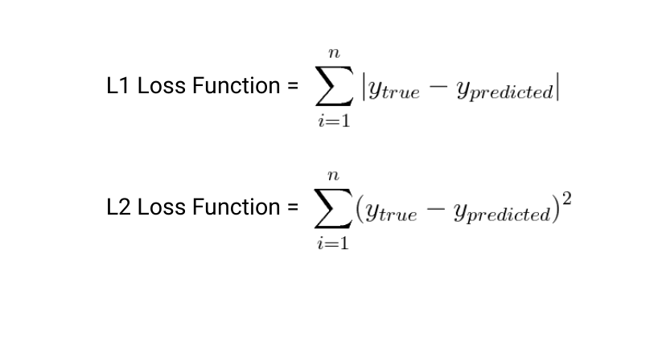
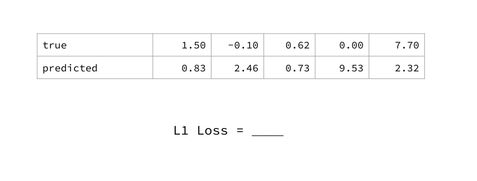
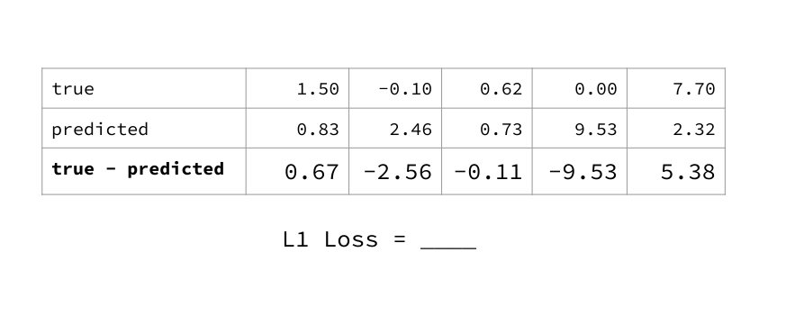
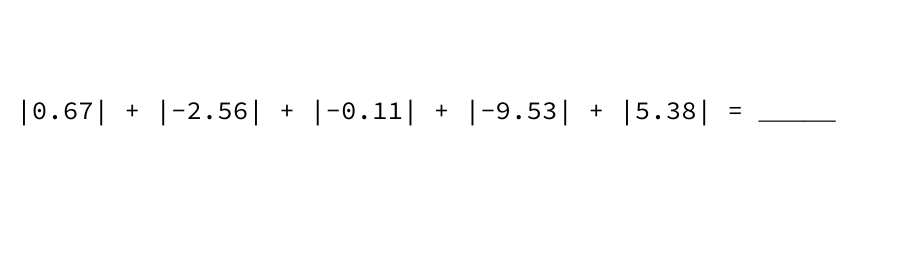
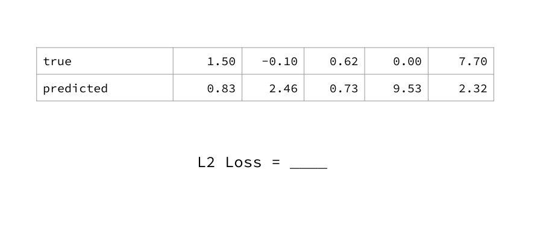
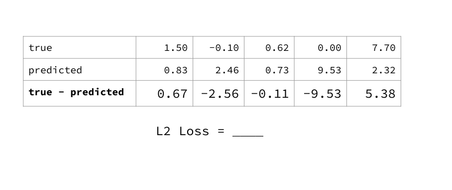
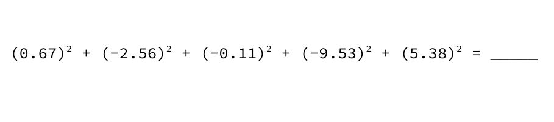
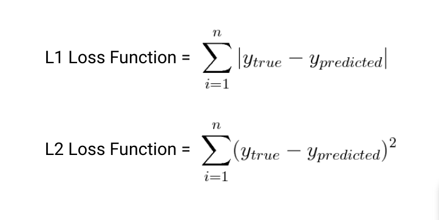
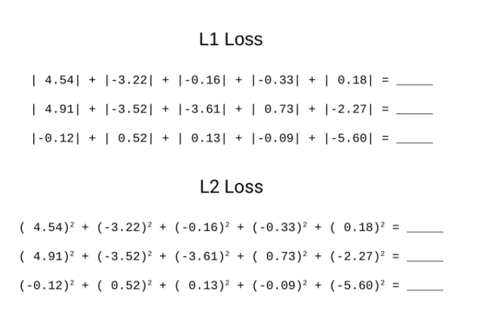
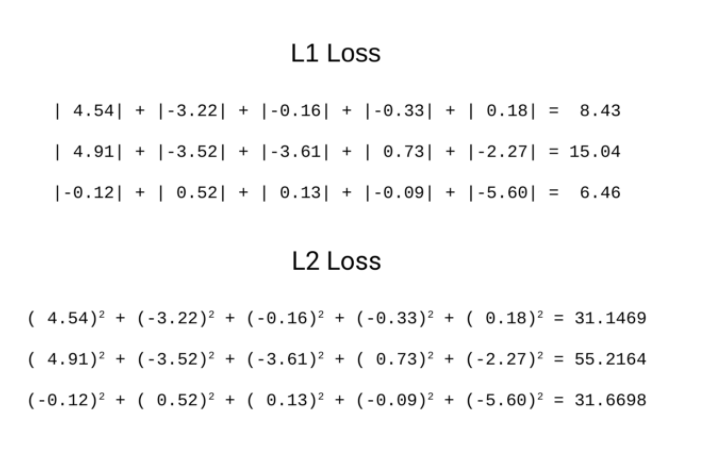

# Loss Functions

---

# L1 and L2 Formulas

<!--
Loss functions are essential to machine learning. At its core, machine learning “learns” by trying to optimize a loss function. A loss function is simply a way to evaluate how well your algorithm models your data. You can think of it as similar to a measure of error: higher loss means your model is performing worse, and lower loss is a sign of better performance.

Two of the most common loss functions for regression are called L1 and L2. L1 is used to minimize the sum of *absolute* differences between the true value and the predicted value of all samples, and L2 is used to minimize the sum of *squared* differences.

Image Details:
* [lossfunction1.png](https://opensource.google/docs/copyright/): Copyright Google
-->

---

# Averaging

<!--
It’s common to either take the sum or average of all data points to calculate overall loss. “Mean Squared Error” (also referred to as MSE) is another widely used loss function that is closely related to L2 loss. But instead of the sum of squared differences, it’s the *average* of squared differences.

You should choose a loss function based on your specific problem and dataset. L1, L2, and MSE are used for regression problems. We’ll discuss loss functions used for other machine learning problems, such as classification, later.

Image Details:
* [lossfunction2.png](https://opensource.google/docs/copyright/): Copyright Google
-->

---

# L1 loss: example

<!--

Let's work through an example of calculating L1 loss, starting from data values and predictions.

Image Details:
* [lossfunction3.png](https://opensource.google/docs/copyright/): Copyright Google
-->

---

# L1 loss: example 

<!--
The first step is to find the differences (y_true - y_predicted).

Image Details:
* [lossfunction4.png](https://opensource.google/docs/copyright/): Copyright Google
-->

---

# L1 loss: example 

<!--
Take the absolute value of each difference.

Image Details:
* [lossfunction5.png](https://opensource.google/docs/copyright/): Copyright Google

-->

---

# L1 loss: example 

<!--
Add all absolute value differences. This is the L1 loss of your model.

Image Details:
* [lossfunction6.png](https://opensource.google/docs/copyright/): Copyright Google
-->

---

# L2 loss: example

<!--
Now, we'll work through the same example, but calculate L2 loss instead.

Image Details:
* [lossfunction7.png](https://opensource.google/docs/copyright/): Copyright Google
-->

---

# L2 loss: example 

<!--
The first step is again to find the differences (y_true - y_predicted).

Image Details:
* [lossfunction8.png](https://opensource.google/docs/copyright/): Copyright Google
-->

---

# L2 loss: example

<!--
Now square each difference.

Image Details:
* [lossfunction9.png](https://opensource.google/docs/copyright/): Copyright Google
-->

---

# L2 loss: example 

<!--
Add the squared differences. This is the L2 loss of your model.

Image Details:
* [lossfunction10.png](https://opensource.google/docs/copyright/): Copyright Google
-->

---

# Your Turn

<!--
@Exercise (10 minutes) {

*Have students work individually on the Loss worksheet. Given them around five minutes to work.*

*The loss worksheet contains:
* Page 1: Solutions. (Don't give these to the students.)
* *Page 2: Three sets of true/predicted data points. (Give these to the students.)
* *Page 3: Intermediate steps to calculating the loss. (Choose whether or not to give these to the students.)
* *Page 4: The examples we worked through above. (Choose whether or not to give these to the students as reference.)
}

Image Details:
* [lossfunction11.png](https://opensource.google/docs/copyright/): Copyright Google
-->

---

# How did you do?

Compare answers with your neighbor.

<!--
@Exercise (5 minutes) {
Have students compare their answers with a neighbor and work through any discrepancies.
}
-->

---

# Solution

<!-- 

*Prompt students for answers.*

Image Details:
* [lossfunction12.png](https://opensource.google/docs/copyright/): Copyright Google
-->

---

# Solution

<!-- 

*End by asking students what the difference is between L1 and L2 as summary measures, and why someone might want to use one over the other.*

*Answer: L2 is more sensitive to outliers in the data set because squaring the difference makes the difference more extreme.*

Image Details:
* [lossfunction13.png](https://opensource.google/docs/copyright/): Copyright Google
-->
