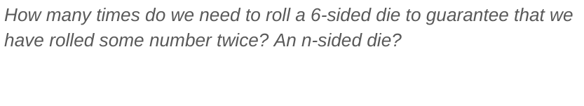

# Probability

---

# Introduction to Probability

* Probabilities
* Expected Value
* Independence
* Conditional Probabilities
* Bayes Theorem

<!--
Image Details:
* [prob01.png](http://www.google.com): Copyright Google
---

# Dice Rolls Are Uniform Probabilities

* If we roll a 6-sided die, what is the probability of rolling a 1?
* What is the probability of rolling an even number?

<!--
Motivation: To first introduce the concept of probability and random variables, we want to begin with a simple example that allows students to easily intuit the likelihood of an event. 

We chose dice problems for both their initial simplicity and as a type of problem that can easily be made more complicated.
-->

---

# Dice Rolls Are Uniform Probabilities

* If we roll a 6-sided die, what is the probability of rolling a 1?
* What is the probability of rolling an even number?

Colab:
[Dice Rolling Simulator](https://colab.sandbox.google.com/drive/1SODGzYxYxIpyVhLyYXu8gyFxz4wBOgXp?usp=sharing)

<!--
We chose dice problems for both their initial simplicity and as a type of problem that can easily be made more complicated.
-->

---

# Rolling a Die Creates a Random Variable

* If we roll a 6-sided die, what is the probability of rolling a 1?
* What is the probability of rolling an even number?

<!--
X is a random variable, in that it can be any one of 6 values, and it achieves each of these values with a certain probability. For a dice, the probability is equal for each value, but for other distributions the probability of achieving certain values can get much more complicated.

Image Details:
* [prob02.png](http://www.google.com): Copyright Google
-->

---

# The Expected Value is the “Average” Roll

* When we roll a 6-sided die what is the “most likely” value?
* Sometimes called the **“mean”** of the random variable
  * Imagine rolling the die 100 times, what would the average roll be?

<!--
Sometimes, we want to know things about a random variable without having to observe it many times. For instance, we might want to know what value the random variable is “most likely” to achieve. To find this, we use the concept of an expected value.

We commonly think of the expected value as being the mean -- that is, over a long period of time with many observations of the random variable, the expected value would be the average value we would see.

Image Details:
* [prob03.png](http://www.google.com): Copyright Google
-->

---

@[YouTube: Expected Value](https://www.youtube.com/watch?v=YWiXHKnX0y4&feature=youtu.be)

<!--
In this demo we show how we could find the experimental average of a distribution, and how it compares to the true expectation of the distribution. We use the rolling of a six-sided die, and generate 1000 random dice rolls to find the experimental average die roll. We then show how to calculate the expected value of rolling a 6-sided die.
-->

---

# Expectation is a type of weighted average

<!--
We can also think of expected value as being a weighted average -- that is, we weight the values by the likelihood of seeing them.

Image Details:
* [prob04.png](http://www.google.com): Copyright Google
-->

# Expected value is linear

<!--
Effectively, we recognize that expected value is linear. This means we can pull scalar constants out of the expectation (1). Also, this means we can add expectations (2) -- “the expected value of the sum is the sum of the expected values.” Finally, we see that the expected value of a constant is simply that constant (3).

Image Details:
* [prob05.png](http://www.google.com): Copyright Google
-->

---

# Expectation of functions

<!--
We find that the expected value of a function of a random variable is simple the weighted average of the possible values of that function, where the weights are the probabilities of each value of the original random variable.

Image Details:
* [prob06.png](http://www.google.com): Copyright Google
-->

# Sample Exercise: Dicier and Dicier

<!--
The expected values is not a guarantee or an upper bound. For instance, we might consider the absolute least number of rolls we need to know that no matter what we rolle, one of our rolls was a duplicate of another roll.

Image Details:
* [prob07.png](http://www.google.com): Copyright Google
-->

---

# Sample Exercise: Dicier and Dicier

<!--
Suggested Exercise Style:
Class discussion for first question. Small groups or think pair share for second and third. Regroup class for fourth question.

Image Details:
* [prob08.png](http://www.google.com): Copyright Google

---

# Sample Exercise: Dicier and Dicier

<!--
Suggested Exercise Style:
Class discussion for first question. Small groups or think pair share for second and third. Regroup class for fourth question.

Image Details:
* [prob09.png](http://www.google.com): Copyright Google

---

# Sample Exercise: Dicier and Dicier

<!--
Suggested Exercise Style:
Class discussion for first question. Small groups or think pair share for second and third. Regroup class for fourth question.

Image Details:
* [prob10.png](http://www.google.com): Copyright Google
-->

---

# Sample Exercise: Dicier and Dicier

<!--
Suggested Exercise Style:
Class discussion for first question. Small groups or think pair share for second and third. Regroup class for fourth question.

Image Details:
* [prob11.png](http://www.google.com): Copyright Google
-->

---

# Sample Exercise: Dicier and Dicier

<!--
Suggested Exercise Style:
Class discussion for first question. Small groups or think pair share for second and third. Regroup class for fourth question.

Image Details:
* [prob12.png](http://www.google.com): Copyright Google
-->

---

# Sample Exercise: Dicier and Dicier

<!--
Suggested Exercise Style:
Class discussion for first question. Small groups or think pair share for second and third. Regroup class for fourth question.

Image Details:
* [prob13.png](http://www.google.com): Copyright Google
-->

---

# Sample Exercise: Dicier and Dicier

<!--
Suggested Exercise Style:
Class discussion for first question. Small groups or think pair share for second and third. Regroup class for fourth question.

Image Details:
* [prob14.png](http://www.google.com): Copyright Google
-->

---

# Functions of random variables are also random

<!--
E[2X] = ⅙(2+4+6+8+10+12) = 7.

E[X] + E[Y] (where X and Y are both dice roll, X the first die and Y the second) = 3.5 + 3.5 = 7.

We ask students to see the difference, which we can show by looking at the different probability distributions (even if we get the same expected values)

Image Details:
* [prob15.png](http://www.google.com): Copyright Google
-->

