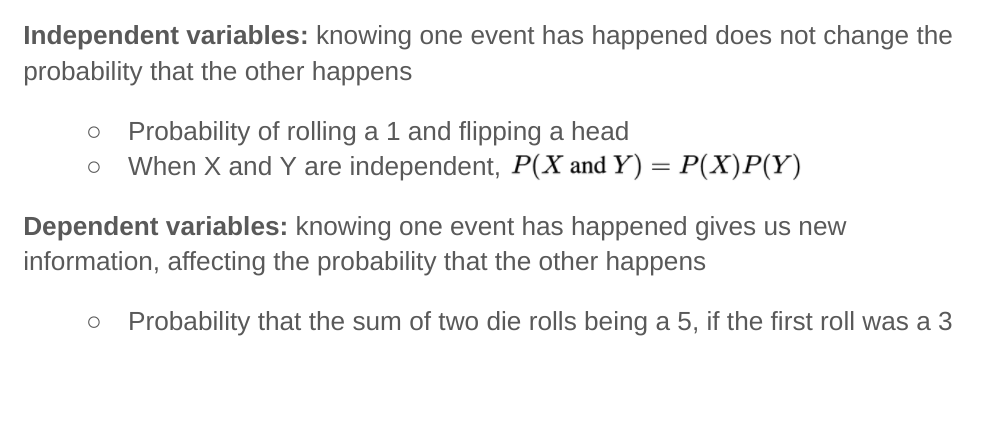
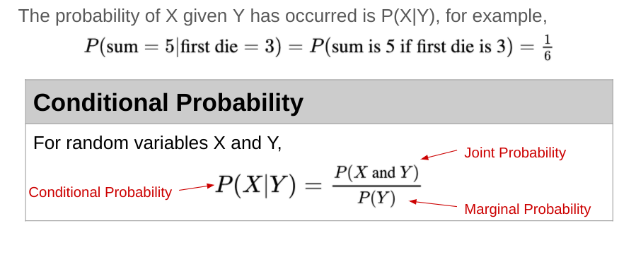
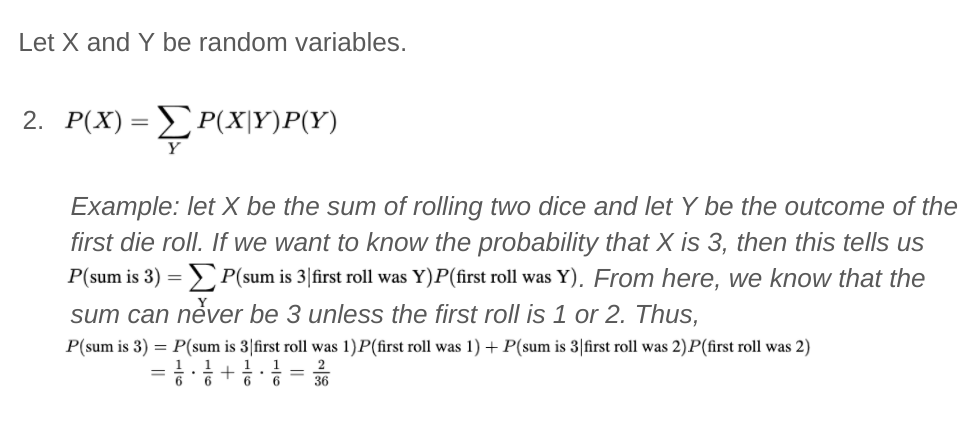
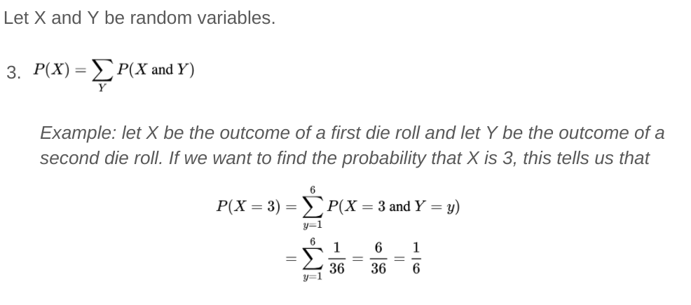
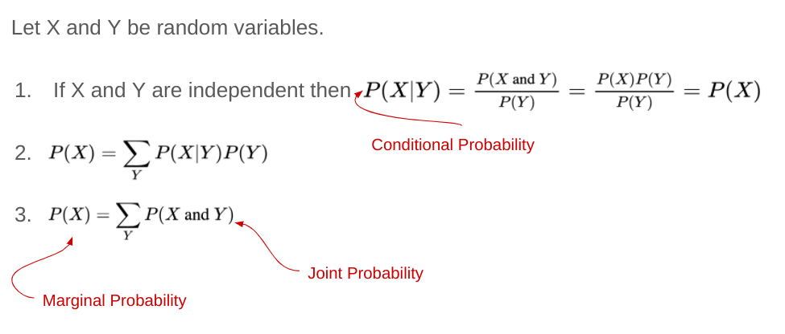
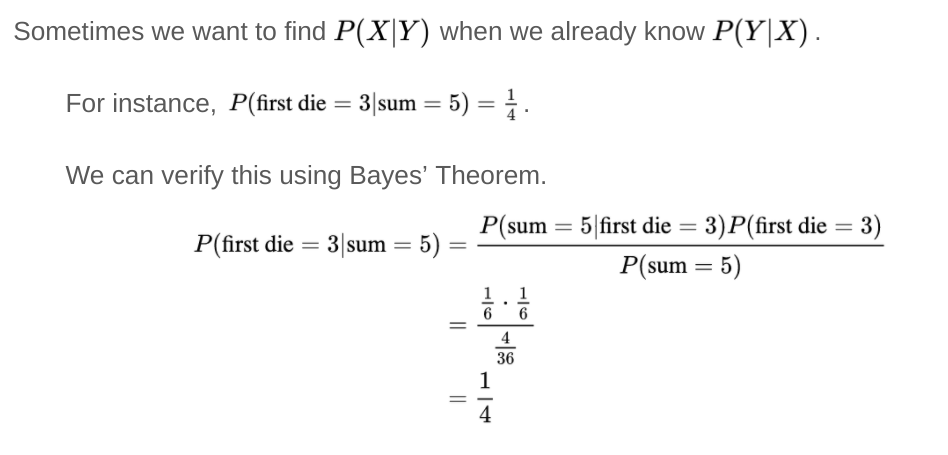

# Probability and Statistics

---

# Introduction to Probability

<!--
This lecture focuses on rolling dice as an illustrative example of probability. We will introduce:

- Random variables
- Expected values
- Conditional and joint probability
- Bayes' Theorem

Image Details:
* [prob01.jpg](https://unsplash.com/photos/4aB1nGtD_Sg): Unsplash License
-->

---

# Rolling a Die Creates a Random Variable

<!--
X is a random variable, in that it can be any one of 6 values, and it achieves each of these values with a certain probability. In this case, we have a uniform distribution of 1/6. 

Image Details:
* [prob02.png](http://www.google.com): Copyright Google
-->

---

# Dice Rolls Are Uniform Probabilities

* If we roll a 6-sided die, what is the probability of rolling a 1?
* What is the probability of rolling an even number?

<!--
For a die, the probability is equal for each value, but for other distributions the probabilities of achieving certain values
can get much more complicated.

Answers:
* 1/6 
* 1/2 = 1/6+1/6+1/6

-->

---

# The Expected Value is the "Average" Roll

* When we roll a 6-sided die, what is the “most likely” value?
* Imagine rolling the die 100 times, what would the "average" roll be?
* The expected value of a random variable can be thought of as the *mean* or *average*

<!--
Sometimes we want to know things about a random variable without having to observe it many times. For instance, we might want
to know what value the random variable is “most likely” to achieve. To find this, we use the concept of an expected value.

We commonly think of the expected value as being the mean. That is, over a long period of time with many observations of the
random variable, the expected value would be the average value we would see.

Answers:
* 3.5 = 1*(1/6) + 2*(1/6) + 3*(1/6) + ... + 6*(1/6)
* 3.5 = (1/100)*(100*1*(1/6) + 100*2*(1/6) + ... + 100*6*(1/6)) 

Image Details:
* [prob03.png](http://www.google.com): Copyright Google
-->

---

# Relationships Among Random Variables 

<!--
We call the relationship between two random variables independent if the value of one random variable does not affect the value of the other. For example, if we roll a die, then flip a coin. Furthermore, we could roll a fair die once and observe that it came up a 4, then roll again. These two events are independent.  

We call the relationship between two random variables dependent if the value of one does affect the other. For example, say we want the probability that the sum of rolling a die twice is 5, if the first roll is a 3. The two variables involved here (the first and second roll) are dependent variables. 

Image Details:
* [probstats01.png](http://www.google.com): Copyright Google
-->

---

# Conditional Probability

<!--
Conditional probability, denoted P(X|Y), is the probability that X occurs given Y has already occurred. 

For example, P(sum = 5 | first roll = 3) 
= P(sum = 5 AND first roll = 3)/P(first roll = 3).
We will go through this example in more detail on the next slide. 

Here are two additional definitions that may be useful.
* Joint probability: the probability that both X and Y occur
* Marginal probability: the probability that X occurs

Image Details:
* [prob22.png](http://www.google.com): Copyright Google
-->

---

# Conditional Probability: Example

<!--
Consider the example from the previous slide. Namely, P(sum = 5 | first roll = 3) 
= P(sum = 5 AND first roll = 3)/P(first roll = 3).

Now, we think through the two pieces of this formula. The simpler part is probably the denominator. We have, P(first roll = 3) = 1/6. 

Now let's talk about the numerator. We have, P(sum = 5 AND first roll = 3). 

How can we get a sum of 5? (1,4) (4,1) (2,3) (3,2).

We see that the only way to have the sum be 5 with a first roll of 3 is to roll a 2 on the second roll. Thus, the numerator, P(sum = 5 AND first roll = 3), is equivalent to P(second roll = 2 AND first roll = 3). These are now independent events and we can calculate their joint probability as the product of the individual probabilities. That is, P(second roll = 2 AND first roll = 3) = (1/6)(1/6) = 1/36.

Therefore, we have  
P(sum = 5 | first roll = 3) = (1/36)/(1/6) = 1/6. 

Image Details:
* [probstats06.png](http://www.google.com): Copyright Google
-->

---

# Conditional Probabilities Are Not Joint Probabilities

<!--
The conditional probability is what we calculated on the previous slide. 

Let's look at the joint probability in this example. Here we are saying we roll a 2 and a 3 (but we are not being particular about the order). So we could first roll a 2, then a 3 or vice versa. So the numerator is 2, which is the total number of ways to roll a 2 and a 3 (when order doesn't matter). The denominator is the total number of combinations for two rolls. That is, (1, 1), (1, 2), (1,3), ... (1,6), (2,1), (2,2), ...(2,6), ... (6,6). There are 36 = 6*6 total possibilities. Therefore, we compute the joint probability of rolling a 2 and a 3 to be 2/36. 

Finally, let's look at the probability that the sum is 5. From the previous slide we saw that the possible ways to have the sum = 5 are given by (1,4), (4,1), (2,3), (3,2). There are four possibilities out of the 36 total combinations for two rolls. Therefore, the probability that the sum equals 5 is 4/36.

Image Details:
* [prob24.png](http://www.google.com): Copyright Google
-->

---

# Conditional, Joint, & Marginal Probabilities Are Related

<!--
The conditional probability between two independent events is simply the probability of X occurring. 

Image Details:
* [prob25.png](http://www.google.com): Copyright Google
-->

---

# Conditional, Joint, & Marginal Probabilities Are Related

<!--
We can recover the probability of X by summing the conditional probability of X given Y times the probability of Y, for every possible Y.

Image Details:
* [probstats02.png](http://www.google.com): Copyright Google
-->

---

# Conditional, Joint, & Marginal Probabilities Are Related

<!--
We can recover the probability of X from summing the joint probabilities of X and Y for every possible Y.

Image Details:
* [prob27.png](http://www.google.com): Copyright Google
-->

---

# Conditional, Joint, & Marginal Probabilities Are Related

<!--
Let's review the formulae we saw on the previous slides. 

Image Details:
* [prob28.png](http://www.google.com): Copyright Google
-->

---

# Conditional Probabilities and Bayes' Theorem

<!--
Bayes' Theorem is a powerful result in probability. It allows us to find P(X|Y) if we know the probability of the reverse implication P(Y|X). 

This theorem will come up again when we talk about using Naive Bayes in machine learning. 

Image Details:
* [prob36.png](http://www.google.com): Copyright Google
-->

---

# Bayes’ Theorem: Example

<!--
Let's look at an example. 

Suppose we want to calculate P(first die = 3 | sum = 5). Note this is the reverse implication from our previous example which was P(sum = 5 | first roll = 3).

We can use Bayes' Theorem and the conditional probability that we already computed. 

Image Details:
* [probstats03.png](http://www.google.com): Copyright Google
-->

---

# Sample Exercise: Peanut Chocolate Detector

<!--
Bayes’ Theorems might seem unnecessarily complicated for solving dice problems, but it can be very useful in Machine Learning
contexts.

@Exercise (10 minutes) {
Give students time to think about this problem in groups. Prompt them for P(p|d), P(d|p) and P(not d|not p) to get them started.
}

Image Details:
* [probstats04.png](http://www.google.com): Copyright Google
-->

---

# Sample Exercise: Peanut Chocolate Detector

<!--
Ask students to discuss the implications of P(p|d) being relatively low even when P(d|p) and P(not d|not p) are high.

Image Details:
* [probstats05.png](http://www.google.com): Copyright Google
-->

---

# Your Turn

<!--
Now let's take a look at the lab where we will work with these ideas in more detail. 
-->
