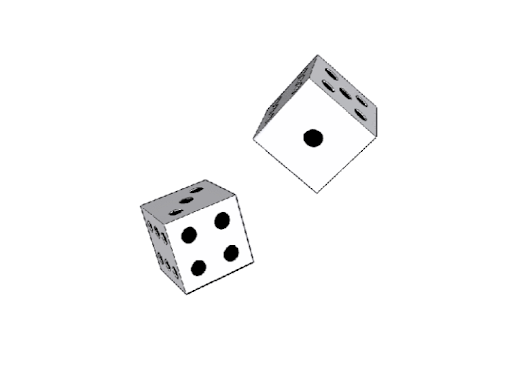
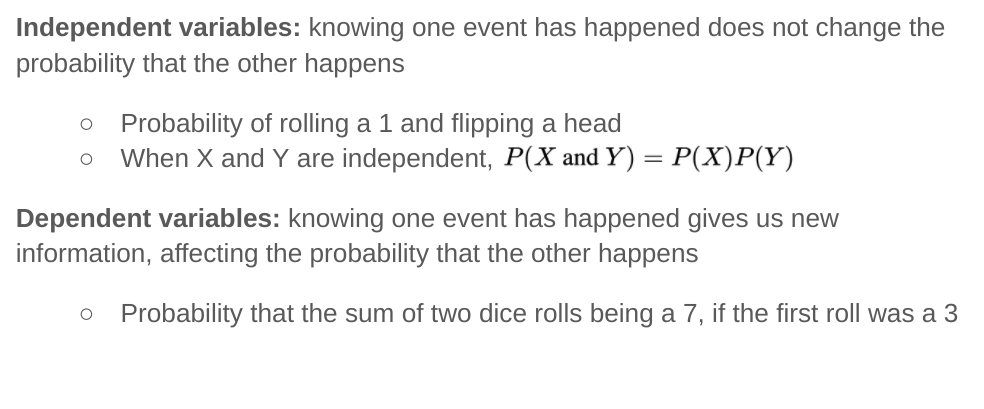
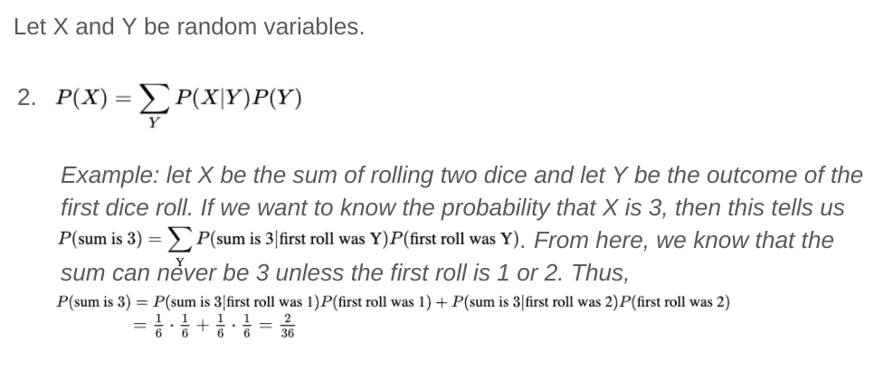
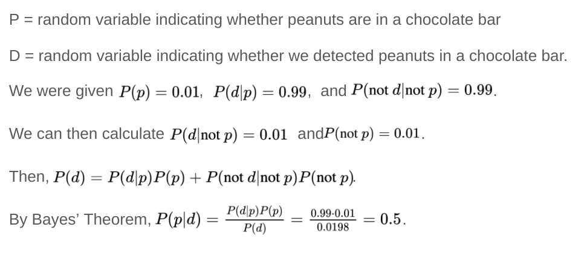

# Probability and Statistics

---

# Introduction to Probability

<!--
This slide deck is focused on rolling dice as an illustrative example of probability. Via this, we will introduce:

- Random variables
- Expected values
- Conditional and joint probability
- Bayes' Theorem

Image Details:
* [prob01.png](http://www.google.com): Copyright Google

---

# Rolling a Die Creates a Random Variable

<!--
X is a random variable, in that it can be any one of 6 values, and it achieves each of these values with a certain
probability.

Image Details:
* [prob02.png](http://www.google.com): Copyright Google
-->

---

# Dice Rolls Are Uniform Probabilities

* If we roll a 6-sided die, what is the probability of rolling a 1?
* What is the probability of rolling an even number?

<!--
For a dice, the probability is equal for each value, but for other distributions the probability of achieving certain values
can get much more complicated.

-->

---

# The Expected Value is the Average Roll

* When we roll a 6-sided die what is the “most likely” value?
* Imagine rolling the die 100 times, what would the average roll be?
* The expected value of a random variable is the mean or average

<!--
Sometimes, we want to know things about a random variable without having to observe it many times. For instance, we might want
to know what value the random variable is “most likely” to achieve. To find this, we use the concept of an expected value.

We commonly think of the expected value as being the mean -- that is, over a long period of time with many observations of the
random variable, the expected value would be the average value we would see.

Image Details:
* [prob03.png](http://www.google.com): Copyright Google
-->

---

# Random Variables Can Have Relations

<!--
After coming back from doing some of their first exercises, switch to talking about relationships between random variables,
bringing in dependence, conditional variables, and Bayes’ Theorem.

Image Details:
* [prob19.png](http://www.google.com): Copyright Google
-->

---

# Conditional Probability

<!--
We then imagine that teachers might spend some time on the definition of conditional probability,
* Joint probability: the probability that both X and Y occur
* Marginal probability: the probability that X occurs

Image Details:
* [prob22.png](http://www.google.com): Copyright Google
-->

---

# Conditional Probability

<!--
Image Details:
* [prob23.png](http://www.google.com): Copyright Google
-->

---

# Conditional Probabilities Are Not Joint Probabilities

<!--
Image Details:
* [prob24.png](http://www.google.com): Copyright Google
-->

---

# Conditional, joint, & marginal probabilities are related

<!--
Image Details:
* [prob25.png](http://www.google.com): Copyright Google
-->

---

# Conditional, joint, & marginal probabilities are related

<!--
Image Details:
* [prob26.png](http://www.google.com): Copyright Google
-->

---

# Conditional, joint, & marginal probabilities are related

<!--
Image Details:
* [prob27.png](http://www.google.com): Copyright Google
-->

---

# Conditional, joint, & marginal probabilities are related

<!--
Image Details:
* [prob28.png](http://www.google.com): Copyright Google
-->

---

# Conditional probabilities are related to each other

<!--
Image Details:
* [prob36.png](http://www.google.com): Copyright Google
-->

---

# Bayes’ Theorem

<!--
Image Details:
* [prob37.png](http://www.google.com): Copyright Google
-->

---

# Sample Exercise: Peanut Chocolate Detector

<!--
Bayes’ Theorems might seem unnecessarily complicated for solving dice problems, but it can be very useful in Machine Learning
contexts.

Image Details:
* [prob38.png](http://www.google.com): Copyright Google
-->

---

# Sample Exercise: Peanut Chocolate Detector

<!--
Ask students to discuss the implications of P(p|d) being very low even when P(d|p) and P(not d|not p) are high.

Image Details:
* [prob39.png](http://www.google.com): Copyright Google
-->

---
