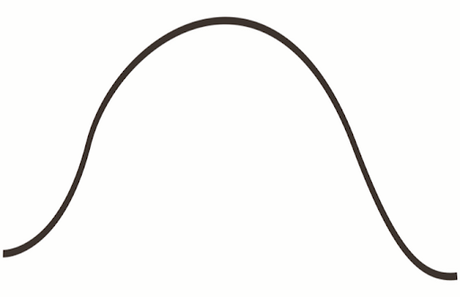
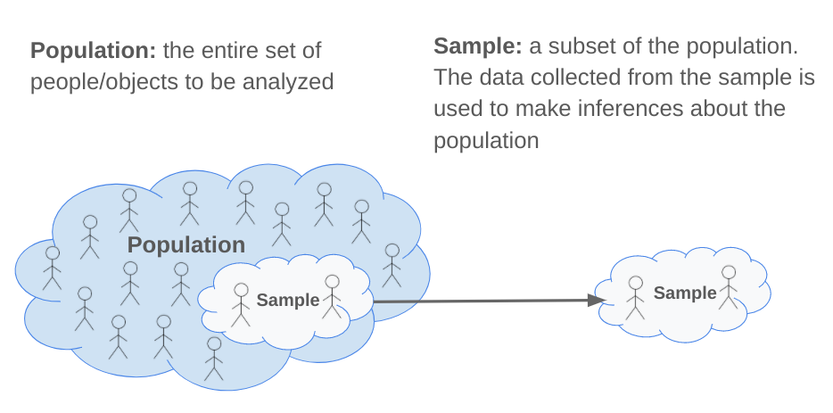
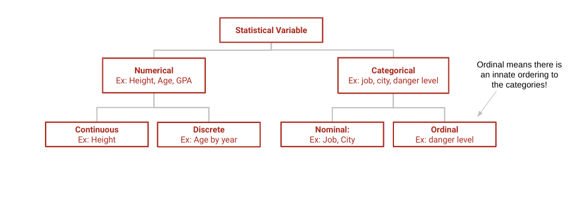
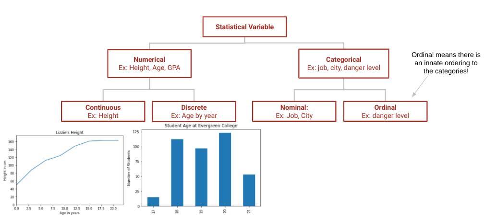
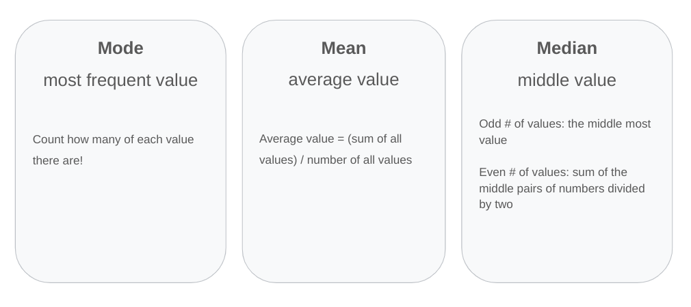
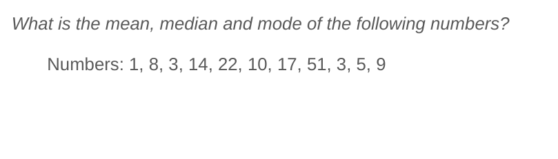
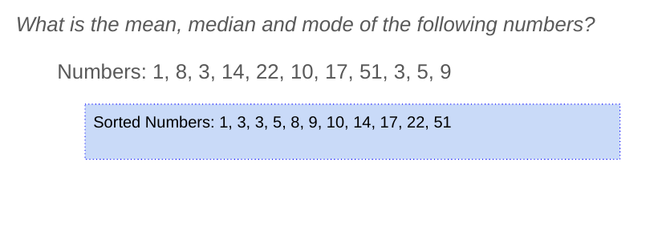
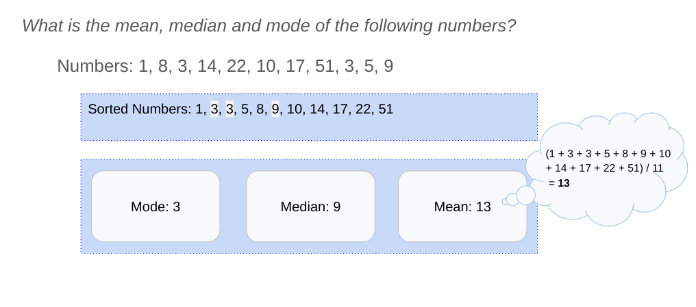
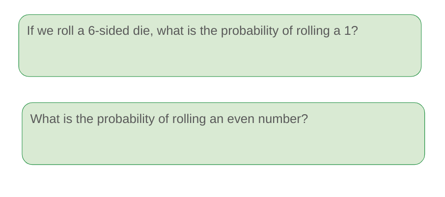

# Statistical Analysis of Data

---

# Introduction to Statistics

* Statistical Sampling
* Variable & Measurements
* Measures of Center
* Measures of Spread
* Distributions
* Coefficient of Variance
* Correlation Coefficient
* Hypothesis Testing

<!--
Image Details:
* [SAOD1.png](http://www.google.com): Copyright Google
-->

---

# Sample vs. Population

<!--
http://analytics-magazine.org/survey-sampling/

What is the difference between a sample and a population?

You can think of a sample as its own population, which is just a subset of the global population. You could imagine a
biologist tagging some sample of birds, tracking their movements with gps, and using that data to make inferences about the
patterns of the larger population of species. Defining assumptions is an abstraction that allows scientists to test theories.
The first assumption is an unbiased sample comes from the same distribution as the population, assuming that distribution is
normal. We can test this hypothesis using a single sided t-test, a statistical method to compare sample means to the
population means.

Image Details:
* [SAOD2.png](http://www.google.com): Copyright Google
-->

---

# Beware of Bias!

Bias: when the survey sample does not serve as an accurate representation of the population. The sample statistics either systematically over or under estimates the population parameter

* **Selection**: the chosen sample is not a representative of the population
  * Ex: Those at home were able to answer the phone for the US Census were more likely to be very young or old
* **Confirmation**: when individuals looks for information that perpetuates their own beliefs
  * Ex: Those who believe the world is flat is more likely to go to websites that claim it is

---

# The Two Types of Statistical Variable

<!--
Image Details:
* [SAOD3.png](http://www.google.com): Copyright Google
-->

---

# The Two Types of Statistical Variable

<!--
Image Details:
* [SAOD4.png](http://www.google.com): Copyright Google
-->

---

# Measures of Center: Mean, Median & Mode

Hint: It helps to sort the values first.

<!--
Image Details:
* [SAOD5.png](http://www.google.com): Copyright Google
-->

---

# Measures of Center: Mean, Median & Mode

Hint: It helps to sort the values first.

<!--
Image Details:
* [SAOD6.png](http://www.google.com): Copyright Google
-->

---

# Measures of Center: Mean, Median & Mode

<!--
Image Details:
* [SAOD7.png](http://www.google.com): Copyright Google
-->

---

# Measures of Center: Mean, Median & Mode

<!--
Image Details:
* [SAOD8.png](http://www.google.com): Copyright Google
-->

---

# Variance Measures How Spread Out Data Is

<!--
Image Details:
* [SAOD9.png](http://www.google.com): Copyright Google
-->

---
